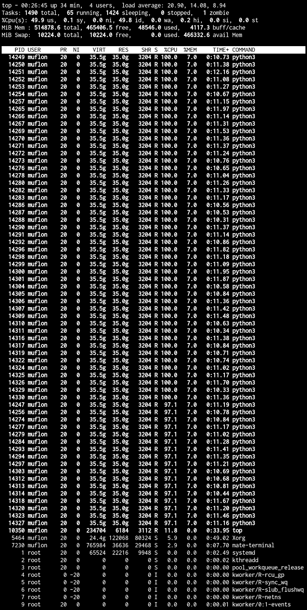

# cry

[library.m0unt41n.ch/challenges/cry](https://library.m0unt41n.ch/challenges/cry)   

# TL;DR

A remote vault using 6-way AES-ECB encryption, with a known plaintext, enabling
[Meet-in-the-middle-attack](https://en.wikipedia.org/wiki/Meet-in-the-middle_attack),
with key space reduced to `2**9**3`.

... and with a twist: we get plaintext/ciphertext pair only for a wrong set of encryption
keys &#128578; and need to juggle quite a bit to get it for the right ones.

# The code

The only file we get is `cry.py`. It has some simple encryption / decryption routines:

```python
def encrypt(data, keys):
    data = pad(data, 16)
    data += b"<<valid_secret>>"
    for k in keys:
        data = AES.new(k, AES.MODE_ECB).encrypt(data)
    return data

def decrypt(data, keys):
    for k in keys[::-1]:
        data = AES.new(k, AES.MODE_ECB).decrypt(data)
    if data[-16:] != b"<<valid_secret>>":
        return (f"Could not decrypt; invalid data: {data[:-16]}")
    return f"Decrypted data: {unpad(data[:-16], 16)}"
```

Note that, before encryption, the plain text is padded, with extra verification string
appended - that is used to check correct decryption later.

Then, there is a rather regular vault:

```python
def add(vault, keys, key, data):
    vault[key] = encrypt(data, keys) 

def get(vault, keys, key):
    return decrypt(vault.get(key, b""), keys) 

def generate_keys():
    return [long_to_bytes(randbelow(2**9)).ljust(16) for _ in range(6)]

def main():
    vault = {}
    admin_keys = generate_keys()
    user_keys = generate_keys()
    add(vault, admin_keys, "example", "nobody will be able to read this")
    add(vault, admin_keys, "FLAG", getenv("FLAG", "flag{fakeflagfakeflag}"))
    EVALUATION_PERIOD = 5
    while 1:
        print(f"Vault menu: {EVALUATION_PERIOD} TESTING QUERIES LEFT")
        print("  1) add value to vault")
        print("  2) get value from vault")
        print("  3) list available keys in the vault")
        option = int(input("option > "))
        match option:
            case 1:
                key = input("key  > ")
                text = input("text > ")
                assert all(i in printable for i in text)
                add(vault, user_keys, key, text)
                print(f"Successfully added the value ({vault[key]})")
            case 2:
                key = input("key > ")
                print(get(vault, user_keys, key))
            case 3:
                print(f"Available keys: {[*vault]}")

        EVALUATION_PERIOD -= 1
        if EVALUATION_PERIOD <= 0:
            print("You used your entire allowance. Goodbye")
            exit(0)

if __name__ == "__main__":
    main()
```

Things to note:

*   There are two sets of six AES keys: `admin_keys` and `user_keys`.
*   These sets are initialized from the RNG, but with **just the first 9 bits set**.
*   User can add and retrieve entries from the vault. These are encrypted with
    `user_keys`.
*   Vault is pre-seeded with two entries: a known plaintext and the flag.
    *   ... unfortunately, they are encrypted with `admin_keys` that we don't have &#128577;
*   We can do up to 5 operations, then the vault closes (next instance will have different keys).

## Example dialog with the app:

```
Vault menu: 5 TESTING QUERIES LEFT
  1) add value to vault
  2) get value from vault
  3) list available keys in the vault
option > 3
Available keys: ['example', 'FLAG']

Vault menu: 4 TESTING QUERIES LEFT
  1) add value to vault
  2) get value from vault
  3) list available keys in the vault
option > 2
key > example
Could not decrypt; invalid data: b'\xe0O-\xe2\xf6{\xaaEB\x91\xe2j\x92\xad\x80h\xcbTRq\x99\xad\xc3(^j\x88<g\xa6\xa5\x81\x13\xb4\xb8\xea,\xc5kh\xf8\xa1\x17I\x10\x19\xd8x'

Vault menu: 3 TESTING QUERIES LEFT
  1) add value to vault
  2) get value from vault
  3) list available keys in the vault
option > 2
key > FLAG
Could not decrypt; invalid data: b'"yUt\x1c\x05\xfd\x9f\xbb\x19\xcdd\\\x0fN5}\xead\xed9[\xcaBvj\xbf\xdfG\x19Co'

Vault menu: 2 TESTING QUERIES LEFT
  1) add value to vault
  2) get value from vault
  3) list available keys in the vault
option > 1
key  > test
text > test test test test
Successfully added the value (b'g\xb3\x97\xd7\x97\xb9\x9a|;\xcc\xc3qE\r\xf5\xe9\x19\xa5\x82\x81\x82\x98\x9c\xf8[\xee^\x18\xcb"E\xf6\xf6~iX/\xcfu\x14\xfezm\xa32\xa1\xecn')

Vault menu: 1 TESTING QUERIES LEFT
  1) add value to vault
  2) get value from vault
  3) list available keys in the vault
option > 2
key > test
Decrypted data: b'test test test test'
You used your entire allowance. Goodbye
```

# Breaking it

Let's summarize what we have:

*   We can encrypt and decrypt strings using `user_keys` (we see the ciphertext)
*   We have a **result of an attempt to decrypt the `admin_keys`-encrypted known-plaintext using `user_keys`**
*   And similarly, a **result of an attempt to decrypt the `admin_keys`-encrypted flag using `user_keys`**

The plan of attack is roughly:

1.  First of all: we'll try a MitM between known-plaintext and its `user_keys`-encrypted ciphertext.
    That should yield the `user_keys`.
2.  Then, we'll use `user_keys` to **encrypt** that failed decryption of known-plaintext. This
    will "reverse" the failed process and, as a result, we will get the `admin_keys`-encrypted version
    of the known-plaintext.
3.  Next, we'll repeat the MitM, but this time between known-plaintext and its
    **`admin_keys`-encrypted version**. That should yield `admin_keys`
4.  Then, we will get the `admin_keys`-encrypted **flag**, with similar trick as in (2) above:
    encrypting the failed result with `user_keys`
5.  Finally, we'll decrypt that value using `admin_keys`

The MitM will be brute-forcing 3 keys, 9-bits each, so the computational complexity of the MitM will be
`2**9**3 = 134217728` - should be doable on a modern PC.

# Exploit

```python
from Crypto.Util.number import bytes_to_long, long_to_bytes
from Crypto.Cipher import AES
import pwn

KEY_SIZE = 2**9
known_text = b"nobody will be able to read this"
```

## Step 0: retrieve the needed data from the vault

*   Get the (failed) decrypted plaintext:

    ```python
    pwn.context(arch='amd64', os='linux', encoding='ascii', log_level='warning')
    io = pwn.process("/usr/bin/env", "python3", "./cry.py")    io.recvuntil(b"option > ")
    io.sendline("2")
    io.recvuntil(b"key > ")
    io.sendline("example")
    io.recvuntil(b"Could not decrypt; invalid data: ")
    known_text_decryption_fail = eval(io.recvline())
    ```

*   Get the (failed) decrypted flag:

    ```python
    io.recvuntil(b"option > ")
    io.sendline("2")
    io.recvuntil(b"key > ")
    io.sendline("FLAG")
    io.recvuntil(b"Could not decrypt; invalid data: ")
    flag_decryption_fail = eval(io.recvline())
    ```

*   Add known-plaintext with user keys and get the ciphertext:

    ```python
    io.recvuntil(b"option > ")
    io.sendline("1")
    io.recvuntil(b"key  > ")
    io.sendline("user")
    io.recvuntil(b"text > ")
    io.sendline(known_text)
    io.recvuntil(b"Successfully added the value ")
    known_text_user_encrypted = eval(io.recvline())
    io.close()
    ```

## Step 1: Get the user keys

We do it by encrypting a known-plaintext and doing a MitM between original and
encrypted values. We use only first 16 bytes:

*   First, generate all possible 3-way encryptions of known-plaintext and record the
    keys that led to them

    ```python
    mid_states = {}
    for a in range(0, KEY_SIZE):
        for b in range(0, KEY_SIZE):
            for c in range(0, KEY_SIZE):
                keys = [long_to_bytes(a).ljust(16), long_to_bytes(b).ljust(16), long_to_bytes(c).ljust(16)]
                state = AES.new(keys[0], AES.MODE_ECB).encrypt(known_text[:16])
                state = AES.new(keys[1], AES.MODE_ECB).encrypt(state)
                state = AES.new(keys[2], AES.MODE_ECB).encrypt(state)
                mid_states[state] = keys
    ```

*   Generate all possible 3-way decryptions of the ciphertext. If the result matches one
    of the encryptions found above, the keys used for both will form the full `user_keys`.

    ```python
    for d in range(0, KEY_SIZE):
        for e in range(0, KEY_SIZE):
            for f in range(0, KEY_SIZE):
                keys = [long_to_bytes(d).ljust(16), long_to_bytes(e).ljust(16), long_to_bytes(f).ljust(16)]
                state = AES.new(keys[2], AES.MODE_ECB).decrypt(known_text_user_encrypted[:16])
                state = AES.new(keys[1], AES.MODE_ECB).decrypt(state)
                state = AES.new(keys[0], AES.MODE_ECB).decrypt(state)
                if state in mid_states:
                    user_keys = mid_states[state]+keys
    ```

At this point, we should have `user_keys`

## Step 2: Get the encrypted plain text

We have the result of a failed attempt to decrypt it using `user_keys`. So, we can get it just by 
**encrypting it back** with `user_keys`! Again, we do just first ECB block:

```python
known_text_admin_encrypted = known_text_decryption_fail[:16]
for key in user_keys:
    known_text_admin_encrypted = AES.new(key, AES.MODE_ECB).encrypt(known_text_admin_encrypted)
```

## Step 3: Get the admin keys

Now that we have admin-encrypted ciphertext for the known plain text, we can repeat the MitM
to get the admin keys. We need to only redo the second part, as `mid_states` from first 3 keys
are the same.

```python
for d in range(0, KEY_SIZE):
    for e in range(0, KEY_SIZE):
        for f in range(0, KEY_SIZE):
            keys = [long_to_bytes(d).ljust(16), long_to_bytes(e).ljust(16), long_to_bytes(f).ljust(16)]
            state = AES.new(keys[2], AES.MODE_ECB).decrypt(known_text_admin_encrypted[:16])
            state = AES.new(keys[1], AES.MODE_ECB).decrypt(state)
            state = AES.new(keys[0], AES.MODE_ECB).decrypt(state)
            if state in mid_states:
                admin_keys = mid_states[state]+keys
```

## Step 4: Get the encrypted flag

We have the result of the failed attempt to decrypt it using `user_keys`. Similarly to step 2, to get
the *actual* ciphertext, we encrypt that result back.

```python
flag_admin_encrypted = flag_decryption_fail
for key in user_keys:
    flag_admin_encrypted = AES.new(key, AES.MODE_ECB).encrypt(flag_admin_encrypted)
```

## Step 5: Decrypt the flag

We have admin-encrypted flag ciphertext and `admin_keys`, so it's easy!

```python
flag = flag_admin_encrypted
for key in admin_keys[::-1]:
    flag = AES.new(key, AES.MODE_ECB).decrypt(flag)
print(flag[:flag.find(b'}')+1].decode())
```

## Testing it

Before running it full scale, I tested above code by adding `KEY_SIZE` to the original
`cry.py` code - with value of 4 it extracted the flag immediately and with value of 6,
after a few seconds. Looked good.

So, I ran it against the remote instance - and *after a little more than an hour*, I got:
`shc2024{every1_will_b3_able_t0_read_th1s}` &#128578;

# Having more fun!

Above code was not really optimized - for example, 2/3 of the AES calculations can be easily
moved outside of the most inner loop, speeding things up by 3x. But, once I knew the order of
magnitude of time this will take, I just left it running for 80 minutes. Why? Because the real
speed-up comes from **parallelizing it** &#128578;

First, we can completely skip the interactive part - we just need a single set of key variables
from the remote instance (encoding the "real flag"), that we can extract either by running above code,
or just by interacting with the app.

```python
known_text_decryption_fail =  b'|\xea\xa6x\xf7\x0cr\xb7Y\x145\xa9\xe6\r^ai\x0ei\xc8\xb4@j<Q\xe1\xabp\x14\x1dN2\xee\xc5X\x87\xe3\xf4%b\x8b\xed\xae\xbe\x04?\xa7\xf9'
flag_decryption_fail =  b'I\xecZ\x84\xa3N\xfe,\xc8\x18\x81\xfd\xc12\xebr\x1b\x1d#\xc3\xebD\xaf\x9f\xc7U\xf8z\x16E\xd4\x0b\xfd\x8d\xd5\x87\x98\x0cL.hi \x0c\xe3\xf9\x9bQ'
known_text_user_encrypted =  b'\x02h\xd5\xc3 I\xb2\n\xd3\x0f\x89_]uc\xee\x1e\x02T\\WM\xc5x\x14[\xdf\x1d\xaa\xecR\x84\xdb\x02\x8e|=\x81\xa3\xe7@~\x04\x86\x0f\x0f\xdd\xd5,\xc8\xc1B\\\xd5\xf8\n\xb9\xc2ll\xa2\x057u'
```

Now, parallelizing this is a bit tricky in Python and took me a while to figure out the right combination of primitives to use:

*   Python concurrency is a mess &#128577;. Using threads got me less than 200% speedup (contention on GIL and shared data structures -
    which includes *reading* from static `mid_states` too).
*   Using a *process* pool needs way more RAM. It's pretty much running with a hope that CoW will save the day.
    Which is mostly does, but, with a wrong combination of primitives I managed to crash my 512GB RAM machine once &#128578;
*   Just submitting data to the thread pool and collecting later, results in a massive lock contention, especially in Step 1.
    In order to get it to work reasonably, I had to manually shard the work into `NPROC`-sized chunks, and merge the data after each step.
*   Then, even once I got enough parallelism in AES, collecting the data from `starmap` ended up taking longer than generating it.
*   Then, with such data size, Python's `Pool` cleanups take lot of time too.

Anyway, here's the code:

```python
from multiprocessing import Pool

NPROC = 64

def worker_encrypt(a, data):
    res = {}
    state1 = AES.new(long_to_bytes(a).ljust(16), AES.MODE_ECB).encrypt(data)
    for b in range(KEY_SIZE):
        state2 = AES.new(long_to_bytes(b).ljust(16), AES.MODE_ECB).encrypt(state1)
        for c in range(KEY_SIZE):
            state3 = AES.new(long_to_bytes(c).ljust(16), AES.MODE_ECB).encrypt(state2)
            state3 = state3[:8]
            res[state3] = [a, b, c]
    return res

def worker_decrypt(f, data):
    global mid_states  # Note: global, but we're only reading from it.
    state1 = AES.new(long_to_bytes(f).ljust(16), AES.MODE_ECB).decrypt(data)
    for e in range(KEY_SIZE):
        state2 = AES.new(long_to_bytes(e).ljust(16), AES.MODE_ECB).decrypt(state1)
        for d in range(KEY_SIZE):
            state3 = AES.new(long_to_bytes(d).ljust(16), AES.MODE_ECB).decrypt(state2)
            state3 = state3[:8]
            if state3 in mid_states:
                return([long_to_bytes(i).ljust(16) for i in mid_states[state3]+[d, e, f]])

# Step 1: MitM the user_keys.
mid_states = {}
with Pool(processes=NPROC) as pool:
    for a in range(0, KEY_SIZE, NPROC):
        res = pool.starmap(worker_encrypt, [(i, known_text[:16]) for i in range(a, min(a+NPROC, KEY_SIZE))])
        for r in res:
            mid_states.update(r)
with Pool(processes=NPROC) as pool:
    for f in range(0, KEY_SIZE, NPROC):
        res = pool.starmap(worker_decrypt, [(i, known_text_user_encrypted[:16]) for i in range(f, min(f+NPROC, KEY_SIZE))])
        res = [r for r in res if not r is None]
        if len(res)>0:
            user_keys = res[0]
            break

# Step 2: Get the admin-encrypted version of the known plain text (just first 16B).
known_text_admin_encrypted = known_text_decryption_fail[:16]
for key in user_keys:
    known_text_admin_encrypted = AES.new(key, AES.MODE_ECB).encrypt(known_text_admin_encrypted)        
    
# Step 3: MitM the admin_keys using known ciphertext. We need to only redo the second part.
with Pool(processes=NPROC) as pool:
    for f in range(0, KEY_SIZE, NPROC):
        res = pool.starmap(worker_decrypt, [(i, known_text_admin_encrypted[:16]) for i in range(f, min(f+NPROC, KEY_SIZE))])
        res = [r for r in res if not r is None]
        if len(res)>0:
            admin_keys = res[0]
            break

# Step 4: get the admin-encrypted flag ciphertext.
flag_admin_encrypted = flag_decryption_fail
for key in user_keys:
    flag_admin_encrypted = AES.new(key, AES.MODE_ECB).encrypt(flag_admin_encrypted)

# Step 5: get the flag.
flag = flag_admin_encrypted
for key in admin_keys[::-1]:
    flag = AES.new(key, AES.MODE_ECB).decrypt(flag)
print(flag[:flag.find(b'}')+1].decode())
```

Optimizations:

*   Staggering AES calculations, reusing earlier steps for multiple iterations
*   Using only first 8 bytes of encrypted state as hash key, hoping to reduce overall hashmap size
    (*we don't really expect a hash collision with 64-bits, rrrrright?*)
*   Early return when decryption finds a match

On my 7985WX this takes **3m16s** - but, at this point, AES calculations are probably not even a half of it.



---

## `shc2024{every1_will_b3_able_t0_read_th1s}`


<hr>

&copy; [muflon77](https://library.m0unt41n.ch/players/805ae1c8-9fe4-5816-b4a4-5057fa6eedb1)
