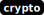

# hsb

[library.m0unt41n.ch/challenges/hsb](https://library.m0unt41n.ch/challenges/hsb)   

# TL;DR

We get a vault:

```
Available operations:
	[0] info
	[1] stop
	[2] gen_key
	[3] sign
	[4] verify
	[5] enc
	[6] dec
	[7] export_secret

Enter selected option: 
```

We can encrypt/decrypt our secrets and, with option `7`, get an encrypted flag.

# Code

```python
from Crypto.PublicKey import RSA
from inspect import signature
from secrets import choice
from secret import FLAG

RSA_LEN = 256
TYPE_USER = b"\x01"
TYPE_INTERNAL = b"\x02"

def b2i(b: bytes) -> int:
    return int.from_bytes(b, "big")

def i2b(i: int) -> bytes:
    return i.to_bytes((i.bit_length() + 7) // 8, "big")

def get_random_bytes(l: int):
    alph = list(range(1, 256))
    return b"".join([bytes([choice(alph)]) for _ in range(l)])

def pad(p: bytes) -> bytes:
    return get_random_bytes(RSA_LEN - len(p) - 2) + b"\x00" + p

def unpad(p: bytes) -> bytes:
    pad_end = 1
    while pad_end < len(p) and p[pad_end] != 0:
        pad_end += 1
    return p[pad_end + 1:]

class HSM:
    def __init__(self):
        self.vendor = "Cybersecurity Competence Center"
        self.model = "Perfection v2.1"
        self.rsa = None
        self.running = False

    def info(self):
        print(f"Vendor: {self.vendor}\nModel: {self.model}")

    def stop(self):
        if not self.running:
            print("HSM is already stopped.")
            return
        self.running = False

    def gen_key(self):
        bits = RSA_LEN * 8
        self.rsa = RSA.generate(bits)
        print(f"Generated new RSA-{bits} keys")

    def sign(self, m: int):
        m_pad = int.from_bytes(pad(i2b(m)), "big")
        sig = pow(m_pad, self.rsa.d, self.rsa.n)
        print(f"Signature: {sig}")

    def verify(self, sig: int, m: int):
        recovered = b2i(unpad(pow(sig, self.rsa.e, self.rsa.n).to_bytes(RSA_LEN, "big")))
        if recovered == m:
            print("Valid signature.")
        else:
            print("Invalid signature.")

    def _enc(self, m: bytes):
        c = pow(int.from_bytes(pad(m), "big"), self.rsa.e, self.rsa.n)
        print(f"Ciphertext: {c}")
        
    def enc(self, m: int):
        self._enc(TYPE_USER + i2b(m))

    def dec(self, c: int):
        m = unpad(pow(c, self.rsa.d, self.rsa.n).to_bytes(RSA_LEN, "big"))
        t, m = m[:1], b2i(m[1:])

        if t == TYPE_USER:
            print(f"Plaintext: {m}")
        else:
            print("Cannot decrypt internal secrets")

    def export_secret(self):
        self._enc(TYPE_INTERNAL + FLAG.encode())

    def run(self):
        self.running = True
        options = [self.info, self.stop, self.gen_key, self.sign, self.verify, self.enc, self.dec, self.export_secret]

        while self.running:
            print("Available operations:")
            for i, opt in enumerate(options):
                print(f"\t[{i}] {opt.__name__}")
            print()

            try:
                opt = int(input("Enter selected option: "))
                print()
                if opt > 2 and not self.rsa:
                    print("No RSA key available. Use gen_key() first.")
                else:
                    fn = options[opt]
                    args = []
                    for i in range(len(signature(fn).parameters)):
                        try:
                            args.append(int(input(f"input {i}: ")))
                        except ValueError as e:
                            print("Invalid input format, must be integer")
                            raise e
                    fn(*args)
            except (ValueError, IndexError):
                print("Invalid option")
                pass
            print()

if __name__ == "__main__":
    HSM().run()
```

# Key observation

*   `sign()` function is actually the same as `dec()`, in that it executes `pow(input, self.rsa.d, self.rsa.n)`.
*   So, we just need to get the encrypted flag (`7`), "sign" (`3`) and convert resulting long integer to bytes (and then, to chars).
*   The result may start with garbage (padding), but the flag should be at the end of it.

# Getting the flag

```python
import pwn
io = pwn.process("./challenge.py")

print(io.recvuntilS(b"Enter selected option: "), end="")
print(2)
io.sendline(b"2")

print(io.recvuntilS(b"Enter selected option: "), end="")
print(7)
io.sendline(b"7")
print(io.recvuntilS(b"Ciphertext: "), end="")
enc = io.recvuntilS(b"\n")
print(enc)

print(io.recvuntilS(b"Enter selected option: "), end="")
print(3)
io.sendline(b"3")
print(io.recvuntilS(b"input 0: "), end="")
print(enc)
io.send(enc.encode('ascii'))

print(io.recvuntilS(b"Signature: "), end="")
sig = io.recvuntilS(b"\n")
print(sig)

print(io.recvuntilS(b"Enter selected option: "), end="")
print(1)
io.sendline(b"1")

io.close()

# Convert signature to bytes object
sig = int(sig)
sig = sig.to_bytes((sig.bit_length() + 7) // 8, "big")

# The flag is at the end. Get it
flag = ""
for i in range(len(sig)-1,0,-1):
  if sig[i]>=32 and sig[i]<128:
    flag = chr(sig[i])+flag
  else:
    break
print(flag)
```

This works both locally and remotely.

---

## `shc2023{sur3ly_n0_0n3_w0uld_b3_s0_stup1d_1n_r34l1ty_r1gh7?}`


<hr>

&copy; [muflon77](https://library.m0unt41n.ch/players/805ae1c8-9fe4-5816-b4a4-5057fa6eedb1)
