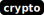

# launch-codes

[library.m0unt41n.ch/challenges/launch-codes](https://library.m0unt41n.ch/challenges/launch-codes)   

# TL;DR

We get a simple TCP server in Python

```
Hello Agent 12
Here is the Authentication Code for your ID: 
6290481082572404567030352773164478064710753531522410371215877224826507193554775387825578340757992590151615684210894639285438300584155811882708352302703635734174317590813932759003770847414225073948841884147650013051057405812311779623223701807453082139164256877877988699377497356131869684385022600049987010026488692708328076944951567433182257015222147782240272070316033641821242156074653522043314863963031893229988435779866621598517940133768977259146946073718844620065338254111388333644743116212307139130980953171845798405616602437249141335255933345684289863437024727403925400264094735124683688760505253684356179233887
 n = 20749811998628574433985904783293701459421617372063707855950864485125312846010208145476606037588892656158723755223438757310292726293214798021157022190780277111777457305132095618509741811840453021926578452935357781151314520559098189742991527020544934542018163472644148728281464012668062382218155810196745037662175803569612698767305830400284164830105688466564999018428792389911396284603609409635549394334445451009012274499594295670107487168391831981426598389380428629184325633270614318710489908145415061606422717325376096617500000078564751119146993972059640334164536046487094143187486000599459900320154589484372355080563
 e = 65537
[1] Launch [2] Authenticate
```

Either of the two options kicks us out after providing some inputs.

# Code

```python
import socket
import random
import secrets
import string
import os
from Crypto.Util.number import bytes_to_long, long_to_bytes
from Crypto.PublicKey import RSA
from Crypto.Util.number import inverse

# Globals
flag = "flag{dummy_flag}"
authentication_list = ['12', '144', '1728', '20736']

def generate_random_string(length):
    characters = os.urandom(length)
    return characters

def generate_key_shares(length, number):
    key_shares = [bytes_to_long(generate_random_string(length)) for _ in range (number)]
    key = key_shares[0]
    for s in key_shares[1:]:
        key = key ^ s
    return key, key_shares

def authenticate(auth_id, auth_code, rsa_key):
    if auth_id in authentication_list and pow(int(auth_id), rsa_key.d, rsa_key.n) == int(auth_code):
        return True, authentication_list.index(auth_id)
    else:
        return False, -1

def start_server(host, port):
    server_socket = socket.socket(socket.AF_INET, socket.SOCK_STREAM)
    server_socket.bind((host, port))
    server_socket.listen(1)
    print(f"Server listening on {host}:{port}...")

    while True:
        client_socket, client_address = server_socket.accept()
        print(f"Connection from {client_address[0]}:{client_address[1]}")

        key, key_shares = generate_key_shares(32, 4)

        rsa_key = RSA.generate(2048)
        first_auth_code = str(pow(12, rsa_key.d, rsa_key.n))
        n = str(rsa_key.n)
        e = str(rsa_key.e)

        client_socket.sendall(b"Hello Agent 12\n")
        client_socket.sendall(b"Here is the Authentication Code for your ID: \n")
        client_socket.sendall(first_auth_code.encode('utf-8'))
        public_key = "\n n = " + n + "\n e = " + e + "\n"
        client_socket.sendall(public_key.encode('utf-8'))

        while True:
            authenticated = False
            client_socket.sendall(b"[1] Launch [2] Authenticate\n")
            try:
                data = client_socket.recv(1024).decode('utf-8').strip()
                print(f"Received data: {data}")
            except Exception as err:
                print("Exception Caught")
                client_socket.close()

            if data == '1':
                client_socket.sendall(b"Enter Launch Code:\n")
                try:
                    launch_data = client_socket.recv(1024).decode('utf-8').strip()
                    print(f"Received launch code: {launch_data}")
                    if str.isnumeric(launch_data) and int(launch_data) == key:
                        response = bytes("Target destroyed at: " + flag + "\n", 'utf-8')
                        client_socket.sendall(response)
                        break
                    else:
                        client_socket.sendall(b"Missiles could not be Launched, Mission Terminated\n")
                except Exception as err:
                    print("Exception Caught")
                    client_socket.sendall(b"Missiles could not be Launched, Mission Terminated\n")
                    client_socket.close()
            elif data == '2':
                client_socket.sendall(b"Agent, please provide your ID:\n")
                try:
                    auth_id = client_socket.recv(1024).decode('utf-8').strip()
                    print(f"Received Auth ID: {auth_id}")
                    client_socket.sendall(b"Enter your Authentication Code:\n")
                    auth_code = client_socket.recv(1024).decode('utf-8').strip()
                    print(f"Received Auth Code: {auth_code}")

                    authenticated, id = authenticate(auth_id, auth_code, rsa_key)
                    if authenticated:
                        client_socket.sendall(b"Authentication Successful, Your Code is:\n")
                        res = str(key_shares[id]) + "\n"
                        client_socket.sendall(res.encode('utf-8'))
                        continue
                    else:
                        client_socket.sendall(b"Authentication Failed, Mission Terminated.\n")
                except Exception as err:
                    print("Exception Caught")
                    client_socket.sendall(b"Authentication Failed, Mission Terminated.\n")
                    client_socket.close()
            else:
                client_socket.sendall(b"Invalid choice. Please select '1' or '2'. Mission Terminated.\n")
            client_socket.close()
            print(f"Connection closed with {client_address[0]}:{client_address[1]}")
            break

HOST = '127.0.0.1'
PORT = 1234
start_server(HOST, PORT)
```

# Key observation

Looking at `authenticate()` code:

```python
authentication_list = ['12', '144', '1728', '20736']
def authenticate(auth_id, auth_code, rsa_key):
    if auth_id in authentication_list and pow(int(auth_id), rsa_key.d, rsa_key.n) == int(auth_code):
        return True, authentication_list.index(auth_id)
    else:
        return False, -1
```

... we see that `auth_id` values are subsequent powers of 12. Therefore:

*   `auth_code[0]` = `(12 ** rsa_key.d) mod rsa_key.n` = *whatever we initially get for auth_id=12*
*   `auth_code[1]` = `((12*12) ** rsa_key.d) mod rsa_key,n` = `(12 ** rsa_key.d) * (12 ** rsa_key.d) mod rsa_key.n` = `auth_code[0] * auth_code[0]`
*   `auth_code[2]` = `auth_code[0] * auth_code[0] * auth_code[0]`
*   `auth_code[3]` = `auth_code[0] * auth_code[0] * auth_code[0] * auth_code[0]`

With these values, we can pull "Codes" for every `auth_id`. Once we have them, looking at `generate_key_shares()`:

```python
def generate_key_shares(length, number):
    key_shares = [bytes_to_long(generate_random_string(length)) for _ in range (number)]
    key = key_shares[0]
    for s in key_shares[1:]:
        key = key ^ s
    return key, key_shares
```

... we just need to XOR them all to get the final code for launch (`key`).


# Getting the flag

```python
import pwn

auth_code = [0, 0, 0, 0]
key_shares = [0, 0, 0, 0]

io = pwn.remote('127.0.0.1', 1234, ssl=False)

# Retrieve the initial code and RSA modulus
print(io.recvuntilS(b"Here is the Authentication Code for your ID: \n").strip())
auth_code[0] = int(io.recvlineS().strip())
print(auth_code[0])
print(io.recvuntilS(b" n = ").strip(), end=" ")
rsa_key_n = int(io.recvlineS().strip())
print(rsa_key_n)

# Get key_shares for all four auth_ids
for i in range(4):
    auth_id = pow(12,i+1)
    if i>0:
        auth_code[i]=(auth_code[0]*auth_code[i-1]) % rsa_key_n

    print(io.recvuntilS(b"[1] Launch [2] Authenticate\n").strip())
    print("2")
    io.sendline(b"2\n")

    print(io.recvuntilS(b"Agent, please provide your ID:\n").strip())
    print(auth_id)
    io.sendline(str(auth_id).encode('ascii'))

    print(io.recvuntilS(b"Enter your Authentication Code:\n").strip())
    print(auth_code[i])
    io.sendline(str(auth_code[i]).encode('ascii'))

    print(io.recvuntilS(b"Authentication Successful, Your Code is:\n").strip())
    key_shares[i] = int(io.recvlineS().strip())
    print(key_shares[i])

print(io.recvuntilS(b"[1] Launch [2] Authenticate\n").strip())
print("1")
io.sendline(b"1\n")

print(io.recvuntilS(b"Enter Launch Code:\n").strip())
key = str(key_shares[0]^key_shares[1]^key_shares[2]^key_shares[3])
print(key)
io.sendline(key.encode('ascii'))

print(io.recvuntilS(b"Target destroyed at: "), end="")
flag = io.recvlineS().strip()
print("\033[1;37;40m"+flag+"\033[0;37;40m")

io.close()
```

This works locally and, after updating the `io`, with remote instance too.

---

## `shc2023{you_want_eternal_rest_I_got_it_here}`


<hr>

&copy; [muflon77](https://library.m0unt41n.ch/players/805ae1c8-9fe4-5816-b4a4-5057fa6eedb1)
