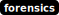

# gotthard

[library.m0unt41n.ch/challenges/gotthard](https://library.m0unt41n.ch/challenges/gotthard)   

# TL;DR

We get a pcap file. Opening it with wireshark we see a simple HTTP exchange and
the flag is in the response.

And in fact, it can be simply grepped out of the pcap too:

```
$ strings gotthard.pcap | grep cyberskills
cyberskills23{Dr1v1n9_thr0ugh_th3_7unnel}
cyberskills23{Dr1v1n9_thr0ugh_th3_7unnel}
```

---

## `cyberskills23{Dr1v1n9_thr0ugh_th3_7unnel}`


<hr>

&copy; [muflon77](https://library.m0unt41n.ch/players/805ae1c8-9fe4-5816-b4a4-5057fa6eedb1)
