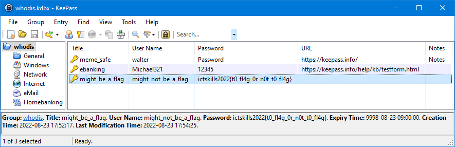

# lost-password

[library.m0unt41n.ch/challenges/lost-password](https://library.m0unt41n.ch/challenges/lost-password)   

# TL;DR

We get a KeePass database, with no obvious hint.

# Analysis

[First Google result](http://google.com/search?q=cracking+keepass) is
[github.com/patecm/cracking_keepass](http://github.com/patecm/cracking_keepass),
let's try that.

## Wordlist

```
$ wget http://gitlab.com/kalilinux/packages/wordlists/-/raw/kali/master/rockyou.txt.gz
$ gunzip rockyou.txt.gz
```

I already have `hashcat` and `john`, but not the `keepass2john`

```
$ git clone http://github.com/ivanmrsulja/keepass2john
$ python keepass2john/keepass2john.py whodis.kdbx
whodis<SHOULD_BE_REMOVED_INCLUDING_COLON>:$keepass$*2*60000*222*3884e01c4d3b0507946d61aabd0101177f87bc6dfcac0749ea160884c2056096*a0417c64f05c75369a418a728de50ede05f6abfde5ed2c27e94b325de2c359f7*9d38517247f37bed446f6cefebc7f45a*fd65995e48c46885d9a58c3752e024f7c1973db3b6558d3d9ddb831da10f5ffc*17df128a1de1325d483341c4dd1c0867e91c7f033fe5b6d6977dcee596b77c13
$ python keepass2john/keepass2john.py whodis.kdbx | cut -c43- >whodis.txt
```

## Hashcat time

```
$ hashcat --help | grep -i keepass
  13400 | KeePass 1 (AES/Twofish) and KeePass 2 (AES)                | Password Manager
  29700 | KeePass 1 (AES/Twofish) and KeePass 2 (AES) - keyfile only mode | Password Manager
$ hashcat -m 13400 -a 0 whodis.txt rockyou.txt --potfile-disable

(...)

$keepass$*2*60000*222*3884e01c......96b77c13:batman
```

## Opening the file in KeePass



---

## `ictskills2022{t0_fl4g_0r_n0t_t0_fl4g}`


<hr>

&copy; [muflon77](https://library.m0unt41n.ch/players/805ae1c8-9fe4-5816-b4a4-5057fa6eedb1)
