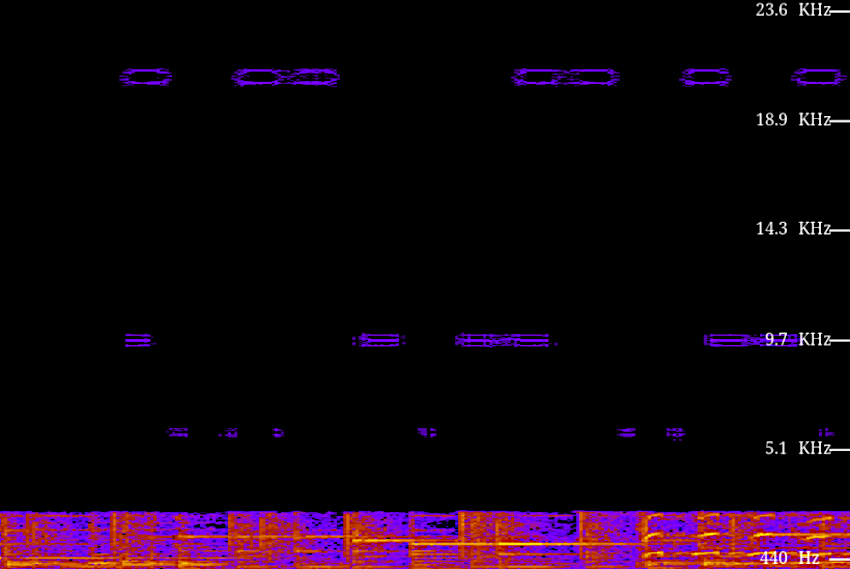
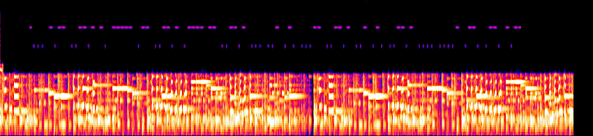

# a-happy-finance-bro

[library.m0unt41n.ch/challenges/a-happy-finance-bro](https://library.m0unt41n.ch/challenges/a-happy-finance-bro)   

# TL;DR

We get a WAV file and a description.

> *Im a new guy here and we have this weird excel magician who doesn't even*
> *use the sheet but just writes some magic somewhere else and everything*
> *happens on its own. Well they seem to be doing 10x the work of the rest*
> *of us mouse users and we know nothing of them and their secrets of excel*
> *magic. The only thing we have found out is that they always listen to*
> *this cursed song on loop?! How are they still sane? maybe it hides the*
> *secret to their speed :0*

The flag is a Morse code, hidden in high frequency part of the spectrum &#128512;

# Solution

## Peeking at the file

The file is 192kHz, mono WAV.

```
$ file the_happy_10x_finance_bro.wav 
the_happy_10x_finance_bro.wav: RIFF (little-endian) data, WAVE audio, Microsoft PCM, 16 bit, mono 192000 Hz
```

There is some metadata:

```
$ exiftool the_happy_10x_finance_bro.wav 
ExifTool Version Number         : 12.70
File Name                       : the_happy_10x_finance_bro.wav
Directory                       : .
File Size                       : 15 MB
File Modification Date/Time     : 2024:09:26 23:48:28+02:00
File Access Date/Time           : 2024:10:29 22:13:50+01:00
File Inode Change Date/Time     : 2024:11:10 22:19:12+01:00
File Permissions                : -rw-r--r--
File Type                       : WAV
File Type Extension             : wav
MIME Type                       : audio/x-wav
Encoding                        : Microsoft PCM
Num Channels                    : 1
Sample Rate                     : 192000
Avg Bytes Per Sec               : 384000
Bits Per Sample                 : 16
Product                         : Finance
Date Created                    : 1984
Software                        : Lavf60.3.100 (libsndfile-1.0.31)
Track Number                    : 1337
ID3 Size                        : 316
User Defined Text               : (Software) Lavf60.3.100
Comment                         : you think there will be a flag here? well nope no flag for you silly :0 ( here you get the flag format just to annoy you shc2024{ )
Genre                           : Salami Core
Warning                         : [minor] Frame 'TDRC' is not valid for this ID3 version
Recording Time                  : 1984
Track                           : 1337
Album                           : Finance
Title                           : Happy Happy Happy
Artist                          : Salami Incoperated
Duration                        : 0:00:38
```

The file has 14732964 bytes / 7366482 samples, 38.367 seconds.

```
$ ffmpeg -i the_happy_10x_finance_bro.wav -f s16le -acodec pcm_s16le out.raw
```

## Ideas

*   Speed it up / slow it down?
*   If it is 4x too fast, take least-significant-bit (byte?) from every 4th word?
*   Analyze with oscilloscope?
*   *"uses only keyboard"* - maybe hides some keycodes?
*   The song repeats twice - maybe there is a diff between first and second instance?


## Spectrum view

Looking at similar challenges, I found that one common pattern is to
hide the flag in the spectrum view. I tried
[academo.org/demos/spectrum-analyzer](https://academo.org/demos/spectrum-analyzer/)
first, which showed some weirdness in the high frequency range.



BTW, this explains why the file uses 192kHz sampling - it would be hard to so clearly
separate the high frequency signal otherwise. The spectrogram makes it look like the
original file had about 25% of the frequency range (44.1kHz &#128578;), it was then resampled
to approx. 4x that and then, additional signals were added, at 6kHz and 10kHz respectively.

Looking at this picture did not give me any immediate clues, but was interesting enough
to try a better tool like Audacity. There, it was more clear what's going on:



The high frequency part looks very much like Morse code (the 20kHz band
in the first output looks like some artifact, possibly a harmonic).

Trying to decode first few characters with that assumption looked promising and 
[fully decoding this with CyberChef](https://gchq.github.io/CyberChef/#recipe=From_Morse_Code('Space','Line%20feed')&input=LS4uLiAtLi0tIC4uLS0uLSBfLiAtLS0tLSAuLS0gLi4tLS4tIC4tLS0tIC0tIC4uLS0uLSAuLi4gLi4tIC4tLiAuLi4tLSAuLi0tLi0gLi4tIC4tLiAuLi0tLi0gLi4uLiAuLi4uLSAuLS0uIC4tLS4gLS4tLQ)
yields: `BY_N0W_1M_SUR3_UR_H4PPY`. Nice!

... except that `shc2024{BY_N0W_1M_SUR3_UR_H4PPY}` was not a correct flag &#128578;
After a bit of back & forth, I tried lowercasing it - and that worked.

## Hearing it! &#x1F4E1; &#x1F442; &#x1F3B6; &#x1F4FB;

... I couldn't resist &#128512; With a bit of audio processing (hi-pass filter, pitch
reduction, normalize), it is possible to recover the original Morse code audio signal:


Note that the third 20kHz signal that I saw in first picture might not be an "artifact"
 after all - this recording has clearly **three** frequencies:

*   ~300Hz and ~550Hz encoding the actual Morse code (I pitch-reduced the original file
    to center the signal around 440Hz).
*   ~1150Hz which seems like a distraction.


---

## `shc2024{by_n0w_1m_sur3_ur_h4ppy}`


<hr>

&copy; [muflon77](https://library.m0unt41n.ch/players/805ae1c8-9fe4-5816-b4a4-5057fa6eedb1)
