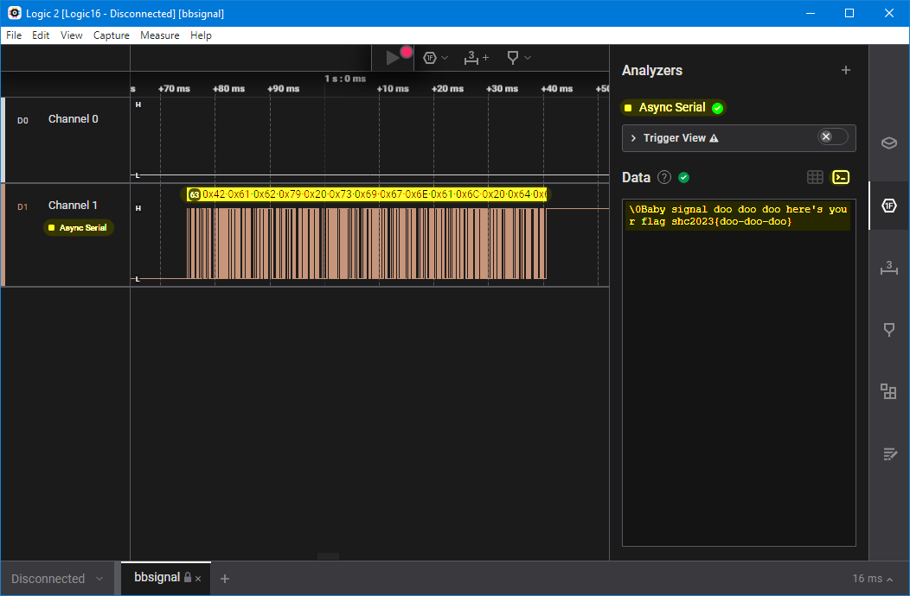

# bbsignal

[library.m0unt41n.ch/challenges/bbsignal](https://library.m0unt41n.ch/challenges/bbsignal)   

# TL;DR

We get a `bbsignal.sal` file. Google Search suggests that it can be
opened with Logic 2 analyzer - opening it there shows two channels,
one with a fixed 0 and the other with some binary signal.

For a `baby` challenge, I did not expect complicated things - and
generic serial protocol was actually the very first thing I tried &#128578;

---

## `shc2023{doo-doo-doo}`

&copy; [muflon77](https://library.m0unt41n.ch/players/805ae1c8-9fe4-5816-b4a4-5057fa6eedb1)
