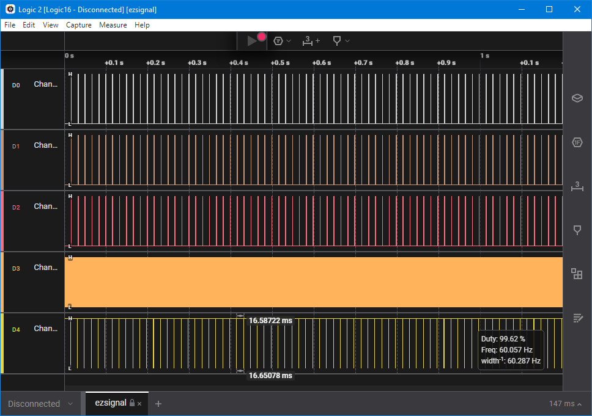
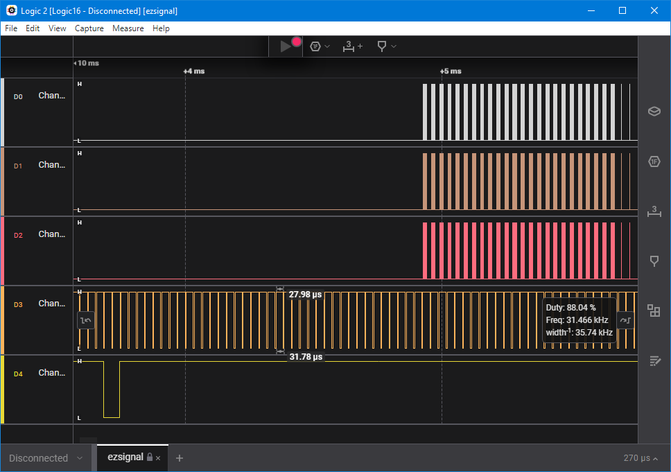
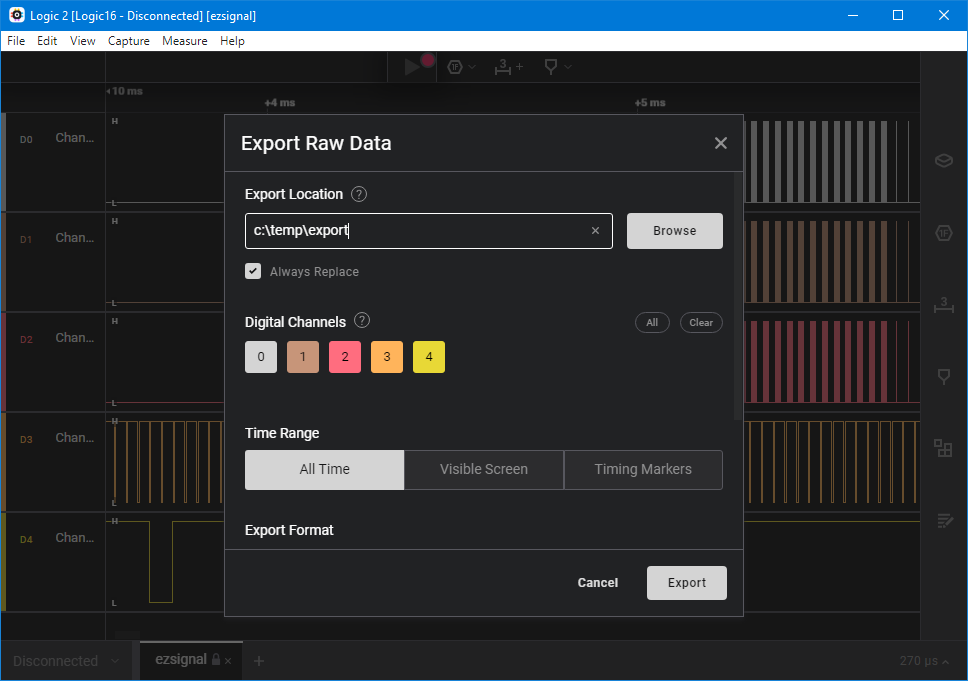
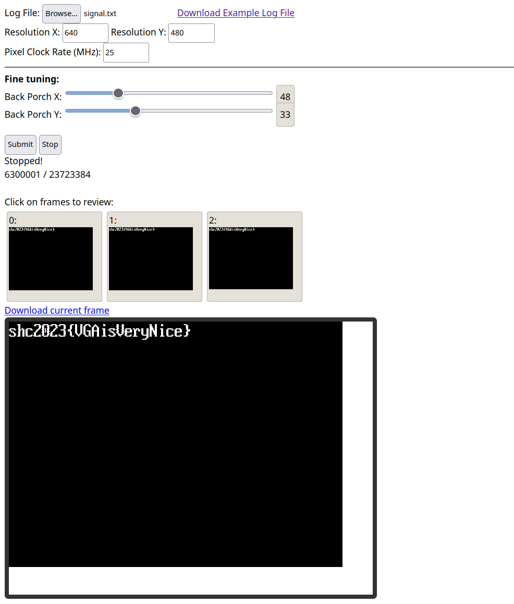

# ezsignal

[library.m0unt41n.ch/challenges/ezsignal](https://library.m0unt41n.ch/challenges/ezsignal)   

# TL;DR

We get a SAL capture file. The hint is: `Can you SEE the flag?`

# Analysis

The signal capture has few channels. First thing we notice is that channel 5 has frequency of 60Hz:



... and with the strong "SEE" hint in the challenge description, the best bet at this point is
[VGA signal](https://en.wikipedia.org/wiki/Video_Graphics_Array#Signal_timings).
Especially as channel #3 has frequency of 31.466 kHz:



So, it's clear the channels are R/G/B/HSync/VSync.

# Decoding VGA signal

There is no good way to decode this in Logic2, but I found
[VGA Simulator](https://madlittlemods.github.io/vga-simulator),
which does exactly that.

## Extracting signal as CSV file

Let's export the signal as CSV:



The export format is:

```
Time [s],Channel 0,Channel 1,Channel 2,Channel 3,Channel 4
0.000000000,0,0,0,1,1
0.000018040,0,0,0,0,1
0.000021840,0,0,0,1,1
0.000049800,0,0,0,0,1
0.000053620,0,0,0,1,1
```

## Converting to VGA Simulator format

VGA Simulator needs:

*   Uses `TTTTT ns: H V RRR GGG BB` format, where H/V/R/G/B are binary.
*   Needs a line for **every** clock cycle, not just when the signals change.

Let's write a converter:

```python
# Input:  time[s], R, G, B, HSync, VSync
# Output: time ns: HSync VSync RRR GGG BB

with open("digital.csv","r") as f:
  lines = f.readlines()[1:]
  for i in range(len(lines)):
    lines[i] = lines[i].strip().split(",")
    lines[i][0]=int(lines[i][0].replace('.', ''))
  for i in range(len(lines)-1):
    l = lines[i]
    for t in range(lines[i][0],lines[i+1][0],10):
      print(str(t)+" ns: "+l[4]+" "+l[5]+" "+l[1]+l[1]+l[1]+" "+l[2]+l[2]+l[2]+" "+l[3]+l[3])
```

That produces a fairly massive 3.3GB file, but a) VGA Simulator is offline (written entirely in JS)
and b) I have a beefy workstation &#128578;

## Getting the flag



---

## `shc2023{VGAisVeryNice}`


<hr>

&copy; [muflon77](https://library.m0unt41n.ch/players/805ae1c8-9fe4-5816-b4a4-5057fa6eedb1)
