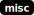
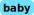

# imagine

[library.m0unt41n.ch/challenges/imagine](https://library.m0unt41n.ch/challenges/imagine)   

# TL;DR

The flag is hidden in a JPG image

# Analysis

First look with [jpegdump.py](https://github.com/DidierStevens/Beta/blob/master/jpegdump.py)

```
$ python jpegdump.py -a ultimate-meme.jpg
$ for N in $(seq 1 58); do python jpegdump.py -a -s $N ultimate-meme.jpg  ; done
```

Oh, wait, 2x `JFIF`? and multiple `Created with GIMP`?

```
$ xxd -g 1 ultimate-meme.jpg | grep -B2 -A2 JFIF
00000000: ff d8 ff e0 00 10 4a 46 49 46 00 01 01 01 01 2c  ......JFIF.....,
00000010: 01 2c 00 00 ff e1 00 f2 45 78 69 66 00 00 49 49  .,......Exif..II
00000020: 2a 00 08 00 00 00 08 00 0e 01 02 00 12 00 00 00  *...............
--
00015ba0: be 09 97 fe c8 08 53 13 40 88 42 cb d4 04 8a c4  ......S.@.B.....
00015bb0: e4 9e 99 b0 7e d1 46 5f 87 a1 fe 4f ff d9 ff d8  ....~.F_...O....
00015bc0: ff e0 00 10 4a 46 49 46 00 01 01 01 01 2c 01 2c  ....JFIF.....,.,
00015bd0: 00 00 ff fe 00 13 43 72 65 61 74 65 64 20 77 69  ......Created wi
00015be0: 74 68 20 47 49 4d 50 ff e2 02 b0 49 43 43 5f 50  th GIMP....ICC_P
```

`ff d8` is `SOI` and `ff e0 00 10` is APP0. So, we can extract at `0x00015bbe`.

```
$ dd if=ultimate-meme.jpg of=flag.jpg bs=1 skip=$((16#15bbe))
14573+0 records in
14573+0 records out
14573 bytes (15 kB, 14 KiB) copied, 0.0162696 s, 896 kB/s
$ display flag.jpg
```

---

## `SCD{fl4g_1s_h3r3_h4ve_fun_typ1ng_4ll_of_th1s_:3}`


<hr>

&copy; [muflon77](https://library.m0unt41n.ch/players/805ae1c8-9fe4-5816-b4a4-5057fa6eedb1)
