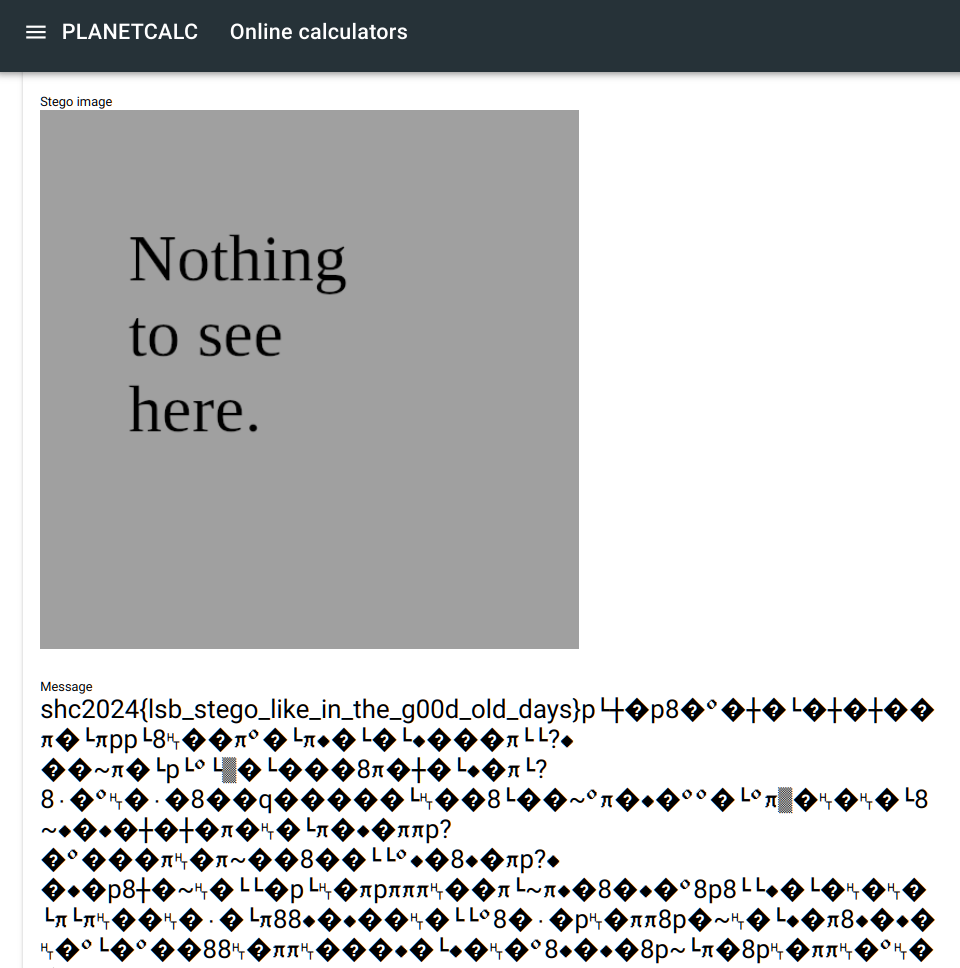

# least-suspicious-bit

[library.m0unt41n.ch/challenges/least-suspicious-bit](https://library.m0unt41n.ch/challenges/least-suspicious-bit)   

# TL;DR

We're given a PNG image and the name of the challenge pretty much says everything &#128522;

Google search: `image least significant bit steganography` gets us
[https://planetcalc.com/9345](https://planetcalc.com/9345) and uploading the
image there gets us:

---

## `shc2024{lsb_stego_like_in_the_g00d_old_days}`

&copy; [muflon77](https://library.m0unt41n.ch/players/805ae1c8-9fe4-5816-b4a4-5057fa6eedb1)
