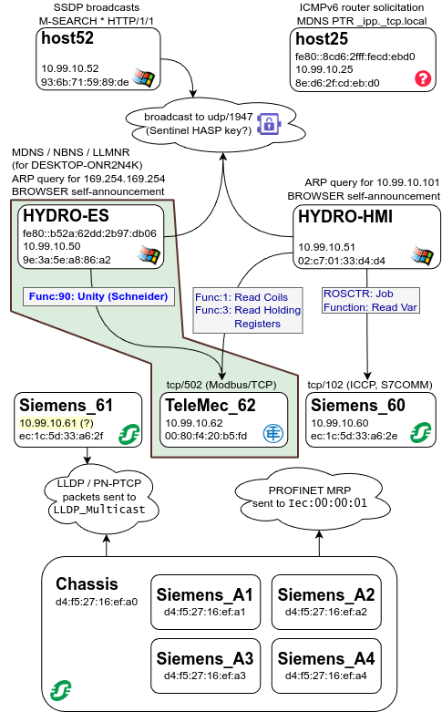
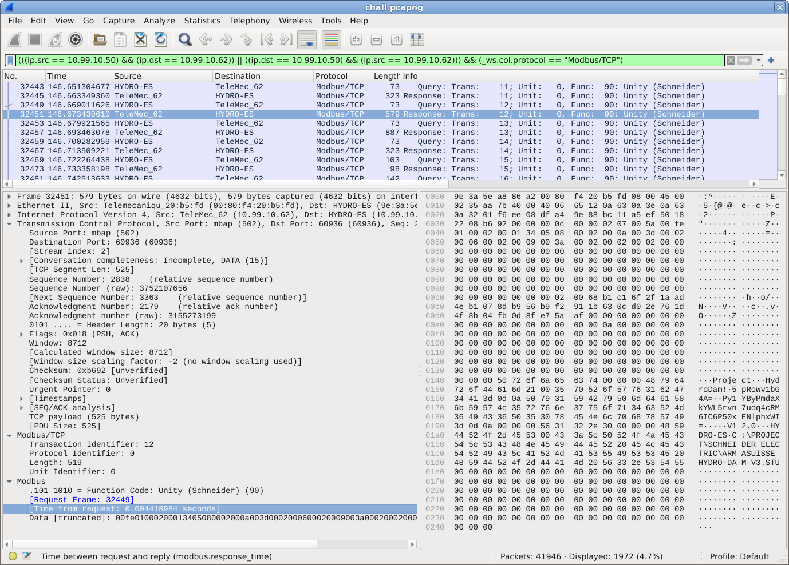

# ot-phone-home

[library.m0unt41n.ch/challenges/ot-phone-home](https://library.m0unt41n.ch/challenges/ot-phone-home)   

# TL;DR

We get a Wireshark dump file, with a description

> *You have gained access to this strategically important hydro dam.*<br>
> *You must find a way to authenticate to the controllers to manipulate the dam's operations.*<br>
> *Luckily, you have found a way to capture network traffic!*<br>
>
> *The flag is `cyberskills23{sha256(bytes("newline terminated pw hash including \x00"))}` and matches the regex: `cyberskills23\{66[0-9a-f]{60}8d\}`*
>
> *Hint: **CVE-2020-28212***

The [hinted CVE](https://nvd.nist.gov/vuln/detail/CVE-2020-28212) is: *Improper Restriction of Excessive Authentication Attempts vulnerability exists in PLC Simulator on EcoStruxure Control Expert (now Unity Pro) (all versions) that could cause unauthorized command execution when a brute force attack is done over Modbus* &#128512;

# Mapping out the network

I could not resist spending some time to map out the various comms going on in the packet trace.



<a name="wireshark"></a>

In context of the CVE, the most interesting part is comms between `HYDRO-ES`
and `TeleMec_62`, using `Modbus/TCP` / `Unity(Schneider)` protocol, also known as
[UMAS](https://github.com/Orange-Cyberdefense/awesome-industrial-protocols/blob/main/protocols/umas.md).
Let's restrict the packets to that:

*   In Wireshark:<br>`(((ip.src == 10.99.10.50) && (ip.dst == 10.99.10.62)) || ((ip.dst == 10.99.10.50) && (ip.src == 10.99.10.62))) && (_ws.col.protocol == "Modbus/TCP")`
*   Dumping respective payloads to a file:<br>`tshark -r chall.pcapng -Y '(((ip.src == 10.99.10.50) && (ip.dst == 10.99.10.62)) || ((ip.dst == 10.99.10.50) && (ip.src == 10.99.10.62))) && (_ws.col.protocol == "Modbus/TCP")' -T fields -e modbus.data > umas.txt`<br>(saved as [umas.txt](https://github.com/mufl0n/mufl0n.github.io/blob/main/shc/misc/ot-phone-home/umas.txt))

Note that there are also many TCP retransmissions happening. Narrowing down the filter
to `_ws.col.protocol == "Modbus/TCP"` helps to hide them. With that, the Wireshark
view becomes:



One particular packet stood out from the start &#128521; and I included it in the
screenshot.

Also, [ARMASUISSE](https://www.ar.admin.ch/en), *cough, cough* &#128521;

# UMAS protocol

The UMAS protocol is proprietary and not officially documented. But, it turns out that there
are many reverse-engineering efforts, probably not least triggered by the vulnerabilities
discovered in it.

Digging deeper around the CVE-2020-28212 hint, I found following interesting documents:

*   Link collection about [UMAS protocol documentation](https://github.com/Orange-Cyberdefense/awesome-industrial-protocols/blob/main/protocols/umas.md).
    This was helpful in initial analysis of the packets.
*   [Original CVE entry](https://cyber.airbus.com/remote-code-execution-on-ecostruxure-plc-simulator) from Airbus. It was
    taken down since, but I found copies in Web Archive:
    [1](https://web.archive.org/web/20240818125100/https://cyber.airbus.com/remote-code-execution-on-ecostruxure-plc-simulator/),
    [2](https://web.archive.org/web/20240420010108/https://cyber.airbus.com/remote-code-execution-on-ecostruxure-plc-simulator/),
    [3](https://web.archive.org/web/20240714044010/https://cyber.airbus.com/remote-code-execution-on-ecostruxure-plc-simulator/).
*   [The secrets of Schneider Electric’s UMAS protocol](https://ics-cert.kaspersky.com/publications/reports/2022/09/29/the-secrets-of-schneider-electrics-umas-protocol/).
*   **[Examining Crypto and Bypassing Authentication in Schneider Electric PLCs (M340/M580)](https://medium.com/tenable-techblog/examining-crypto-and-bypassing-authentication-in-schneider-electric-plcs-m340-m580-f37cf9f3ff34)**<br>I found this to be the most comprehensive explanation of the auth protocol and the vulnerability. Below analysis is following the decsription there.

# Analyzing the PLC auth sequence

Armed with knowledge from above documents, looking at the `umas.txt` saved above, we see
that there is an initial auth sequence using `5a00` prefix and then, once we get the
session ID (`cd`) it is then used for further communication (`5acd` prefix) - except for
commands that don't require authentication, they keep on using `5a00`.

Specifically, the auth sequence is:

```
5a0002
5a00fe063001030000000001030000030006010301000000000c424d582050333420323032300201010000000040000401000000007c02
5a000100
5a00fefd030006000032000000000000
5a00fe00545454545454545454545454545454545454545454545454545454545454545454545454545454545454545454545454545454545454545454545454545454545454545454545454545454545454545454545454545454545454545454545454545454545454545454545454545454545454545454545454545454545454545454545454545454545454545454545454545454545454545454545454545454545454545454545454545454545454545454545454545454545454545454545454545454545454545454545454545454545454545454545454545454545454545454545454545454545454545454545454545454545454545454545454545454545454545454545454545454545454545454545454545454545454545454545454545454545454545454545454545454545454545454545454545454545454545454545454545454545454545454545454545454545454545454545454545454545454545454545454545454545454545454545454545454545454545454545454545454545454545454545454545454545454545454545454545454545454545454545454545454545454545454545454545454545454545454545454545454545454545454545454545454545454545454545454545454545454545454545454545454545454545454545454545454545454545454545454545454545454545454545454545454545454545454545454545454545454545454545454545454545454545454545454545454545454545454545454545454545454545454545454545454545454545454545454545454545454545454545454545454545454545454545454545454545454545454545454545454545454545454545454545454545454545454545454545454545454545454545454545454545454545454545454545454545454545454545454545454545454545454545454545454545454545454545454545454545454545454545454545454545454545454545454545454545454545454545454545454545454545454545454545454545454545454545454545454545454545454545454545454545454545454545454545454545454545454545454545454545454545454545454545454545454545454545454545454545454545454545454545454545454545454545454545454545454545454545454545454545454545454545454545454545454545454545454545454545454545454545454545454545454545454545454545454545454545454545454545454545454545454545454545454545454545454545454545454545454545454545454545454545454545454545454545454545454545454545454545454545454545454545454545454545454545454545454545454545454545454
5a000300
5a00fe060e0000a0e6020000060e0000a0e6020000032935101509e6070419300c1609e6075d0000000850726f6a65637400
5a000304
5a00fe098000000000002a0004000000a800000000002b00500000000002000000002a00840000000004000000002b00a00100000001000000002c0000000000000000000000000000000000000000000000000000000000000000000000000000000000000000000000000000000000
5a0004
5a00fe038600065c4e2110d6d51e1800000000a09c4019a09c401903000000000000000000000000000000000000800000000000000000000000000108040002010000fa00
5a000100
5a00fefd030006000032000000000000
5a00fe00000102030405060708090a0b0c0d0e0f101112131415161718191a1b1c1d1e1f202122232425262728292a2b2c2d2e2f303132333435363738393a3b3c3d3e3f404142434445464748494a4b4c4d4e4f505152535455565758595a5b5c5d5e5f606162636465666768696a6b6c6d6e6f707172737475767778797a7b7c7d7e7f808182838485868788898a8b8c8d8e8f909192939495969798999a9b9c9d9e9fa0a1a2a3a4a5a6a7a8a9aaabacadaeafb0b1b2b3b4b5b6b7b8b9babbbcbdbebfc0c1c2c3c4c5c6c7c8c9cacbcccdcecfd0d1d2d3d4d5d6d7d8d9dadbdcdddedfe0e1e2e3e4e5e6e7e8e9eaebecedeeeff0f1f2f3f4f5f6f7f8f9fafbfcfdfeff000102030405060708090a0b0c0d0e0f101112131415161718191a1b1c1d1e1f202122232425262728292a2b2c2d2e2f303132333435363738393a3b3c3d3e3f404142434445464748494a4b4c4d4e4f505152535455565758595a5b5c5d5e5f606162636465666768696a6b6c6d6e6f707172737475767778797a7b7c7d7e7f808182838485868788898a8b8c8d8e8f909192939495969798999a9b9c9d9e9fa0a1a2a3a4a5a6a7a8a9aaabacadaeafb0b1b2b3b4b5b6b7b8b9babbbcbdbebfc0c1c2c3c4c5c6c7c8c9cacbcccdcecfd0d1d2d3d4d5d6d7d8d9dadbdcdddedfe0e1e2e3e4e5e6e7e8e9eaebecedeeeff0f1f2f3f4f5f6f7f8f9fafbfcfdfeff000102030405060708090a0b0c0d0e0f101112131415161718191a1b1c1d1e1f202122232425262728292a2b2c2d2e2f303132333435363738393a3b3c3d3e3f404142434445464748494a4b4c4d4e4f505152535455565758595a5b5c5d5e5f606162636465666768696a6b6c6d6e6f707172737475767778797a7b7c7d7e7f808182838485868788898a8b8c8d8e8f909192939495969798999a9b9c9d9e9fa0a1a2a3a4a5a6a7a8a9aaabacadaeafb0b1b2b3b4b5b6b7b8b9babbbcbdbebfc0c1c2c3c4c5c6c7c8c9cacbcccdcecfd0d1d2d3d4d5d6d7d8d9dadbdcdddedfe0e1e2e3e4e5e6e7e8e9eaebecedeeeff0f1f2f3f4f5f6f7f8f9fafbfcfdfeff000102030405060708090a0b0c0d0e0f101112131415161718191a1b1c1d1e1f202122232425262728292a2b2c2d2e2f303132333435363738393a3b3c3d3e3f404142434445464748494a4b4c4d4e4f505152535455565758595a5b5c5d5e5f606162636465666768696a6b6c6d6e6f707172737475767778797a7b7c7d7e7f808182838485868788898a8b8c8d8e8f909192939495969798999a9b9c9d9e9fa0a1a2a3a4a5a6a7a8a9aaabacadaeafb0b1b2b3b4b5b6b7b8b9babbbcbdbebfc0c1c2c3c4c5c6c7c8c9cacbcccdcecfd0d1d2d3d4d5d6d7d8d9dadbdcdddedfe0e1e2e3e4e5e6e7e8e9eaebecedeeeff0f1f2f3f4f5f6f7f8
5a0004
5a00fe038600065c4e2110d6d51e1800000000a09c4019a09c401903000000000000000000000000000000000000800000000000000000000000000108040002010000fa00
5a0004
5a00fe038600065c4e2110d6d51e1800000000a09c4019a09c401903000000000000000000000000000000000000800000000000000000000000000108040002010000fa00
5a0020011300000000000001
5a00fe0100010001000100000000000000000000000000000000060e0000a0e6020000060e0000a0e6020000032935101509e6070419300c1609e6070601091401010101010000620920020000003f00000000000000ff00080000000000ff5c4e2110d6d51e1800000000a09c4019a09c4019030000000000000000000000a90f0400a90f0400e6387000eaf702009a0f0400000000009279710000000000020000008f0f040000000000000000000000000000000000000000000000000072000000070000000200000002000000004b00005d0000009d1f000001000000050c0000a4990200000134330a0205e60701000000000000005902000000000000000000000000
5a0020011400000000000002
5a00fe01000200013405080002000a003d0002000600020009003a0002000200020000000000000000000000000000000000000000000000000000000000000000000000000000000000000000000000000000000000000000000000000000000000000000000000000000000000000000000000000000000000020068b1c16f2f1aad4eb1078db956b9f2911b630cd02e761d4f8b04fb0d8fe75aaf00000000000000000000000000000000000a0000000000000000000000000000000000000000000000000000000000000000000000000000000000000000000000000000000000000000000000000000000000000000000000000000000000000000000000000000000050726f6a656374000000487964726f44616d21003570526f577631624734413d0d0a507931594279506d6461586b59574c3572766e37756f713463524d3649433650353078454e6c70687857493d0d0a0000005631322e30000000485944524f2d455300433a5c50524f4a4543545c5343484e454944455220454c4543545249435c41524d4153554953534520485944524f2d44414d2056332e535455000000000000000000000000000000000000000000000000000000000000000000000000000000000000000000000000000000000000000000000000000000000000000000000000000000000000000000000000000000000000000000000000000000
5a0020011400000200003403
5a00fe01340300000000000000000000000000000000000000000000000000000000000000000000000000000000000000000000000000000000000000000000000000000000000000000000000000000000000000000000000000000000000000000000000000000000000000000000000000000000000000000000000000000000000000000000000000000000000000000000000000000000000000000000000000000000000000000000000000000000000000000000000000000000000000000000000000000000000000000000000000000000000000000000000000000000000000000000000000000000000000000000000000000000000000000000000000000000000000000000000000000000000000000000000000000000000000000000000000000000000000000000000000000000000000000000000000000000000000000000000000000000000000000000000000000000000000000000000000000000000000000000000000000000000000000000000000000000000000000000000000000000000000000000000000000000000000000000000000000000000000000000000000000000000000000000000000000000000000000000000000000000000000000000000000000000000000000000000000000000000000000000000000000000000000000000000000000000000000000000000000000000000000000000000000000000000000000000000000000000000000000000000000000000000000000000000000000000000000000000000000000000000000000000000000000000000000000000000000000000000000000000000000000000000000000000000000000000000000000000000000000000000000000000000000000000000000000000000000000000000000000000000000000000000000000000000000000000000000000000000000000000000000000000000000000000000000000000000000000000000000000000000000000000000000000000000000000000000000000000000000000000000000000000000000000000000000000000000000000000000000000000000000000000000000000000000000000000000000000000000000000000000000000000000000000000
5a0020011300000000000001
5a00fe0100010001000100000000000000000000000000000000060e0000a0e6020000060e0000a0e6020000032935101509e6070419300c1609e6070601091401010101010000620920020000003f00000000000000ff00080000000000ff5c4e2110d6d51e1800000000a09c4019a09c4019030000000000000000000000a90f0400a90f0400e6387000eaf702009a0f0400000000009279710000000000020000008f0f040000000000000000000000000000000000000000000000000072000000070000000200000002000000004b00005d0000009d1f000001000000050c0000a4990200000134330a0205e60701000000000000005902000000000000000000000000
5a006e02a6100000dd250db9eecbd15871afef1c13899c48a73cf5512123ebe734a88b35dad53e9d0000
5a00feaaaadf312fa8741c8540ec4d65516a195cd74936bb5bed45ca8cf36231ac88167f38
5a0010a610000049485944524f2d45530061373064663937366432333666386663333938316162376462643262356330393662353966646364323661656665323734623035376465333030383737306436
5a00fecd
```

Let's dissect it, using information in the above documentation.

## `READ_ID`

**Query**: `5a0002`<br>
**Response**:<br>
`5a00fe063001030000000001030000030006010301000000000c424d582050333420323032300201010000000040000401000000007c02`

What do we see here:

*   `5a`: UMAS, `00`: SID, `fe`: OK
*   `0630`: PLC Type: `0x30`, PLC Family: `0x06`
*   `0103`: PLC ID
*   `00000000`: (unknown)
*   `0103`: **Firmware: 3.01** - this is important. That's exactly where the vendor introduced
    the **basic** Application Password scheme. This means that we are in the "medium difficulty" scenario from
    [this post](https://medium.com/tenable-techblog/examining-crypto-and-bypassing-authentication-in-schneider-electric-plcs-m340-m580-f37cf9f3ff34),
    i.e. the strong hashing described at the end of the article is **not** enabled.
*   `0000`: (unknown)
*   `0300`: `Ir`: 3
*   `06010301`: `HwId`
*   `00000000`: `FwLoc`
*   `0c`: Device text length
*   `424d5820503334203230323`: `BMX P34 2020`
*   `00201010000000040000401000000007c02`: (unknown)

## `INIT_COMM`

**Query**: `5a000100`<br>
**Response**:<br>
`5a00fefd030006000032000000000000`<br>
`5a00fe00545454(...)545454`

Seems like a generic transmission test. It is repeated later, with various payload patterns.

## `READ_PROJECT_INFO #0`

**Query**: `5a000300`<br>
**Response**:<br>
`5a00fe060e0000a0e6020000060e0000a0e6020000032935101509e6070419300c1609e6075d0000000850726f6a65637400`

*   `5A`: UMAS, `00`: SID, `fe`: OK
*   `060e0000a0e6020000`: (unknown)
*   `060e0000a0e6020000`: (unknown)
*   `032935101509e607` `0419300c1609e607`: Date/time
*   `5d00`: Version
*   `0000`: (unknown)
*   `08`: Project name length (incl. `\0`)
*   `50726f6a65637400`: Project name

## `READ_PROJECT_INFO #4`

**Query**: `5a000304`<br>
**Response**:<br>
`5a00fe098000000000002a0004000000a800000000002b00500000000002000000002a00840000000004000000002b00a00100000001000000002c00(...)`

(nothing interesting here)

## `READ_PLC_INFO`

**Query**: `5a0004`
**Response**:<br>
`5a00fe_038600065c4e2110d6d51e1800000000a09c4019a09c401903000000000000000000000000000000000000800000000000000000000000000108040002010000fa00`

Another periodic request. What do we have here (see [documentation](http://lirasenlared.blogspot.com/2017/08/the-unity-umas-protocol-part-i.html)):

*   `5A`: UMAS, `00`: SID, `fe`: OK
*   `038600`: Ignored
*   `06`: six 32-bit blocks to read next
*   `5c4e2110`: (unknown)
*   `d6d51e18`: (unknown)
*   `00000000`: (unknown)
*   `a09c4019`: Application signature
*   `a09c4019`: Application signature
*   `03000000`: (unknown)
*   `00000000000000000000000000000080`: (unknown)
*   `00`: SD card is not write protected
*   `000000000000000000000001080400`: (unknown)
*   `02`: PLC is on
*   `010000fa00`: (unknown)

Interesting stuff, but we are not likely to need any of that.

## `INIT_COMM`

**Query**: `5a000100`<br>
**Response**:<br>
`5a00fefd030006000032000000000000`<br>
`5a00fe00000102030405060708090a0b0c0d0e0f(...)f0f1f2f3f4f5f6f7f8`

Another transmission test sequence.


## `READ_PLC_INFO`

**Query**: `5a0004`, same as above.

## `READ_PLC_INFO`

**Query**: `5a0004`, same as above.

## `READ_MEM`

**Query**: `5a0020011300000000000001`

*   `5a`: UMAS, `00`: SID, `2001`: `READ_MEM`
*   `1300`: Block number
*   `0000`: Start offset
*   `0000`: (unknown)
*   `0001`: Length

So, we are reading `0x100` bytes from block `0x0013` at offset `0x000`.

### Response:

```
5a00fe_0100010001000100000000000000000000000000000000060e0000a0e6020000060e0000a0e6020000032935101509e6070419300c1609e6070601091401010101010000620920020000003f00000000000000ff00080000000000ff5c4e2110d6d51e1800000000a09c4019a09c4019030000000000000000000000a90f0400a90f0400e6387000eaf702009a0f0400000000009279710000000000020000008f0f040000000000000000000000000000000000000000000000000072000000070000000200000002000000004b00005d0000009d1f000001000000050c0000a4990200000134330a0205e60701000000000000005902000000000000000000000000
```

This is not mentioned in the
[article](https://medium.com/tenable-techblog/examining-crypto-and-bypassing-authentication-in-schneider-electric-plcs-m340-m580-f37cf9f3ff34), so we'll skip it for now.


## `READ_MEM`

**Query**: `5a0020011400000000000002`

*   `5a`: UMAS, `00`: SID, `2001`: `READ_MEM`
*   `1400`: Block number
*   `0000`: Start offset
*   `0000`: (unknown)
*   `0002`: Length

So, we are reading `0x0200` bytes from block `0x0014` at offset `0x0000`. This is the key packet
(and also the one shown on the [Wireshark screenshot above](#wireshark))

### Response:

```
5a00fe01000200013405080002000a003d0002000600020009003a0002000200020000000000000000000000000000000000000000000000000000000000000000000000000000000000000000000000000000000000000000000000000000000000000000000000000000000000000000000000000000000000020068b1c16f2f1aad4eb1078db956b9f2911b630cd02e761d4f8b04fb0d8fe75aaf00000000000000000000000000000000000a0000000000000000000000000000000000000000000000000000000000000000000000000000000000000000000000000000000000000000000000000000000000000000000000000000000000000000000000000000000050726f6a656374000000487964726f44616d21003570526f577631624734413d0d0a507931594279506d6461586b59574c3572766e37756f713463524d3649433650353078454e6c70687857493d0d0a0000005631322e30000000485944524f2d455300433a5c50524f4a4543545c5343484e454944455220454c4543545249435c41524d4153554953534520485944524f2d44414d2056332e535455000000000000000000000000000000000000000000000000000000000000000000000000000000000000000000000000000000000000000000000000000000000000000000000000000000000000000000000000000000000000000000000000000000
```

There is a lot of interesting information here. There is a slight difference from the
[article](https://medium.com/tenable-techblog/examining-crypto-and-bypassing-authentication-in-schneider-electric-plcs-m340-m580-f37cf9f3ff34)
in that, there, the analysis is over 256 bytes read from offset `0x00ff` and here, we have
512 bytes from offset `0x0000`. But otherwise, there is a perfect match with he findings there:

*   `5a`: UMAS, `00`: SID, `fe`: OK
*   (more extra data because of the difference above)
*   `50726f6a656374000000`: `Project\0\0\0` - project name
*   `487964726f44616d2100`: **`HydroDam!\0`** - looks plain text?
*   `3570526f577631624734413d0d0a`: Base64 string: **`5pRoWv1bG4A=\r\n`**
*   `507931594279506d6461586b59574c3572766e37756f713463524d3649433650353078454e6c70687857493d0d0a00`: Base64 string: **`Py1YByPmdaXkYWL5rvn7uoq4cRM6IC6P50xENlphxWI=\r\n\0\0\0`**
*   `5631322e300`: String: `V12.0\0\0\0`
*   `485944524f2d455300`: String: `HYDRO-ES\0`
*   `433a5c50524f4a4543545c5343484e454944455220454c4543545249435c41524d4153554953534520485944524f2d44414d2056332e53545500`: String: `C:\PROJECT\SCHNEIDER ELECTRIC\ARMASUISSE HYDRO-DAM V3.STU\0\0\0`
*   `0000...`: Padding

This information will be used in the hashing process below!

## `READ_MEM`

**Query**: `5a0020011400000200003403`<br>
**Response**: `5a00fe013403000000(...)`

This reads `0x0334` bytes from block `0x0014` at offset `0x0000`. But, not needed for the analysis (and
these are mostly zeros anyway).

## `READ_MEM`

**Query**: `5a0020011300000000000001`<br>
**Response**: `5a00fe0100010001000100000000000000000000000000000000060e0000a0e602(...)`

This reads `0x0100` bytes from block `0x0013` at offset `0x0000`. There is quite a bit of non-zero
data in the response, but not relevant to the analysis / not mentioned in the
article.

## `GET_NONCE`

**Query**: `5a006e02a6100000dd250db9eecbd15871afef1c13899c48a73cf5512123ebe734a88b35dad53e9d0000`

*   `5a`: UMAS, `00`: SID, `6e`: `GET_NONCE`
*   `02a6100000`: (unknown)
*   `dd250db9eecbd15871afef1c13899c48a73cf5512123ebe734a88b35dad53e9d`:<br>
    **Client nonce** (random 32 bytes generated by client)
*   `0000`: terminator

**Response**: `5a00feaaaadf312fa8741c8540ec4d65516a195cd74936bb5bed45ca8cf36231ac88167f38`

*   `5a`: UMAS, `00`: SID, `fe`: OK
*   `aaaa`: Padding
*   `df312fa8741c8540ec4d65516a195cd74936bb5bed45ca8cf36231ac88167f38`:<br>
     **Server nonce** (32 bytes response from the server)

## `RESERVE_PLC`

**Query**:<br>`5a0010a610000049485944524f2d45530061373064663937366432333666386663333938316162376462643262356330393662353966646364323661656665323734623035376465333030383737306436`

*   `5a`: UMAS, `00`: SID, `10`: `RESERVE_PLC`
*   `a6100000`: (unknown)
*   `49485944524f2d455300`: client name (`IHYDRO-ES\0`).<br>
    Looks like a random character prefix gets added (it's `P` in the article)
*   `61373064663937366432333666386663333938316162376462643262356330393662353966646364323661656665323734623035376465333030383737306436`:<br>
    ASCII representation of a SHA256 hash (described below)

**Response**: `5a00fecd`

*   `5a`: UMAS, `00`: SID, `fe`: OK
*   `CD`: new session ID


# How is the SHA256 hash calculated

To recap, let's map the data so far to the terms used in the
[article](https://medium.com/tenable-techblog/examining-crypto-and-bypassing-authentication-in-schneider-electric-plcs-m340-m580-f37cf9f3ff34):

*   **Password**: `HydroDam!`. Note that the article describes an optionally enabled hashing
    scheme for this. But, that hash apparently only allows `A-Z0-9`. Therefore this must be
    a plain text password. Besides, it looks like one &#128578;
*   **First Base64 string**: `5pRoWv1bG4A=\r\n`
*   **Second Base64 String**: `Py1YByPmdaXkYWL5rvn7uoq4cRM6IC6P50xENlphxWI=\r\n\0\0\0`
*   **Client nonce**: `dd250db9eecbd15871afef1c13899c48a73cf5512123ebe734a88b35dad53e9d`
*   **Server nonce**: `df312fa8741c8540ec4d65516a195cd74936bb5bed45ca8cf36231ac88167f38`

## Step 1: Verify the password against Base64 strings

*   First Base64 string (`5pRoWv1bG4A=`), [decoded](https://gchq.github.io/CyberChef/#recipe=From_Base64('A-Za-z0-9%2B/%3D',true,false)To_Hex('None',0)&input=NXBSb1d2MWJHNEE9): **`e694685afd5b1b80`**
*   Password (`HydroDam!`), [UTF-16 encoded](https://gchq.github.io/CyberChef/#recipe=To_Hex('None',0)&input=SAB5AGQAcgBvAEQAYQBtACEA&ienc=1200): **`48007900640072006f00440061006d002100`**
*   [SHA256 of both these combined](https://gchq.github.io/CyberChef/#recipe=From_Hex('Auto')SHA2('256',64,160)&input=ZTY5NDY4NWFmZDViMWI4MDQ4MDA3OTAwNjQwMDcyMDA2ZjAwNDQwMDYxMDA2ZDAwMjEwMA): **`3f2d580723e675a5e46162f9aef9fbba8ab871133a202e8fe74c44365a61c562`**
*   That hash should match the [decoded second Base64 string](https://gchq.github.io/CyberChef/#recipe=From_Base64('A-Za-z0-9%2B/%3D',true,false)To_Hex('None',0)&input=UHkxWUJ5UG1kYVhrWVdMNXJ2bjd1b3E0Y1JNNklDNlA1MHhFTmxwaHhXST0) - and it does!

## Step 2: Calculate SHA256 of nonces + Base64 strings

*   Server nonce: **`df312fa8741c8540ec4d65516a195cd74936bb5bed45ca8cf36231ac88167f38`**
*   Base64 strings combined:
    *   As string: **`5pRoWv1bG4A=\r\nPy1YByPmdaXkYWL5rvn7uoq4cRM6IC6P50xENlphxWI=\r\n`**
    *   [Hex encoded](https://gchq.github.io/CyberChef/#recipe=Unescape_Unicode_Characters('%5C%5Cu')To_Hex('None',0)&input=NXBSb1d2MWJHNEE9XHUwMDBEXHUwMDBBUHkxWUJ5UG1kYVhrWVdMNXJ2bjd1b3E0Y1JNNklDNlA1MHhFTmxwaHhXST1cdTAwMERcdTAwMEE): **`3570526f577631624734413d0d0a507931594279506d6461586b59574c3572766e37756f713463524d3649433650353078454e6c70687857493d0d0a`**
*   client nonce: **`dd250db9eecbd15871afef1c13899c48a73cf5512123ebe734a88b35dad53e9d`**

[SHA256](https://gchq.github.io/CyberChef/#recipe=From_Hex('Auto')SHA2('256',64,160)&input=ZGYzMTJmYTg3NDFjODU0MGVjNGQ2NTUxNmExOTVjZDc0OTM2YmI1YmVkNDVjYThjZjM2MjMxYWM4ODE2N2YzODM1NzA1MjZmNTc3NjMxNjI0NzM0NDEzZDBkMGE1MDc5MzE1OTQyNzk1MDZkNjQ2MTU4NmI1OTU3NGMzNTcyNzY2ZTM3NzU2ZjcxMzQ2MzUyNGQzNjQ5NDMzNjUwMzUzMDc4NDU0ZTZjNzA2ODc4NTc0OTNkMGQwYWRkMjUwZGI5ZWVjYmQxNTg3MWFmZWYxYzEzODk5YzQ4YTczY2Y1NTEyMTIzZWJlNzM0YTg4YjM1ZGFkNTNlOWQ) of these three things combined is: `a70df976d236f8fc3981ab7dbd2b5c096b59fdcd26aefe274b057de3008770d6`.
And [its ASCII version](https://gchq.github.io/CyberChef/#recipe=From_Hex('Auto')SHA2('256',64,160)To_Hex('None',0)&input=ZGYzMTJmYTg3NDFjODU0MGVjNGQ2NTUxNmExOTVjZDc0OTM2YmI1YmVkNDVjYThjZjM2MjMxYWM4ODE2N2YzODM1NzA1MjZmNTc3NjMxNjI0NzM0NDEzZDBkMGE1MDc5MzE1OTQyNzk1MDZkNjQ2MTU4NmI1OTU3NGMzNTcyNzY2ZTM3NzU2ZjcxMzQ2MzUyNGQzNjQ5NDMzNjUwMzUzMDc4NDU0ZTZjNzA2ODc4NTc0OTNkMGQwYWRkMjUwZGI5ZWVjYmQxNTg3MWFmZWYxYzEzODk5YzQ4YTczY2Y1NTEyMTIzZWJlNzM0YTg4YjM1ZGFkNTNlOWQ&oeol=CR) is: **`61373064663937366432333666386663333938316162376462643262356330393662353966646364323661656665323734623035376465333030383737306436`** - which **matches the hash that we sent in the RESERVE_PLC command above!**.

Q.E.D. - we can now claim that we understand the auth exchange in the packet dump &#128522;

# But, the flag?...

> *The flag is cyberskills23{sha256(bytes("newline terminated pw hash including \x00"))}*<br>
> *and matches the regex: `cyberskills23\{66[0-9a-f]{60}8d\}`*

Figuring out *"what the author had in mind here"* was probably the most ambiguous
part of the challenge &#128512; With all the rev-eng above, I probably knew *too much*
about the protocol at this point, and I had more questions come to mind:

*   *What "PW hash"? We did not calculate any here!*
*   *None of the hex / Base64 strings are technically speaking a "PW hash" either!*
*   *Or do you mean the hash of `HydroDam!`? But none of the hashes that I tried on it worked!*

At some point I gave up and just wrote a small Python program [findhash.py](https://github.com/mufl0n/mufl0n.github.io/blob/main/shc/misc/ot-phone-home/findhash.py),
that took all above hex strings, generated their hex-encoded / hex-decoded / Base64-encoded /
Base64-decoded versions. Then, tried padding all of them with all combinations of
`\0`, `\n`, `\r`. And then, generated SHA256 of all these permutations, looking
for a match to the `66...8d` pattern.

... and sure enough, that worked. Obvious in hindsight, the intended input was:
*"both Base64 strings, including their `\r\n` and final `\0`"*:

```python
import hashlib
s = b'5pRoWv1bG4A=\r\nPy1YByPmdaXkYWL5rvn7uoq4cRM6IC6P50xENlphxWI=\r\n\x00'
print(hashlib.sha256(s).hexdigest())
```

---

## `cyberskills23{667ff883575ee8e108b0ed79c1cf6f3f1530000d971b9181e2a5e3b0b347558d}`


<hr>

&copy; [muflon77](https://library.m0unt41n.ch/players/805ae1c8-9fe4-5816-b4a4-5057fa6eedb1)
