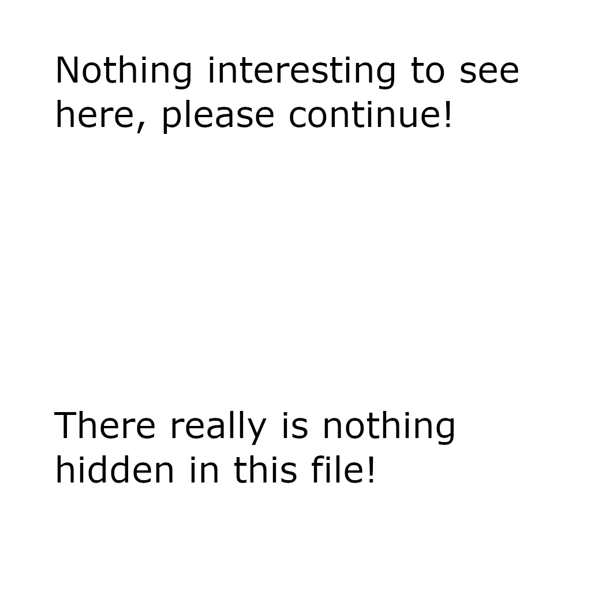

# polyglot

[library.m0unt41n.ch/challenges/polyglot](https://library.m0unt41n.ch/challenges/polyglot)   

# TL;DR

We get a PNG file:



When displaying it with ImageMagick, we notice:

```
$ display polyglot.png 
display: IDAT: Extra compressed data `writeup.png' @ warning/png.c/MagickPNGWarningHandler/1526.
```

Looking with a hex editor, there is a `PK` somewhere towards the end of the file. 
Key observation: there is something like a ZIP file at the end of the file -
and then, `flag.txt` string.

```
$ binwalk -e polyglot.png 
DECIMAL  HEXADECIMAL  DESCRIPTION
------------------------------------------------------------------------
0        0x0          PNG image, 1024 x 1024, 8-bit/color RGBA, non-interlaced
41       0x29         Zlib compressed data, best compression
33199    0x81AF       Zip archive data, at least v2.0 to extract, compressed size: 33, uncompressed size: 34, name: flag.txt

$ ls -l _polyglot.png.extracted/
-rw-r--r--. 1 muflon muflon 4195328 Sep 26 23:36 29
-rw-r--r--. 1 muflon muflon   33373 Sep 26 23:36 29.zlib
-rw-r--r--. 1 muflon muflon     215 Sep 26 23:36 81AF.zip
-rw-r--r--. 1 muflon muflon      34 Apr 18 17:16 flag.txt

$ cat _polyglot.png.extracted/flag.txt
flag{well_what_the_h3ll_i5_th1s?}
```

---

## `flag{well_what_the_h3ll_i5_th1s?}`


<hr>

&copy; [muflon77](https://library.m0unt41n.ch/players/805ae1c8-9fe4-5816-b4a4-5057fa6eedb1)
