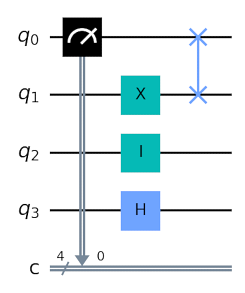

# quantum

[library.m0unt41n.ch/challenges/quantum](https://library.m0unt41n.ch/challenges/quantum)   

# TL;DR

We get a Python script plus some [Qiskit](https://www.ibm.com/quantum/qiskit) diagrams.

# The script

The Python script:

```python
#!/usr/bin/env python3

import hashlib

from Crypto.Util.Padding import pad, unpad
from Cryptodome.Cipher import AES

from backports.pbkdf2 import pbkdf2_hmac

SALT = b'LA_LI_LU_LE_LO_ARE_THE_PATRIOTS'

ENCRYPTED_FLAG = b'K\xd3W\xf9\x90\x121\xb5\xd2\x88\xc45y1\x8f\xe9\xd6\x7f!\xb1\xfa\xaa\x89J\xf5u8\xb4_\x1f@\x1b\xb5\xec\xaea\x13\xdc\xf2\xf7\x8eH\x07\x9c\xa4\xc1]\xf2'

# circuit passwords
circ1_pw = b''
circ2_pw = b''
circ3_pw = b''

print('[...] This will take a moment...')

# circuit 1
circ1_key = pbkdf2_hmac("sha256", circ1_pw, SALT, 5000000, 32)
assert circ1_key == b"`6~QAS\x8c;\x9c\x7f\xaa\xdc\xf9ood\xb1ASs2I.\xb1\x17\xb0<\x8f'>\x10\x80"
print('[+] Circuit 1 Password is correct! ')


# circuit 2
circ2_key = pbkdf2_hmac("sha256", circ2_pw, SALT, 5000000, 32)
assert circ2_key == b'\xe4.\xfb\xfd\xc2f\xd0\xe3\xd4\xb4\x86Z\xad\x95%\x8fX\x11\xe9\x07\xf6\xb9*\x087\x11\xd3\x95\x03\x12}\x8f'
print('[+] Circuit 2 Password is correct! ')


# circuit 3
circ3_key = pbkdf2_hmac("sha256", circ3_pw, SALT, 1337, 32)
print(circ3_key)
assert circ3_key == b'\xa7[\x90\x9d\xfae\xc5\x03?\xa6\x95\\\x1b\\\x03Pc\xf7\xfe\xf6\xb5\xad\xf8f\x10\x7f\x86\xc8\xe1\xa6O\xf6'
print('[+] Circuit 3 Password is correct! ')

# decrypt flag
AES_KEY = hashlib.md5(circ1_pw + circ2_pw + circ3_pw).hexdigest().encode('ascii')
aes_decrypter = AES.new(AES_KEY, AES.MODE_ECB)
print('[+] Flag: ' + unpad(aes_decrypter.decrypt(ENCRYPTED_FLAG),16).decode('ascii'))
```

Note: this needs some modules from pip:

```
pip install pycryptodome pycryptodomex backports.pbkdf2
```

# The diagrams

And then, we get a few images, which look like some circuit diagrams.
There is a hint in the challenge:

> Check out these quantum circuits, we suspect they were generated using qiskit,
> maybe you can rebuild them and understand them?
> Attention: The first qubit will be at the end of the password string, so
> suppose there are 4 qubites: 1, 0, 0, 0 the password string will be b"0001"

# Creating circuits in qiskit

[ Note: this was not needed, see later for a way to read the diagrams directly ]

[Qiskit](https://www.ibm.com/quantum/qiskit) is a SDK for working with quantum
computers. It is an OpenSource project maintained by IBM
([github.com/Qiskit](https://github.com/Qiskit)) and main documentation can
be found on [docs.quantum.ibm.com/api/qiskit](https://docs.quantum.ibm.com/api/qiskit).

The `QuantumCircuit` is documented
[here](https://docs.quantum.ibm.com/api/qiskit/0.28/qiskit.circuit.QuantumCircuit).
Looking through
[hello world example](https://docs.quantum.ibm.com/guides/hello-world)
and mapping it to what we see on provided diagrams, it seems that we use
following elements:

*   [H Gate](https://docs.quantum.ibm.com/api/qiskit/qiskit.circuit.library.HGate)
*   [I Gate](https://docs.quantum.ibm.com/api/qiskit/qiskit.circuit.library.IGate) 
*   [X Gate](https://docs.quantum.ibm.com/api/qiskit/qiskit.circuit.library.XGate)
*   [Swap Gate](https://docs.quantum.ibm.com/api/qiskit/qiskit.circuit.library.SwapGate)
*   [Measure](https://docs.quantum.ibm.com/api/qiskit/circuit#measure)

All these do some operations on the qubits. But, of course, we are not experts in
quantum computers &#128578; so, let's try to just recreate the circuits.

```python
# pip install qiskit matplotlib qiskit_aer
from qiskit import QuantumCircuit, transpile
from qiskit_aer import AerSimulator

c = QuantumCircuit(4,4)
c.measure(0,0)
c.x(1)
c.id(2)
c.h(3)
c.swap(0,1)
c.draw(output='mpl', filename='gates.png', style='clifford')
```
Output



Looks pretty similar to provided diagrams.

# Simulating the circuits

From [StackOverflow example](https://quantumcomputing.stackexchange.com/questions/38590/simple-basic-qiskit-example-program)
(and with extra data from documentation / source:
[1](https://github.com/Qiskit/qiskit-aer/blob/main/qiskit_aer/backends/aer_simulator.py#L1006),
[2](https://github.com/Qiskit/qiskit-aer/blob/main/qiskit_aer/backends/aer_simulator.py#L139))

```python
backend = AerSimulator(method="stabilizer")
qc_compiled = transpile(c, backend)
job_sim = backend.run(qc_compiled, shots=1024)
result_sim = job_sim.result()
counts = result_sim.get_counts(qc_compiled)
print(counts)
```
Result: `{'0000': 1024}`. So, all four output bits have stabilized at 0. This works.

# Recreating and simulating the provided circuits

With that, we can recreate the circuits that were provided in the challenge.
This is quite painful, but doesn't take *that* long. See
[simulate.py](https://github.com/mufl0n/mufl0n.github.io/blob/main/shc/misc/quantum/simulate.py) - that produces pictures identical to the
initial ones.

Now, simulating the circuits provides mixed results:

```
0100010101010001010101000101010100010101010001010101000101010100
1000101010100010101010001010101000101010100010101010001010101000
Traceback (most recent call last):
(...)
qiskit.exceptions.QiskitError: 'Multiple values have the same maximum counts: 0000000000000000000000000000000000000000000000000000001011100010,0000000000000000000000000000000000000000000000000000000100000110'
```

# Testing the passwords

Let's update the first two passwords in `flag.py`:
```
circ1_pw = b'0100010101010001010101000101010100010101010001010101000101010100'
circ2_pw = b'1000101010100010101010001010101000101010100010101010001010101000'
```
They work!
```
$ ./
flag.py 
[...] This will take a moment...
[+] Circuit 1 Password is correct! 
[+] Circuit 2 Password is correct! 
(...)
AssertionError
```
But we still don't have the third one

# Cracking the third password

Two important observations:

*   All the results from the simulation use only low 10 bits. (There is a
    good explanation why, we'll get to it later)
*   Compared to other two, hash of the third password was obtained with
    only 1337 iterations.

This is enough for brute-forcing. Insert before checking `circ3_key`:

```python
# crack circuit3 password
import itertools
print('[*] Cracking Circuit 3 Password... ')
for pw in itertools.product(b'01', repeat=10):
    circ3_pw = (54*b'0')+bytes(pw)+b'1'
    h = pbkdf2_hmac("sha256", circ3_pw, SALT, 1337, 32)
    if h == b'\xa7[\x90\x9d\xfae\xc5\x03?\xa6\x95\\\x1b\\\x03Pc\xf7\xfe\xf6\xb5\xad\xf8f\x10\x7f\x86\xc8\xe1\xa6O\xf6':
        print('[!] Circuit 3 Password Found: ', circ3_pw)
        break
```

With that,

```
$ ./flag.py 
[...] This will take a moment...
[+] Circuit 1 Password is correct! 
[+] Circuit 2 Password is correct! 
[*] Cracking Circuit 3 Password... 
[!] Circuit 3 Password Found:  b'0000000000000000000000000000000000000000000000000000001111000011'
b'\xa7[\x90\x9d\xfae\xc5\x03?\xa6\x95\\\x1b\\\x03Pc\xf7\xfe\xf6\xb5\xad\xf8f\x10\x7f\x86\xc8\xe1\xa6O\xf6'
[+] Circuit 3 Password is correct! 
[+] Flag: shc2023{p4tr10t_q4ntum_c1rcu1t_3ng1n33r1ng}
```

# Did we have to recreate the circuits?

No. The circuit diagrams actually have a simple interpretation in terms of
digital logic:

*    All qubits start with `0` by default
*    `I-gate` is a no-op
*    `X-gate` is a negation
*    `Swap-gate` does what it says :) swaps the signal between two lines
*    `Measure` returns the output on the given bit

With this information, we can trace the signals on first two diagrams and
compute the outputs and the passwords.

Third circuit is more problematic - it has a `H Gate`. Looking at
[documentation](https://docs.quantum.ibm.com/api/qiskit/qiskit.circuit.library.HGate),
we see:

> Single-qubit Hadamard gate. This gate is a pi rotation about the X+Z axis

We see this in the third diagram. There are two cases:

*    For bits [0-9] it is applied once and the result seems to be random
     *   (further reading: this is called *"Superposition"* - where the qubit
         is in both states at once, and observed values will be random - which
         is exactly what we saw in simulation).
*    For other bits it is always applied even number of times. And, if a single
     pass is "rotation by pi" then, **all these are effectively no-op**. This
     explains why the bits [10-63] are always returned as zero.

Overall, this explains what we saw in simulation and would've been enough to
reverse-engineer the circuits without simulating them.

---

## `shc2023{p4tr10t_q4ntum_c1rcu1t_3ng1n33r1ng}`


<hr>

&copy; [muflon77](https://library.m0unt41n.ch/players/805ae1c8-9fe4-5816-b4a4-5057fa6eedb1)
