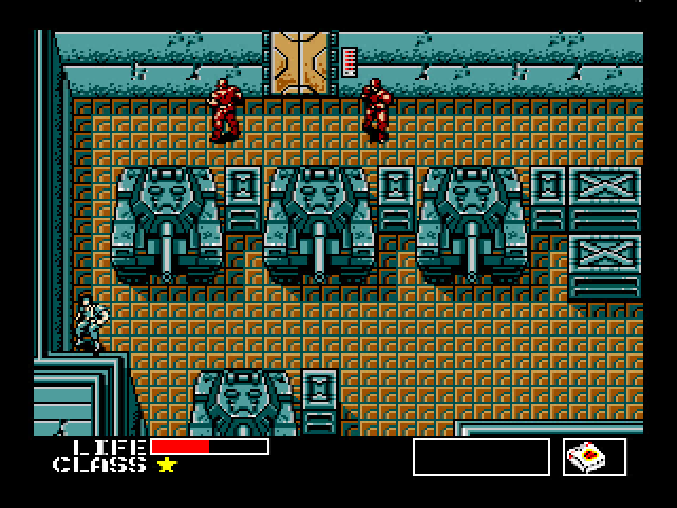
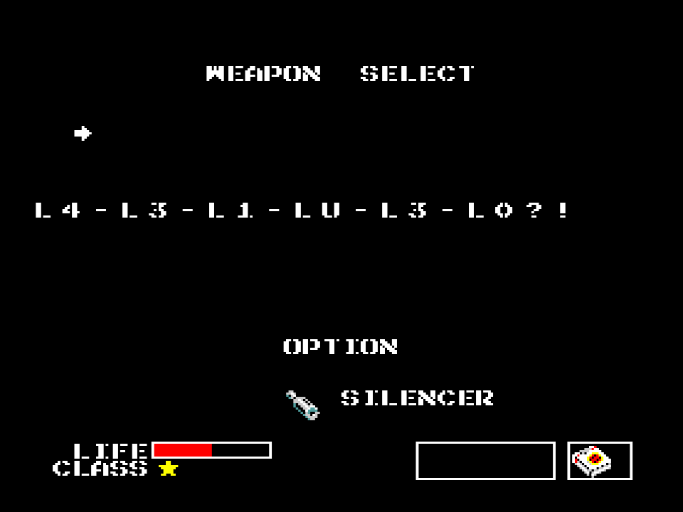

# corrupted-gear

[library.m0unt41n.ch/challenges/corrupted-gear](https://library.m0unt41n.ch/challenges/corrupted-gear)   

# TL;DR

So, we get a `.tar.gz` file with a source of a MSX game written in assembly.

This was a super fun challenge! Admittedly, I had a bit of a head start here as,
back in the 90s I did quite a bit of Z80 assembly, including a bit of MSX &#128578;
So, back2roots and somewhat familiar ground.

# Making it work

So, at first, with sjasm v0.42c, we get plenty of errors, mainly in `constants/structures.asm`:

```
$ tar xzf corrupted-gear.tar.gz ; cd corrupted-gear
$ sjasm CorruptedGear.asm CorruptedGear.rom
Sjasm Z80 Assembler v0.42c - www.xl2s.tk
constants/structures.asm(3) : Syntax error
constants/structures.asm(4) : Syntax error

constants/structures.asm(3672) : Syntax error
constants/structures.asm(3673) : Syntax error
Banks0123.asm(45) : Label not found: idxSoundData
Banks0123.asm(421) : Label not found: UpdateSound
Banks0123.asm(628) : Label not found: SetSound
Banks0123.asm(1639) : Illegal operand
Banks0123.asm(1641) : Illegal operand
Banks456.asm(5) : Error opening file: sound/sound.asm
```

Google: [sjasm structures.asm "syntax error"](https://www.google.com/search?q=sjasm+structures.asm+"syntax+error") &#x21D2; [Metal Gear annotated disassembly published](https://www.msx.org/news/en/metal-gear-annotated-disassembly-published)

>> during the assembly I get a lot of error: 'constants\structures.asm: syntax error
>
> As stated in the "How to assemble" section, you have to use Sjasm 0.39 or compatible assembler.

Google: [sjasm 0.39](https://www.google.com/search?q=sjasm+0.39) &#x21D2; [github.com/istvan-v/sjasmep](https://github.com/istvan-v/sjasmep)


```
$ git clone https://github.com/istvan-v/sjasmep
$ cd sjasmep
$ make
$ ls -l sjasm
-rwxr-xr-x. 1 muflon muflon 126208 Sep  9 21:04 sjasm
$ cd ..
```

And now

```
$ sjasmep/sjasm CorruptedGear.asm CorruptedGear.rom 
SjASM Z80 Assembler v0.39g6 - www.xl2s.tk
Error opening file: sound/sound.asm
```

... well, I don't think that the author wrote the entire game from scratch? Google: [banks0123.asm](https://www.google.com/search?q=banks0123.asm) &#x21D2; [github.com/GuillianSeed/MetalGear](https://github.com/GuillianSeed/MetalGear). *"Fully annotated disassembly of the original Metal Gear game"* &#128578; Good. We can use it as a baseline.

```
$ mkdir mod ; mv * mod ; mv mod/sjasmep .
$ git clone https://github.com/GuillianSeed/MetalGear
$ mv MetalGear orig
```

And it sure does have the `sound` directory:

```
$ cp -Ra orig/sound mod
$ cd mod
$ ../sjasmep/sjasm CorruptedGear.asm CorruptedGear.rom
SjASM Z80 Assembler v0.39g6 - www.xl2s.tk
Pass 1 complete (0 errors)
Pass 2 complete
Errors: 0
$ openmsx CorruptedGear.rom
```
... and it works like a charm! [strategywiki.org](http://strategywiki.org/wiki/Metal_Gear/Gameplay)
has a bit more information about the gameplay and [openmsx.org](https://openmsx.org/manual/user.html)
has the emulator manual.

# Getting a diff

A simple `diff -r` shows large amount of diffs. But, inspecting specific files, the main difference seems
to be that the modified version has stripped all (most?) of the comments. Let's strip them from source too
and change it to Unix format:

```
$ cd ..
$ for F in $(find orig -name *.asm); do sed -ri -e '/^;/d' -e 's/;.*//g' -e 's/\r//g' $F; done
$ cp -Ra orig/sound mod/
```
Some more cleanup: remove output files, README, Git metadata and rename modified version:

```
$ rm -rf {orig,mod}/{Metal,Corrupted}Gear.{lst,rom} orig/.git{,ignore} */README.md
$ mv mod/{Corrupted,Metal}Gear.asm
```
Looks pretty good now:

```
$ diff -qr orig mod
Files orig/Banks0123.asm and mod/Banks0123.asm differ
Files orig/data/hudstartendtexts.asm and mod/data/hudstartendtexts.asm differ
Files orig/logic/actors/elevatorguardspawner.asm and mod/logic/actors/elevatorguardspawner.asm differ
Files orig/logic/actors/jetpack.asm and mod/logic/actors/jetpack.asm differ
Files orig/logic/checkpoints.asm and mod/logic/checkpoints.asm differ
Files orig/logic/destructiontimer.asm and mod/logic/destructiontimer.asm differ
Files orig/logic/hudspritemask.asm and mod/logic/hudspritemask.asm differ
Files orig/logic/mainmenu.asm and mod/logic/mainmenu.asm differ
Files orig/logic/passwords.asm and mod/logic/passwords.asm differ
```

Out of which, for three files it's just a missing newline in the modified version:

```
$ sed -ri '/$/a\' orig/logic/actors/{jetpack,elevatorguardspawner}.asm \
                orig/logic/{checkpoints,destructiontimer,hudspritemask}.asm
```

... and `logic/actors/jetpack.asm` has a single corrupted byte - it was in
[original source](https://github.com/GuillianSeed/MetalGear/blob/master/logic/actors/jetpack.asm#L194)
too, just commented out, and somehow our striping kept it. Let's just copy it from the modified file:

```
$ cp mod/logic/actors/jetpack.asm orig/logic/actors/
```

With that, our diff is clean. BTW, I recommend [Meld](https://meldmerge.org) for visual diffing.

# Initial look at the diff

## data/hudstartendtexts.asm and logic/mainmenu.asm

These seem to be simple text patches - replacing strings in title screen etc.

## logic/passwords.asm

This adds `SNAKE` password to a list that contains few others: `DS_4`, `ANTA_WA`, `INTRUDER`
`ISOLATION` and `HIRAKE`, all terminated with `0xFFh`. And some code that handles it:
```
PassSNAKE:      db 4h, 25h, 11h, 2Fh, 1Dh, 2h, 24h, 1Dh, 22h, 7h, 0FFh
(...)
ChkPasswords:
            ld      de, PassSNAKE
            call    ChkPassword
            ld      c, 0
            jr      z, SetSnakeFlag
(...)
SetSnakeFlag:
            ld a, 0ABh
            ld (UnusedVar1), a
            ret
```
These passwords look like cheat codes, and [indeed](https://www.google.com/search?q=metal+gear+intruder+isolation+hirake): [http://strafefox.nl/warpzone/mgear.htm](http://strafefox.nl/warpzone/mgear.htm):

```
ANTA WA ERAI  4 class stars.
INTRUDER      Allows you to carry 999 bullets.
DS 4          One extra class star.
HIRAKE GOMA   All 8 cards.
ISOLATION     Allows you to carry 999 rations.
```

### Decoding the SNAKE password

The codes have to be entered at the "Pause" screen (F1). Quick check confirms that they work. What
we know about `SNAKE` code so far, is that it sets an "unused" variable, to a predefined value of `0ABh`.

One tricky bit is that the passwords are not ASCII codes. From quick look around nearby code
(in particular, the fact that a `ReadKeyboard` function calls `SNSMAT` BIOS call), these are probably
[scan codes](https://github.com/theNestruo/msx-msxlib/blob/master/lib/msx/symbols.asm#L126)
and somehow mangled at that.

But, we have some known passwords, so, assuming a 1:1 mapping, should be able to figure out at least
some characters in the `SNAKE` password. It is obviously not actual `SNAKE`, because the length does
not match. Also, looking at the character pattern of the passwords, we see that they are encoded
backwards. The mapping is:

```
                4  _  S  D
"DS 4"          03 47 2F 1E

                I  A  R  E  _  A  W  _  A  T  N  A
"ANTA WA ERAI"  19 11 20 1D 47 11 2B 47 11 2E 24 11

                R  E  D  U  R  T  N  I
"INTRUDER"      20 1D 1E 2D 20 2E 24 19

                N  O  I  T  A  L  O  S  I
"ISOLATION"     24 23 19 2E 11 26 23 2F 19

                A  M  O  G  _  E  K  A  R  I  H
"HIRAKE GOMA"   11 25 23 1B 47 1D 27 11 20 19 1A
```

Our password is `04 25 11 2F 1D 02 24 1D 22 07` which, with these mappings is: `?PEN?ESAM?`.
Which:

*   Sounds an awful lot like `0PEN5ESAM3` &#128578;
*   We know that `4` has code of `03`
*   Therefore it would make sense that `02` is `3`, `04` is `5`
*   There is no clear mapping from `07` to `0`, but, close enough.
    Also the [keyboard matrix](https://github.com/theNestruo/msx-msxlib/blob/master/lib/msx/symbols.asm#L126-L137) seems non-linear somehow.

Let's work on assumption that the password is **0PEN5ESAM3**. As a sanity check, I tried entering it
as a flag, but, obviously, it did not work.

I'm not too worried about it anyway, as, comes the worst, we can always NOPify the password check
in the code.

## Banks0123.asm

OK, now we are talking This file seems to have the main bulk of changes. First, let get the
trivial ones out of the way:

*   Few functions are replaced with NOPs: `DrawPitfall`, `SetupPitfall`, `InitLaserRoom`,
`DrawMovingLasers`. Presumably to keep the image under the memory size limit.
*   In `txtPause`, `PAUSE` is replaced with `CONSIDER THIS A HINT`

Then, there is a whole new `DogTheBanner` function, with plenty of "different" comments. That function is called from `DrawWeaponMenu`, in following context:

```
            ld      a, (TempData)
            cp      SUPRESSOR               
            call    z, DogTheBanner
```
From looking at the flow of `DrawWeaponMenu`, it seems to be drawing the `F2` screen (weapons) - and
`DogTheBanner` is called if "Supressor" modifier (or "Silencer") is active.

### Some helper functions that we will need below

These are not part of the diff, but understanding these functions will help with looking at the
modified code:

**DrawChar** - we don't need to know the implementation details, just the calling convention
```
DrawChar:
        ; A = Char (A=0 or C=0 : Erase char)
        ; D = X  E = Y
```

**ADD_DE_A** - what it says (zero-extend `a` and add it to `de`)
```
ADD_DE_A:
        add     a, e
        ld      e, a
        ret     nc
        inc     d
        ret
```

**ADD_HL_A** similar, but for `a` and `hl`, with an extra **ADD_HL_2A** version that also doubles `a` first
```
ADD_HL_2A: 
        add     a, a

ADD_HL_A:
        add     a, l
        ld      l, a
        ret     nc

        inc     h
        ret
```


### A table with codes.

Let's look in more detail. First, there is a table, which is heavily used by the below code.
We don't understand it yet.

```
StrBanner:      db 04ch, 010h, 05bh, 0f4h, 057h, 014h, 053h, 0c8h
                db 044h, 026h, 05ah, 0fah, 042h, 013h, 04ch, 045h
                db 046h, 05bh, 05ah, 096h, 040h, 0ech, 051h, 0fdh
                db 04ch, 064h, 04ch, 028h, 045h, 0c4h, 044h, 0e7h
                db 055h, 0e8h, 045h, 00eh, 03dh, 05ch, 054h, 08eh
                db 04ch, 04ah, 055h, 0d6h, 033h, 035h, 050h, 080h
                db 045h, 0e7h, 04ch, 0e5h, 041h, 0d4h, 04bh, 0bfh
                db 057h, 0eah, 049h, 0b8h, 04ah, 040h, 042h, 03ah
                db 055h, 0e8h, 047h, 040h, 042h, 0fch, 04ch, 0ech
                db 051h, 0feh, 04ch, 021h, 033h, 03ah, 04dh, 014h
                db 031h, 04fh, 04fh, 0afh, 050h, 06dh, 043h, 041h
                db 030h, 072h, 040h, 039h, 049h, 094h, 04ah, 008h
                db 057h, 0edh, 04fh, 04dh, 055h, 0b1h, 043h, 084h
                db 04ah, 0e1h, 000h, 000h, 040h, 016h, 055h, 021h
                db 04eh, 037h, 058h, 09ah, 04ah, 0d6h, 053h, 03dh
                db 053h, 00fh, 046h, 070h, 04fh, 0d7h, 041h, 0e4h
                db 047h, 092h, 049h, 015h, 058h, 0bdh, 046h, 089h
                db 055h, 0f7h, 040h, 0f8h, 047h, 051h, 04dh, 019h
                db 034h, 012h, 040h, 0f2h, 053h, 0b1h, 054h, 01dh
```

### AppendActor

Then, we have a simple helper function `AppendActor`. It takes an `ACTOR` structure in
`ix` and writes its `X`, `Y` and `ID` byte values to the address at `(bc)`, increasing
it every time
```
AppendActor:
            ld a, (ix+ACTOR.X)
            ld (bc), a
            inc bc
            ld a, (ix+ACTOR.Y)
            ld (bc), a
            inc bc
            ld a, (ix+ACTOR.ID)
            ld (bc), a
            inc bc
            ret
```

For reference: `ACTOR.ID=0`, `ACTOR.Y=3`, `ACTOR.X=5` and the 
[whole struct](https://github.com/GuillianSeed/MetalGear/blob/master/constants/structures.asm#L3461)
has 128 bytes.

### DogTheBanner

Finally, the main mod function:

```
DogTheBanner:
            push hl
            push af
            push de
            push bc
```

First, check if we are in room #3. What is room 3? Comparing `room_images/MGEAR1_0003.png` and
[the map at strategywiki.org](https://strategywiki.org/wiki/Metal_Gear/B1_Floor_1),
this is room `B1` on Floor 1 / Building 1 (so, **just three rooms north from the
initial location**)

```
            ld a, (Room)
            cp 3
            jr nz, Exit
```

Unsurprisingly, we are now checking the `UnusedVar1` which was set when we entered
the secret code at the pause screen:

```
            ld a, (UnusedVar1)
            cp 0ABh
            jr nz, Exit
```

Finally, we do "stuff". First, we prepare `UnusedVar11` buffer, by putting following byts there:

*   `X`, `Y`, `ID` of first Actor from `EnemyList`
*   Reversed piece of `PasswordBuffer`, starting from position `0Bh`, going backwards until
    we get `07h` byte (storing it too)
*   `X`, `Y`, `ID` of second Actor from `EnemyList` (note `80h` is the size of the struct)
*   Similarly, `X`, `Y`, `ID` of third Actor

This is tricky. It means that decoding of the above table into characters to put on screen will
depend on the position of the objects on the screen. Nice!

```
YouDontNeedToRevThis:
            ld bc, UnusedVar11
            ld ix, EnemyList
            call AppendActor
            ld hl, PasswordBuffer+0Bh
OrThisLoop:
            ld a, (hl)
            ld (bc), a
            inc bc
            dec hl
            cp 7
            jr nz, OrThisLoop
NorThat:
            ld      de, 80h             
            add     ix, de
            call AppendActor
            add     ix, de
            call AppendActor
```

Finally, the main decoding loop. The pseudocode here is roughly:

```
            ld b, 0                  ; char pos = 0;
            ld ix, StrBanner         ; char *p = &strBanner;
NoReally:                            ; while (1) }
            ld a, b                  ;
            ld hl, 0
            call ADD_HL_2A
            call ADD_HL_2A
            call ADD_HL_A
            ld d, l
            ld e, 80
            ld a, (ix)               ;     if (!*p) break;
            cp 0
            jr z, Exit
            call DrawChar            ;     DrawChar(5*pos, 80, *p);
            inc ix                   ;     p++;
            ld de, UnusedVar11
            ld a, b
            call ADD_DE_A            ;     a = *p + UnusedVar11[pos]
            ld a, (ix)
            ld c, a
            ld a, (de)
            add a, c
            ld ix, StrBanner         ;     p = &StrBanner[a]
            ld hl, ix
            call ADD_HL_A
            ld ix, hl
            inc b                    ;     pos++;
            jp NoReally              ; }
Exit:
```

Or, slightly shorter:

```c
char *p = &StrBanner;   // ix
for (int8 pos=0; *p; pos++) {
    drawChar(5*pos, 80, *(p++))
    p = &StrBanner[unusedVar11[pos] + *p]
}
```
This collects characters from arbitrary places in `StrBanner`, based on contents of `UnusedVar11`.
However, we already established that `UnusedVar11` is dependent on sprite positions. So, no clear way
of reverse-engineering that offline

For completeness, return:
```
            pop bc
            pop de
            pop af
            pop hl
            ret
```

# What now?

From all above analysis, the rough idea of attack is:

*    Start the game, use `F1` to pause after the intro
*    Enter the `0PEN5ESAM3` cheat code
*    Press `F1` again to exit pause mode
*    Press `F10` to get to OpenMSX console
*    Use `trainer Metal\ Gear 77` cheat code, to get the supressor (see
     [manual](https://openmsx.org/manual/commands.html) for more interesting things
     you can do with the emulator)
*    Go north, to the room #3.
*    Hit `F2` to display weapon inventory
*    ... and hope that you'll end up with the right position of the sprites &#128578;

By the way, once we actually enter room #3, we see why there are three `ACTOR` structures appended
to the buffer: the room has two soldiers guarding the door, that eventually go away to the right.

However, it's not that easy. Pressing `F2` in that room results in a game crashing most of the
time.

# The flag

So, funny enough, I got the flag the first time above trick worked. Then I entered it in
the SHC website, did not record it and... had a hard time reproducing it ever again &#128578;

But eventually, with enough trial and error, I figured that the clean position is with 
player in left-bottom corner and two enemies having just came back from "Relief" and being
stationary at the door:



With that, the flag:



... except that even then, I could not cleanly reproduce it from a zero-state &#128578; In any case: solved.

---

## `shc2023{L4-L3-L1-LU-L3-L0?!}`


<hr>

&copy; [muflon77](https://library.m0unt41n.ch/players/805ae1c8-9fe4-5816-b4a4-5057fa6eedb1)
