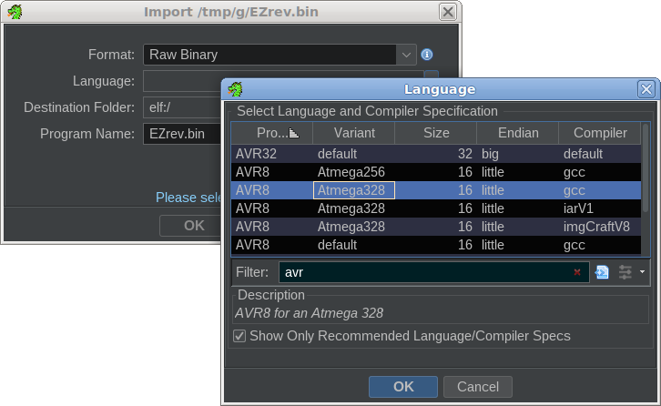

# ezrev

[library.m0unt41n.ch/challenges/ezrev](https://library.m0unt41n.ch/challenges/ezrev)   

# TL;DR

To get the flag, we have to reverse-engineer an Arduino binary. We get two files: `EZrev.hex` and `eeprom.txt`. And a suggestion to study the
[ATmega328P datasheet](https://ww1.microchip.com/downloads/en/DeviceDoc/Atmel-7810-Automotive-Microcontrollers-ATmega328P_Datasheet.pdf) &#128578;

... I made the rookie mistake of actually following the hint &#128512; I've spent a lot of time learning about
Arduino, AVR, memories, I/O registers, etc, most of that probably not needed for the solution. But,
I'm glad I did -  it made me understand many things about Arduino much better. In particular, why & how
some of my previous projects worked under the hood.

# Looking for the right tool

The things I tried and/or read about:

*   **Documentation**. Not just the
    [datasheet](https://ww1.microchip.com/downloads/en/DeviceDoc/Atmel-7810-Automotive-Microcontrollers-ATmega328P_Datasheet.pdf),
    but also:
    *   [Microchip wiki](http://developerhelp.microchip.com/xwiki/bin/view/products/mcu-mpu/8-bit-avr/structure)
        ([Registers](http://developerhelp.microchip.com/xwiki/bin/view/products/mcu-mpu/8-bit-avr/structure/gpr)
        [Memory](http://developerhelp.microchip.com/xwiki/bin/view/products/mcu-mpu/8-bit-avr/structure/memory)
        [Stack](http://developerhelp.microchip.com/xwiki/bin/view/products/mcu-mpu/8-bit-avr/structure/stack)
        [Status register](http://developerhelp.microchip.com/xwiki/bin/view/products/mcu-mpu/8-bit-avr/structure/status))
    *   [Instruction set manual](https://ww1.microchip.com/downloads/en/devicedoc/atmel-0856-avr-instruction-set-manual.pdf)
    *   [avr-gcc documentation](https://gcc.gnu.org/wiki/avr-gcc)
*   **Decompilers / disassemblers**
    *   [vAVRdisasm](http://linux.softpedia.com/get/Programming/Disassemblers/vAVRdisasm-28478.shtml) (Windows)
    *   [AVRDisassembler](http://github.com/twinearthsoftware/AVRDisassembler) (Linux, source)
    *   [avrdisas](http://www.johannes-bauer.com/mcus/avrdisas) (Linux, source/binary)
    *   [ReAVR](http://www.jassenbaum.de/ja-tools/reavr.html) (Windows, binary)
    *   [Ghidra]() with [avr_ghidra_helpers](https://github.com/ahroach/avr_ghidra_helpers) <== **that ultimately worked**.
        Some relevant articles:
        *   [Reverse Engineering Arduino Binaries with Ghidra](https://www.jonaslieb.de/blog/arduino-ghidra-intro/)
        *   [Hack the Box - Bare Metal](https://medium.com/@tobias.strg/hack-the-box-bare-metal-cf2771f32d0e)
        *   [Loading bare-metal binaries into Ghidra](https://swisskyrepo.github.io/HardwareAllTheThings/firmware/firmware-reverse-engineering/#loading-bare-metal-binaries-into-ghidra)
    *   I also discovered [Dogbolt](https://dogbolt.org) - ***De***compiler Explorer &#128578;
*   **Simulators**
    *   [AVR Simulator IDE](http://www.oshonsoft.com/downloads.php?newimage=1) (Windows, trial). Quite good,
        see another [CTF write-up using it](http://0xdf.gitlab.io/hackvent2019/leet).
    *   [simavr](http://github.com/buserror/simavr) - command line, `run_avr` exports GDB target on port `1234`, which
        can be then used by 
        [avr-gdb](https://github.com/juanfresia/avr-linux/blob/master/docs/avr-gdb.md)
        ([copr RPM](http://copr.fedorainfracloud.org/coprs/jpf91/avr-gdb/build/6319028))
    *   [PCSimLab](https://lcgamboa.github.io/picsimlab_docs/stable/) /
        [github.com/lcgamboa/picsimlab](https://github.com/lcgamboa/picsimlab) nice!
        ([Arduino Uno](https://lcgamboa.github.io/picsimlab_docs/stable/ArduinoUno.html#x20-190004.3))
    *   QEMU has [AVR target](https://qemu-project.gitlab.io/qemu/system/target-avr.html)
        (see [article](https://yeah.nah.nz/embedded/qemu-avr/)) - but I could not get it to work, it always
        segfaulted for me.
    *   [Wokwi](https://wokwi.com/) can apparently [do that too](https://blog.wokwi.com/gdb-avr-arduino-cheatsheet/)!
    *   [UnoArduSim](https://sites.google.com/site/unoardusim/home)
*   **Arduino command line tools**
    *   [Manually uploading files](https://forum.arduino.cc/t/how-to-upload-arduino-sketches-manually-using-avrdude/100706)
        with [avrdude](https://github.com/avrdudes/avrdude).
    *   Manipulating flash images / EEPROM files
        ([avr-objdump](https://linux.die.net/man/1/avr-objdump) /
        [avr-objcopy](https://linux.die.net/man/1/avr-objcopy) /
        [srec_cat](https://linux.die.net/man/1/srec_cat))
    *   [Combining pieces of ELF files](https://www.avrfreaks.net/s/topic/a5C3l000000UZsWEAW/t151710),
        in particular, how to make one that includes a section for EEPROM.

... but none of these worked well enough, that I could stop struggling with tooling and focus on the challenge instead.

# Getting Ghidra to work

Eventually, I found a [write-up](https://medium.com/@tobias.strg/hack-the-box-bare-metal-cf2771f32d0e)
for another Arduino `rev` challenge, where the author mentioned that he got good results with Ghidra.
It (still) does not support ATmega32 out-of-the-box, but [avr_ghidra_helpers](https://github.com/ahroach/avr_ghidra_helpers)
(still) work fine &#128578;

*   Add Ghidra libraries for better ATmega328 support

    ```bash
    git clone https://github.com/ahroach/avr_ghidra_helpers
    cp avr_ghidra_helpers/{avr,AVR,atmega}* $GHIDRA_DIR/Ghidra/Processors/Atmel/data/languages
    ```

*   Create a raw binary out of hex dump. We can use either ELF or raw binary:

    ```bash
    avr-objcopy -I ihex EZrev.hex -O binary EZrev.bin
    avr-objcopy -I ihex EZrev.hex -O elf32-avr EZrev.elf
    ```

    For some reason, `bin` file worked better. BTW, `avr-objdump` can be used to disassemble the code too:

    ```
    avr-objdump -m avr5 -x -s -D EZrev.hex
    ```

*   Load the file into Ghidra (`File / Import`). With successful installation of
    [avr_ghidra_helpers](https://github.com/ahroach/avr_ghidra_helpers), we should see:

    

    The `Language` will be set to: `avr8:LE:16:atmega328:gcc`. Load the file, confirm
    `Analyze now` and we seem to be getting qute decent disassembly. Time to learn some AVR!

# Understanding AVR assembly and GCC calling convention

ATmega328 is an 8-bit microcontroller and, as such, it is a very different world from the usual x86 or ARM.

## Memory types

AVR is a [Harvard architecture](https://en.wikipedia.org/wiki/Harvard_architecture),
with multiple memory types, with separate physical memory spaces:

*   **RAM** - pretty generic one, accessed with typical assembly instructions
*   **Flash** (a.k.a. *"program memory"*) - can be accessed only with a special `LPM` instruction,
    one byte at a time. In fact, first part of executing any Arduino program is copying any initialized
    data from flash to RAM, using these instructions.
*   **I/O** - memory-mapped in the same address space as RAM (first page), and accessed with similar
    instructions.
*   **EEPROM** - that's pretty much an I/O device. To access it we flip bits in control registers -
    and again, one byte at a time.

## Registers

There are 32 8-bit registers (`R0..R31`). The top 6 are usually referred to as 16-bit `X`, `Y`, `Z`
registers (with `Xlo`/`Xhi` etc. pairs). `Z` register is often used as address. Some instructions
can use other adjacent registers as a single 16-bit value, but, in practice, I mostly saw the
compiler doing this manually. So, you see things like this a lot:

```bash
e:000079 21 50       subi     R18,0x1
e:00007a 31 09       sbc      R19,R1
e:00007b 41 09       sbc      R20,R1
e:00007c 51 09       sbc      R21,R1
```

... just to decrement a 32-bit local variable (stored in `R21..R18` registers).

## Calling convention

Compared to x86 / x86_64, AVR GCC calling convention is much more complicated and prescriptive.
According to [avr-gcc documentation](https://gcc.gnu.org/wiki/avr-gcc#Register_Layout):

*   **Function arguments**: It's... [complicated](https://gcc.gnu.org/wiki/avr-gcc#Calling_Convention) &#128578;
    But, most of the time we will see 32-bit values there and that will come in `R25..R22`, `R21..R18` etc.
*   **Function return**: `R25..R22`, `R25..R24` or `R25`.
*   Registers `R1`, `R2`-`R17` and `Y`(`R29`:`R28`) have to be **preserved in a function call**
*   Registers `R0`, `R18`-`R25`, `X`(`R27`:`R26`) and `Z`(`R31`:`R30`) can be **clobbered by a function call**
*   `R0` is treated as **scratch register** and GCC makes no assumptions about it.
*   `R1` is **always assumed to be zero**. A function can temporarily use it for other purposes, but has to
    restore it to zero afterwards.

# Reducing the problem space

The problem with the decompiled program in Ghidra is that... the decompilation is not that great &#128577;.
It does a good job at breaking down logical structures of the program (functions, memory blocks,
*overall* flow), but, in details, it pretty much translates raw assembly instructions to equivalent
C code. In particular, all the 8/16/32-bit intricacies end up being one big mess of casts.

I realized that it is actually faster for me to manually decompile the code than use Ghidra's output.
Not least because, again, all the 16/32 bit operations have a very high assembly-to-C ratio and,
ultimately, there was not *that* much code after all.

But, at first there **was** still way too much code. I started with my usual heavy-handed approach:
decompile `RESET`, `main`, try to understand some short-looking functions that manipulate control
registers, EEPROM reading, etc. But, at some point I realized that I must be going too deep. Things
like:

*   Details of setting up the UART - control registers, operating modes, etc
*   *"What kind waveform and phase does this signal for the counter clock use"*

There *must* be a better way.

## Eliminating the boilerplate code

Key assumption: the challenge is likely compiled with Arduino toolchain. Which means that vast majority
of the code should be boilerplate stuff: overall skeleton, chip initialization, I/O, serial, timing,
EEPROM access. I tried creating a **simple Arduino sketch**:

```c
#include <EEPROM.h>

void setup() {
  Serial.begin(9600);
}

void loop() {
  delay(1000);
  Serial.println("aaa");
  Serial.println(EEPROM.read(0));
}
```

Then, in the Arduino IDE:

*   `Sketch` / `Optimize for debugging`
*   `Sketch` / `Verify/Compile`
*   `Sketch` / `Export compiled binary`

Lo and behold: `build/arduino.avr.uno/` directory has everything: `.hex`, `.elf`, `.eep` even.
The ELF file has debug info and all that loads beautifully into Ghidra!

### Cross-referencing with Arduino toolchain output

With that, I looked at functions identified by Ghidra, one-by-one, and I could map almost all of them
to the standard library:

| Offset | Standard function                     | Comment                                                                        |
| ------ | ------------------------------------- | ------------------------------------------------------------------------------ |
| `0035` | `__vector_22()`                       | the RESET handler.                                                             |
| `005f` | `HardwareSerial::begin()`             | took me longer to figure this one out &#128578;                                      |
| `00cd` | `Print:write()`                       |                                                                                |
| `00fa` | `HardwareSerial::availableForWrite()` |                                                                                |
| `0109` | `HardwareSerial::peek()`              |                                                                                |
| `011d` | `HardwareSerial::read()`              |                                                                                |
| `0125` | `HardwareSerial::available()`         |                                                                                |
| `0137` | `Serial0_available()`                 |                                                                                |
| `0141` | `serialEventRun()`                    |                                                                                |
| `014b` | `HardwareSerial::_tx_udr_empty_irq()` |                                                                                |
| `016d` | `HardwareSerial::write()`             |                                                                                |
| `01bf` | `HardwareSerial::flush()`             |                                                                                |
| `01df` | `micros()`                            |                                                                                |
| `0204` | `_eeprom_read_byte()`                 | only a placeholder / thunk function (`JMP` to the actual `eeprom_read_byte()`) |
| `0206` | `__vector_19`                         | the serial HW interrupt handler (`STDOUSART_UDRE`)                             |
| `022c` | `__vector_18`                         | another serial HW interrupt handler (`STD_USART_RX`)                           |
| `025e` | `__vector_16`                         | timer 0 interrupt handler (`STD_TIMER0_OVF`)                                   |
| `03a4` | `_GLOBAL__sub_l___vector_18()`        | whatever, probably more serial stuff &#128578;                                       |
| `03d1` | `eeprom_read_byte()`                  | the *actual* read function                                                     |
| `03d9` | `__udivmodsi4()`                      | real men write their own division routines!                                    |
| `0401` | `exit()`                              | infinite loop                                                                  |

It wasn't *as* easy as this table though... Before I got to the stage of eliminating the standard library,
I actually decompiled quite a few of these routines by hand - and scratched my head really hard, thinking
what could they be doing &#128578; Example: `HardwareSerial::begin()` - looking at all the magic numebrs inside,
I was pretty sure that it contains some descrambling / decryption.

### Initializing the static variables.

Above code helped to find a whole bunch of global variables too, in particular for timer handling.
This further reduced the scope for manual analysis.

Then, looking at `RESET` handler helped to understand how the initialized data is copied from PGMEM to
RAM at start, and to write down the RAM layout after:

```
0100 00 00       dw       0h
0102 00 00       dw       0h
0104 6d 01       dw       16Dh
0106 cd 00       dw       CDh
0108 fa 00       dw       FAh
010a bf 01       dw       1BFh
010c 2b 01       dw       12Bh
010e 09 01       dw       109h
0110 1d 01       dw       11Dh
0112 52 65       ds       "Reading The Flag From EEPROM For Your Convenience ;)"
     61 64 
     69 6e 
0146 00          db       00h
0147 00          db       00h
```

## The actual challenge code

With all the boilerplate out of the way, we're left with just two functions.

### 01BA : sendChar()

I actually wasn't sure if this was a standard function - the code was very simple and it looked more
like a wrapper for the regular `HardwareSerial::write`, with a fixed `0x0151` pointer:

```
************************************************
*                   FUNCTION                   *
************************************************
undefined __stdcall sendChar(word R25R24)
     undefined     R24:1      <RETURN>
     word          R25R24:2   R25R24
e:0001ba 68 2f       mov      R22,R25R24
e:0001bb 81 e5       ldi      R25R24,0x51
e:0001bc 91 e0       ldi      R25R24,0x1
e:0001bd 0c 94       jmp      HardwareSerial::write
         6d 01
```

In any case, combined with its usage in `main()` below, it surely just writes a byte to the serial port.

### 02a8 : main()

With all the rest out of the way, there is not much left in here:

```c
void main() {
    // It starts with a whole bunch of inlined boilerplate code - looks like
    // some low-level intialization of HW registers for timers / serial port.
  
    Serial.begin(115200);
    Serial.begin(274);
    do {
        sendChar(eeprom_read_byte(0x01));
        sendChar(eeprom_read_byte(0x04));
        sendChar(eeprom_read_byte(0x21));
        sendChar(eeprom_read_byte(0x34));
        sendChar(eeprom_read_byte(0x0b));
        sendChar(eeprom_read_byte(0x20));
        sendChar(eeprom_read_byte(0x16));
        sendChar(eeprom_read_byte(0x05));
        sendChar(eeprom_read_byte(0x09));
        sendChar(eeprom_read_byte(0x09));
        sendChar(eeprom_read_byte(0x2c));
        sendChar(eeprom_read_byte(0x17));
        sendChar(eeprom_read_byte(0x0e));
        sendChar(eeprom_read_byte(0x37));
        sendChar(eeprom_read_byte(0x0d));
        sendChar(eeprom_read_byte(0x3d));
        sendChar(eeprom_read_byte(0x3d));
        sendChar(eeprom_read_byte(0x38));
        sendChar(eeprom_read_byte(0x24));
        sendChar(eeprom_read_byte(0x02));
        delay(1000000);   // Note: this is inlined in the code.
    } while(!Serial0_available());
}
```

... and it's pretty obvious where this is going. Especially as EEPROM
contains only regular ASCII characters.

# Getting the flag

```python
#!/usr/bin/python3

# Copy of eeprom.txt
EEPROM = [
  84, 115, 125, 85, 104, 123, 61, 39, 91, 69, 88, 48, 37, 70,
  79, 77, 47, 122, 107, 83, 41, 82, 51, 82, 36, 93, 122, 107,
  75, 110, 62, 124, 50, 99, 59, 68, 78, 78, 73, 37, 38, 115,
  80, 125, 80, 81, 73, 102, 38, 104, 39, 74, 50, 66, 105, 77,
  85, 56, 68, 40, 51, 85, 62, 49
]

# eeprom_read_byte() arguments from main()
ORDER = [
  0x01, 0x04, 0x21, 0x34, 0x0b, 0x20, 0x16, 0x05, 0x09, 0x09,
  0x2c, 0x17, 0x0e, 0x37, 0x0d, 0x3d, 0x3d, 0x38, 0x24, 0x02
]

print("".join([chr(EEPROM[c]) for c in ORDER]))
```

---

## `shc2023{EEPROMFUUUN}`


<hr>

&copy; [muflon77](https://library.m0unt41n.ch/players/805ae1c8-9fe4-5816-b4a4-5057fa6eedb1)
