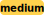

# krabs

[library.m0unt41n.ch/challenges/krabs](https://library.m0unt41n.ch/challenges/krabs)   

# TL;DR

We get a binary:

```
$ ./krabs 
Get away if your name is Plankton!
Password: meme
Password is not in the expected format. Try: cyberskills23{...}
```

No obvious hints, so, yet again, full-decompile mode.

The catch: the binary is in Rust &#128578;

# Analysis

I haven't found any obvious way to decompile Rust binaries, so, I tried to reason
about what IDA showed me as C++ code. There is almost certainly a better way.

Everything happens in `main()` function (plus Rust standard library calls).

```c
void krabs::main::h4bca3c1b626a9c35() {
  unsigned __int8 *matchPtr;
  unsigned __int8 *ptrToFlagContent;
  unsigned __int64 flagContentLen;
  struct dynBuf_t *dynBuf;
  unsigned __int64 fourthWordAsInt;
  __int64 bufWithLens[6];
  char *input;
  __int64 v23[2];
  struct dynBuf_t *ptr;
  void (__cdecl *v25)();
  char pattern[68];
```

These were not all variables, just ones that seemed most relevant later.

Following some boilerplate code, we get to part where the program reads a line
from `stdin` into `input` and exits on failure (I had to figure some of this
from disassembly, I'm not sure how that relates to `v27` and calling convention):

```c
  std::io::stdio::Stdin::read_line::hda1bfe7873a8c4ae((__int64)&v17, &v27);
  if ( v17 )
  {
    *(_QWORD *)pattern = v18;
    core::result::unwrap_failed::h170bc2721a6c6ff2();
  }
```

Now, we fill `pattern[]` with some saved data. As we will see later, this is not
needed for getting the flag, just prints some fun text after entering a correct one.

```c
  *(_OWORD *)pattern = x216B2F080924780A2616450A0C120416;
  *(_OWORD *)&pattern[16] = x6F1719207F125D535C4525333A101700;
  *(_OWORD *)&pattern[32] = x2D160F13071F5510000E216B252A0D2D;
  *(_OWORD *)&pattern[48] = x3E3E0D1D45021926555C4B57773D0250;
  *(_DWORD *)&pattern[64] = 0x1F081C08;
```

Following code probably trims whitespace from both ends of string (confirmed with
padding the flag, once I got it later). Or rather: toes not *trim*, but returns

*   `matchPtr` as first non-space character
*   `RDX`, length of the strinng until the whitespace tail

Again, not understanding calling convention for complex calls bites me hard here.

```c
  matchPtr = core::str::_$LT$impl$u20$str$GT$::trim_matches::h785a560a9ba03b7e((unsigned __int8 *)input, v23[1], v3, v4);
```

Now we want:

*   The trimmed input to start with `cyberskills23{`
*   ... to end with `}`
*   ... and be 14 or more characters

```c
  if ( r_rdx < 14
    || *(_QWORD *)matchPtr ^ 'iksrebyc' | *(_QWORD *)(matchPtr + 6) ^ '{32sllik'
    || matchPtr[r_rdx - 1] != '}' )
  {
    v17 = &passwordIsNotInTheExpectedFormat;
    v18 = 1LL;
    p_ptr = (struct dynBuf_t **)"Get away if your name is Plankton!\n"
                                "Password: Could not flush stdoutsrc/main.rsInput couldn't be read from stdin.Password is"
                                " not in the expected format. Try: cyberskills23{...}\n"
                                "Go away Plankton!\n"
                                "Welcome, Mr. Krabs! Here is the secret formula:\n"
                                "\n";
    *(_OWORD *)bufWithLens = 0LL;
    std::io::stdio::_print::h0fa237faa39ae709();
  }
```

If above test passed, we now check if:

*   The string has 15 or more characters
*   That 14th character is &lt;= `-65` (I don't qutei udnerstand, should be always true for ASCII?)

BTW, `RDX` still contains the length of the input at this point

```c
    if ( r_rdx < 15 || (char)matchPtr[14] <= (char)'\xBF' )
      core::str::slice_error_fail::h2bf83956ce92b0bd();
    ptrToFlagContent = matchPtr + 14;
    flagContentLen = r_rdx - 15;
    v17 = 0LL;
    v18 = r_rdx - 15;                           // flagContentLen
    // At this point, it's the inside content of the flag after {
    p_ptr = (struct dynBuf_t **)(matchPtr + 14);
    bufWithLens[0] = r_rdx - 15;                // flagContentLen
    bufWithLens[1] = 0LL;
    bufWithLens[2] = r_rdx - 15;                // flagContentLen
    bufWithLens[3] = 1LL;
    bufWithLens[4] = 0x5F0000005FLL;            // These 5Fs are '_'. A hint for spec_from_iter below!
    LOWORD(bufWithLens[5]) = 1;
```

For the next part: with a bit of trial &amp; error I figured that
`alloc::vec::from_iter` below tokenizes the flag, with `_` as separator.
The result seems to be an array of `{ char *str, int64 len}` struct entries.
I created that as a struct in IDA for better readability.

Now, `alloc::vec::from_iter` is called, with two arguments:

*   `&ptr` (address to the pointer which will be updated with allocated array of above structs)
*   `&v17` which is probably the "spec" created with above instructions.

Result:

*   `ptr` is updated to point to the newly created array
*   `*v25` is updated to `4`, but I don't know what that is
*   `v26` is updated to number of tokens.

```c
    _$LT$alloc..vec..Vec$LT$T$GT$$u20$as$u20$alloc..vec..spec_from_iter..SpecFromIter$LT$T$C$I$GT$$GT$::from_iter::h3b6d0b4f7d0c206c(
      &ptr,
      &v17);
```

Now we check for few more things:

*   There are 4 tokens
*   Token #4 can be converted to integer (`core::num::u32::from_str_radix`)
    *   Note that the result will be in *uppper* dword of RAX (and then, moved to R13).
        Then, lowest bit of the result is checked, likely for status (has to be 0)
*   Tokens #1-#3 match simple byte patterns
    *   Note that they form strings: `Eugene`, `Harold` and `Krabs`

```c
    if ( v26 != 4
      || (dynBuf = ptr, core::num::_$LT$impl$u20$u32$GT$::from_str_radix::h1017d546e426c0f3(), (r_Rax & 1) != 0)
      || dynBuf->len != 6
      || *(_DWORD *)dynBuf->str ^ 'eguE' | *((unsigned __int16 *)dynBuf->str + 2) ^ 'en'
      || dynBuf[1].len != 6
      || *(_DWORD *)dynBuf[1].str ^ 'oraH' | *((unsigned __int16 *)dynBuf[1].str + 2) ^ 'dl'
      || dynBuf[2].len != 5
      || *(_DWORD *)dynBuf[2].str ^ 'barK' | *((unsigned __int8 *)dynBuf[2].str + 4) ^ 's' )
    {
```

If any of above checks failed, we bail out:

```c
      if ( v25 )
        _rust_dealloc(ptr);
LABEL_18:
      v17 = &goAwayPlankton;
      v18 = 1LL;
      p_ptr = (struct dynBuf_t **)"Get away if your name is Plankton!\n"
                                  "Password: Could not flush stdoutsrc/main.rsInput couldn't be read from stdin.Password "
                                  "is not in the expected format. Try: cyberskills23{...}\n"
                                  "Go away Plankton!\n"
                                  "Welcome, Mr. Krabs! Here is the secret formula:\n"
                                  "\n";
      *(_OWORD *)bufWithLens = 0LL;
      std::io::stdio::_print::h0fa237faa39ae709();
      goto LABEL_20;
    }
```

And finally, a clear hint what the token #4 should be:

```c
    fourthWordAsInt = r_Rax & 0xFFFFFFFF00000000LL;
    if ( v25 )
      _rust_dealloc(dynBuf);
    if ( fourthWordAsInt != 0x9A75692400000000LL )
      goto LABEL_18;
```

The only catch is that, in the flag, it's actually lowercase `a`.

The program continues, with some more text printing, cleanups, etc, but, at this point,
we don't care.

# Verify the flag

```
$ ./krabs 
Get away if your name is Plankton!
Password: cyberskills23{Eugene_Harold_Krabs_9a756924}
Welcome, Mr. Krabs! Here is the secret formula:
Squid Ink
Kelp Sauce
Dried Kelp
Chum
Salt
Turmeric
Barnacle shavings
```

---

## `cyberskills23{Eugene_Harold_Krabs_9a756924}`


<hr>

&copy; [muflon77](https://library.m0unt41n.ch/players/805ae1c8-9fe4-5816-b4a4-5057fa6eedb1)
