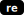

# krabs2

[library.m0unt41n.ch/challenges/krabs2](https://library.m0unt41n.ch/challenges/krabs2)   

# TL;DR

We get a Mono assembly and decompile the hell out of it &#128578;

In my opinion, thanks to the relative ease of decompiling C#, this was actually easier than
[krabs](https://library.m0unt41n.ch/challenges/krabs) (marked as `medium`).

# Decompilation and analysis

Using [ILSpy](https://github.com/icsharpcode/ILSpy), we get code that seems like a reasonable mix of
static data and methods. Except... most identifiers seem to be in Chinese &#128512;
See [krabs2_initial.cs](https://github.com/mufl0n/mufl0n.github.io/blob/main/shc/re/krabs2/krabs2_initial.cs) for the initial output.

But, bit by bit, we cat bite it!

## Xor3D (乙)

First, the `乙` function, that is obviously just XORing a buffer with `0x3D`:

```c#
private static void Xor3D(byte[] data) {
    for (int i = 0; i < data.Length; i++) {
        data[i] = (byte)(data[i] ^ 0x3D);
    }
}
```

## Byte arrays encoded with 0x3D (不, 仌 and 亘)

At initialization, that function is used to decrypt three byte arrays in the main assembly class (that we'll call `Krabs2`):

*   `不`: decodes to `"System.Security.Cryptography.AesGcm, System.Security.Cryptography.Algorithms, Version=6.0.0.0, Culture=neutral, PublicKeyToken=b035f7f11d50a3a"` string ([link](https://gchq.github.io/CyberChef/#recipe=From_Decimal('Space',false)XOR(%7B'option':'Hex','string':'3D'%7D,'Standard',false)&input=MTEwLCA2OCwgNzgsIDczLCA4OCwgODAsIDE5LCAxMTAsIDg4LCA5NCwgNzIsIDc5LCA4NCwgNzMsIDY4LCAxOSwgMTI2LCA3OSwgNjgsIDc3LCA3MywgODIsIDkwLCA3OSwgOTIsIDc3LCA4NSwgNjgsIDE5LCAxMjQsIDg4LCA3OCwgMTIyLCA5NCwgODAsIDE3LCAyOSwgMTEwLCA2OCwgNzgsIDczLCA4OCwgODAsIDE5LCAxMTAsIDg4LCA5NCwgNzIsIDc5LCA4NCwgNzMsIDY4LCAxOSwgMTI2LCA3OSwgNjgsIDc3LCA3MywgODIsIDkwLCA3OSwgOTIsIDc3LCA4NSwgNjgsIDE5LCAxMjQsIDgxLCA5MCwgODIsIDc5LCA4NCwgNzMsIDg1LCA4MCwgNzgsIDE3LCAyOSwgMTA3LCA4OCwgNzksIDc4LCA4NCwgODIsIDgzLCAwLCAxMSwgMTksIDEzLCAxOSwgMTMsIDE5LCAxMywgMTcsIDI5LCAxMjYsIDcyLCA4MSwgNzMsIDcyLCA3OSwgODgsIDAsIDgzLCA4OCwgNzIsIDczLCA3OSwgOTIsIDgxLCAxNywgMjksIDEwOSwgNzIsIDk1LCA4MSwgODQsIDk0LCAxMTgsIDg4LCA2OCwgMTA1LCA4MiwgODYsIDg4LCA4MywgMCwgOTUsIDEzLCAxNCwKOTEsIDgsIDkxLCAxMCwgOTEsIDEyLCAxMiwgODksIDgsIDEzLCA5MiwgMTQsIDky&oeol=VT))

    ```c#
    AesGcmClassName = new byte[143] {
        // "System.Security.Cryptography.AesGcm, System.Security.Cryptography.Algorithms, Version=6.0.0.0, Culture=neutral, PublicKeyToken=b03f5f7f11d50a3a"
        // XOR'd with 0x3D
        110, 68, 78, 73, 88, 80, 19, 110, 88, 94, 72, 79, 84, 73, 68, 19, 126, 79, 68, 77,
        73, 82, 90, 79, 92, 77, 85, 68, 19, 124, 88, 78, 122, 94, 80, 17, 29, 110, 68, 78,
        73, 88, 80, 19, 110, 88, 94, 72, 79, 84, 73, 68, 19, 126, 79, 68, 77, 73, 82, 90,
        79, 92, 77, 85, 68, 19, 124, 81, 90, 82, 79, 84, 73, 85, 80, 78, 17, 29, 107, 88,
        79, 78, 84, 82, 83, 0, 11, 19, 13, 19, 13, 19, 13, 17, 29, 126, 72, 81, 73, 72, 79,
        88, 0, 83, 88, 72, 73, 79, 92, 81, 17, 29, 109, 72, 95, 81, 84, 94, 118, 88, 68,
        105, 82, 86, 88, 83, 0, 95, 13, 14, 91, 8, 91, 10, 91, 12, 12, 89, 8, 13, 92, 14, 92
    };
    ```

*   `仌`: decodes to `"Encrypt"` string ([link](https://gchq.github.io/CyberChef/#recipe=From_Decimal('Space',false)XOR(%7B'option':'Hex','string':'3D'%7D,'Standard',false)&input=MTIwLCA4MywgOTQsIDc5LCA2OCwgNzcsIDcz&oeol=VT)):

    ```c#
    EncryptStr = new byte[7] { 120, 83, 94, 79, 68, 77, 73 };  // "Encrypt" XOR'd with 0x3D
    ```

*   `亘`: decodes to `"Decrypt"` string ([link](https://gchq.github.io/CyberChef/#recipe=From_Decimal('Space',false)XOR(%7B'option':'Hex','string':'3D'%7D,'Standard',false)&input=MTIxLCA4OCwgOTQsIDc5LCA2OCwgNzcsIDcz&oeol=VT))

    ```c#
    DecryptStr = new byte[7] { 121, 88, 94, 79, 68, 77, 73 };  // "Decrypt" XOR'd with 0x3D
    ```

## Wrapper around the RNG (儻)

```c#
private static byte[] RandomBytes(int len) {
    return RandomNumberGenerator.GetBytes(len);
}
```

## Function returning a fixed, 32-byte array (又)

```c#
private static byte[] FixedBytes() {
    byte[] result = new byte[32];
    for (int i = 0; i < result.Length; i++) {
        result[i] = (byte)(i ^ 0xBE);
    }
    return result;  // BEBFBCBDBABBB8B9B6B7B4B5B2B3B0B1AEAFACADAAABA8A9A6A7A4A5A2A3A0A1
}
```

## Functions for loading native methods

*   A helper class `乡`:

    ```c#
    internal class AllocHelper {
        // https://learn.microsoft.com/en-us/windows/win32/api/memoryapi/nf-memoryapi-virtualalloc
        [DllImport(Constants.kernel32Str)]
        public static extern nint VirtualAlloc(
            nint pointer, nuint size, uint allocationType, uint protect);
    }
    ```

*   Actual code-loading function `仟`:

    ```c#
    private static DelegateType LoadFunction<DelegateType>(byte[] code) {
        nint num = AllocHelper.VirtualAlloc(
            IntPtr.Zero, Constants.size, Constants.allocationType, Constants.protect);
        Marshal.Copy(code, 0, num, code.Length);
        return Marshal.GetDelegateForFunctionPointer<DelegateType>(num);
    }
    ```

*   ... which helps to understand some of the numbers in `亼` class:

    ```c#
    internal class Constants {
        internal delegate ulong 个(byte[] 丨, uint 丩);
        internal delegate ulong 土(byte[] 丨, byte[] 丨2, uint 丩);
        internal static readonly nuint size = 2000;
        internal const uint allocationType = 0x3000;  // MEM_COMMIT|MEM_RESERVE
        internal const uint protect = 0x0040;         // PAGE_EXECUTE_READWRITE
        internal const int 刾 = 12;
        internal const int 匜 = 16;
        internal const string kernel32Str = "kernel32.dll";
    }
    ```

## Encrypt (尸) and Decrypt (屮) functions

Since we have the `AesGcmClassName` and `Encrypt`/`Decrypt` strings, we can mostly see
that these two functions are just a somewhat convoluted way of caling these methods.

```c#
private static byte[] Encrypt(byte[] key, byte[] input) {
    Type bytesType = typeof(byte[]);

    // aes = new System.Security.Cryptography.AesGcm(key)
    Type aesType = Type.GetType(Encoding.ASCII.GetString(AesGcmClassName));
    object aes = (aesType?.GetConstructor(new Type[1] { bytesType }))?.Invoke(new object[1] { key });

    byte[] iv = RandomBytes(12);
    byte[] tag = new byte[16];
    byte[] ciphertext = new byte[input.Length];

    // https://learn.microsoft.com/en-us/dotnet/api/system.security.cryptography.aesgcm.decrypt
    // aes.Encrypt(iv, input, ciphertext, tag)        
    (aesType?.GetMethod(Encoding.ASCII.GetString(EncryptStr), new Type[5] { bytesType, bytesType, bytesType, bytesType, bytesType }))?.Invoke(aes, new object[5] {
        iv, input, ciphertext, tag, Array.Empty<byte>()
    });

    // Save IV, tag and ciphertext in the output
    byte[] result = new byte[iv.Length + tag.Length + ciphertext.Length];
    iv.CopyTo(result, 0);
    tag.CopyTo(result, iv.Length);
    ciphertext.CopyTo(result, iv.Length + tag.Length);
    return result;
}
```

Note how the output packs: iv, GCM tag and the ciphertext. The only thing needed to decode such package back
is the key - which is exactly what the `Decrypt()` function does:

```c#
private static byte[] Decrypt(byte[] key, byte[] input) {
    Type bytesType = typeof(byte[]);

    // aes = new System.Security.Cryptography.AesGcm(key)
    Type aesType = Type.GetType(Encoding.ASCII.GetString(AesGcmClassName));
    object aes = (aesType?.GetConstructor(new Type[1] { bytesType }))?.Invoke(new object[1] { key });

    byte[] iv = new byte[12];
    byte[] tag = new byte[16];
    byte[] ciphertext = new byte[input.Length - iv.Length - tag.Length];
    byte[] result = new byte[ciphertext.Length];

    // Extract IV, tag and ciphertext from the input
    Array.Copy(input, 0, iv, 0, iv.Length);
    Array.Copy(input, iv.Length, tag, 0, tag.Length);
    Array.Copy(input, iv.Length + tag.Length, ciphertext, 0, ciphertext.Length);

    // https://learn.microsoft.com/en-us/dotnet/api/system.security.cryptography.aesgcm.decrypt
    // aes.Decrypt(iv, ciphertext, tag, result)        
    (aesType?.GetMethod(Encoding.ASCII.GetString(DecryptStr), new Type[5] { bytesType, bytesType, bytesType, bytesType, bytesType }))?.Invoke(aes, new object[5] {
        iv, ciphertext, tag, result, Array.Empty<byte>()
    });
    return result;
}
```

With above code, we can also now update the `刾` and `匜` in `Constants`:

```c#
internal class Constants {
    ...
    internal const int ivLen = 12;
    internal const int tagLen = 16;
}
```

(and, because we *of course* want a perfect decompile &#128578; also replace the 12/16 used above with references to these)

## Native methods

First, let's recall the
[x64 calling convention](https://learn.microsoft.com/en-us/cpp/build/x64-calling-convention?view=msvc-170#parameter-passing).
We expect:

*   Function arguments to be in: `RCX`, `RDX`, `R8`, `R9`, etc.
*   Result to be returned in `RAX`.

### Xor2A (个/亞) 

At the start of `Main()` we see: `LoadFunction<Constants.个>(亞)(冫, (uint)冫.Length);`. Let's
[convert 亞 to hex](https://gchq.github.io/CyberChef/#recipe=From_Decimal('Space',false)To_Hex('Space',0)&input=MTM4LCA2OCwgMTcsIDI1NSwgNTIsIDQyLCAxMzYsIDY4LCAxNywgMjU1LCA3MiwgMjU1LCAyMDIsIDExNywgMjQxLCA3MiwgMTM3LCAyMDAsIDE5NSwgMCwgMCwgMCwgMCwgMA) first
and then, [disassemble it](https://shell-storm.org/online/Online-Assembler-and-Disassembler/?opcodes=8a+44+11+ff+34+2a+88+44+11+ff+48+ff+ca+75+f1+48+89+c8+c3+00+00+00+00+00&arch=x86-64&endianness=little&baddr=0x00000000&dis_with_addr=True&dis_with_raw=True&dis_with_ins=True#disassembly):

```c#
_Xor2A = new byte[24] {
    138, 68, 17, 255,        // 0x0000000000000000:  8A 44 11 FF    mov al, byte ptr [rcx + rdx - 1]
    52, 42,                  // 0x0000000000000004:  34 2A          xor al, 0x2a
    136, 68, 17, 255,        // 0x0000000000000006:  88 44 11 FF    mov byte ptr [rcx + rdx - 1], al
    72, 255, 202,            // 0x000000000000000a:  48 FF CA       dec rdx
    117, 241,                // 0x000000000000000d:  75 F1          jne 0
    72, 137, 200,            // 0x000000000000000f:  48 89 C8       mov rax, rcx
    195,                     // 0x0000000000000012:  C3             ret 
    0, 0, 0, 0, 0
};
```

Which is an equivalent of:

```c#
_Xor2A(buf, len) {
    while (len) {
        buf[--len] ^= 0x2A;
    }
}
```

The function is called via `Constants` array, so, we can update it there too:

```c#
internal class Constants {
    internal delegate ulong Xor2A(byte[] buf, uint len);
    ...
}
```

### Password prompt (冫)

The above call to `Xor2A()` decrypts the `冫` array which is used as an ASCII string later. With
[help from CyberChef](https://gchq.github.io/CyberChef/#recipe=From_Decimal('Space',false)XOR(%7B'option':'Hex','string':'2A'%7D,'Standard',false)&input=MTIyLCA3MCwgNzksIDc1LCA4OSwgNzksIDEwLCA3OSwgNjgsIDk0LCA3OSwgODgsIDEwLCA5NCwgNjYsIDc5LCAxMCwgOTAsIDc1LCA4OSwgODksIDkzLCA2OSwgODgsIDc4LCAxNg&oeol=VT):

```c#
PasswordPrompt = new byte[26] {
    // "Please enter the password:" XOR'd with 0x2A
    122, 70, 79, 75, 89, 79, 10, 79, 68, 94, 79, 88, 10, 94, 66, 79, 10, 90, 75, 89, 89, 93, 69, 88, 78, 16
};
```

### CompareXor7C (土/垯)

Second call to `Xor2A()` (`LoadFunction<Constants.Xor2A>(_Xor2A)(垯, (uint)垯.Length);`) is
used to decrypt native code from the `垯` array. We
[get the raw unXOR'd bytes](https://gchq.github.io/CyberChef/#recipe=From_Decimal('Space',false)To_Hex('Space',0)&input=MTM4LCA2OCwgMTcsIDI1NSwgNTIsIDQyLCAxMzYsIDY4LCAxNywgMjU1LCA3MiwgMjU1LCAyMDIsIDExNywgMjQxLCA3MiwgMTM3LCAyMDAsIDE5NSwgMCwgMCwgMCwgMCwgMA)
first and again use ShellStorm disassembler to
[get the code](https://shell-storm.org/online/Online-Assembler-and-Disassembler/?opcodes=49+83+f8+1e+75+19+42+8a+44+01+ff+34+7c+42+38+44+02+ff+75+0b+49+ff+c8+75+ed+b8+01+00+00+00+c3+b8+00+00+00+00+c3+00+00+00&arch=x86-64&endianness=little&baddr=0x00000000&dis_with_addr=True&dis_with_raw=True&dis_with_ins=True#disassembly). This results in:

```c#
_CompareXor7C = new byte[40] {
    99, 169, 210, 52,        // 0x0000000000000000:  49 83 F8 1E       cmp r8, 0x1e
    95, 51,                  // 0x0000000000000004:  75 19             jne 0x1f
    104, 160, 110, 43, 213,  // 0x0000000000000006:  42 8A 44 01 FF    mov al, byte ptr [rcx + r8 - 1]
    30, 86,                  // 0x000000000000000b:  34 7C             xor al, 0x7c
    104, 18, 110, 40, 213,   // 0x000000000000000d:  42 38 44 02 FF    cmp byte ptr [rdx + r8 - 1], al
    95, 33,                  // 0x0000000000000012:  75 0B             jne 0x1f
    99, 213, 226,            // 0x0000000000000014:  49 FF C8          dec r8
    95, 199,                 // 0x0000000000000017:  75 ED             jne 6
    146, 43, 42, 42, 42,     // 0x0000000000000019:  B8 01 00 00 00    mov eax, 1
    233,                     // 0x000000000000001e:  C3                ret
    146, 42, 42, 42, 42,     // 0x000000000000001f:  B8 00 00 00 00    mov eax, 0
    233,                     // 0x0000000000000024:  C3                ret 
    42, 42, 42               
};
```

Which is an equivalent of:

```c#
_CompareXor7C(buf1, buf2, len) {
    if (len != 0x1E)
        return 0;
    while(len) {
        if ((buf1[len-1] ^ 0x7C) != buf2[len-1])
            return 0;
        len--;
    }
    return 1;
}
```

We can als now update `Constants` to its final form:

```c#
internal class Constants {
    internal delegate ulong Xor2A(byte[] buf, uint len);
    internal delegate ulong CompareXor7C(byte[] buf1, byte[] buf2, uint len);
    internal static readonly nuint size = 2000;
    internal const uint allocationType = 0x3000;  // MEM_COMMIT|MEM_RESERVE
    internal const uint protect = 0x0040;         // PAGE_EXECUTE_READWRITE
    internal const int ivLen = 12;
    internal const int tagLen = 16;
    internal const string kernel32Str = "kernel32.dll";
}
```

## Main()

We can now attack the `Main()` function. The gist of it seems to be:

```c#
byte[] password = Encoding.ASCII.GetBytes(Console.ReadLine().Trim());
byte[] 么 = FixedBytes();
byte[] 么2 = RandomBytes(32);
if (LoadFunction<Constants.CompareXor7C>(_CompareXor7C)(password, 埜, (uint)password.Length) == 0) {
    Console.WriteLine(Encoding.ASCII.GetString(Decrypt(么2, Encrypt(么2, Decrypt(么, 夼)))));
} else {
    Console.WriteLine(Encoding.ASCII.GetString(Decrypt(么2, Encrypt(么2, Decrypt(么, 坙)))));
}
```

Which looks a lot like:

*   `埜`: a correct password XOR'd with `0x7C` (verified using the `CompareXor7C()` native method)
*   `夼` and `坙`: string messages printed when the comparison fails / succeeds
*   `么`: a fixed key used to encrypt them
*   `么2`: a random key that is used only to encrypt a string and immediately decrypt it back for printing

Let's make it so:

```c#
byte[] input = Encoding.ASCII.GetBytes(Console.ReadLine().Trim());
byte[] keyReal = FixedBytes();
byte[] keyDummy = RandomBytes(32);
if (LoadFunction<Constants.CompareXor7C>(_CompareXor7C)(input, PaswordStr, input.Length) == 0) {
    Console.WriteLine(Encoding.ASCII.GetString(Decrypt(keyDummy, Encrypt(keyDummy, Decrypt(keyReal, FailureStr)))));
} else {
    Console.WriteLine(Encoding.ASCII.GetString(Decrypt(keyDummy, Encrypt(keyDummy, Decrypt(keyReal, SuccessStr)))));
}
```

## Remaining encrypted strings

We know the `keyReal`, so we can use it to decrypt `FailureStr` and `SuccessStr`. And, of course, the password.

### password

[Oh, hai](https://gchq.github.io/CyberChef/#recipe=From_Decimal('Space',false)XOR(%7B'option':'Hex','string':'7c'%7D,'Standard',false)&input=MjQsIDc2LCA4LCAxOCwgNzksIDgsIDM1LCAxOCwgNzIsIDgsIDc3LCAxMCwgNzksIDM1LCAxMiwgNzcsIDE4LCAxMCwgNzYsIDIzLCA3OSwgMzUsIDI1LCA3OCwgNzksIDY5LCA2OSwgMzAsIDc4LCA3Mg&oeol=VT) &#128512;

```c#
PaswordStr = new byte[30] {
    // "d0tn3t_n4t1v3_p1nv0k3_e2399b24" XOR'd with 0x7C
    24, 76, 8, 18, 79, 8, 35, 18, 72, 8,
    77, 10, 79, 35, 12, 77, 18, 10, 76, 23,
    79, 35, 25, 78, 79, 69, 69, 30, 78, 72
};
```

This is the flag for the challenge (`cyberskills23{d0tn3t_n4t1v3_p1nv0k3_e2399b24}`). But, of course we are not stopping here &#128578;

### SuccessStr / FailureStr

From `Encrypt/Decrypt` functions we now understand what is the structure of these byte arrays and we
know the AES key (`BEBFBCBDBABBB8B9B6B7B4B5B2B3B0B1AEAFACADAAABA8A9A6A7A4A5A2A3A0A1`):

```c#
SuccessStr = new byte[46] {
    239, 37, 95, 53, 9, 193, 151, 245, 255, 217, 92, 200,                              // IV:EF255F3509C197F5FFD95CC8
    15, 202, 72, 226, 242, 133, 41, 10, 133, 184, 138, 26, 152, 247, 161, 90,          // tag:0FCA48E2F285290A85B88A1A98F7A15A
    147, 198, 137, 171, 164, 145, 226, 182, 80, 82, 253, 238, 35, 199, 70, 23, 206, 8  // ciphertext:93C689ABA491E2B65052FDEE23C74617CE08
};
```

This [decrypts to](https://gchq.github.io/CyberChef/#recipe=AES_Decrypt(%7B'option':'Hex','string':'BEBFBCBDBABBB8B9B6B7B4B5B2B3B0B1AEAFACADAAABA8A9A6A7A4A5A2A3A0A1'%7D,%7B'option':'Hex','string':'EF255F3509C197F5FFD95CC8'%7D,'GCM','Hex','Raw',%7B'option':'Hex','string':'0FCA48E2F285290A85B88A1A98F7A15A'%7D,%7B'option':'Hex','string':''%7D)&input=OTNDNjg5QUJBNDkxRTJCNjUwNTJGREVFMjNDNzQ2MTdDRTA4)
`"Password correct!!"`

```c#
FailureStr = new byte[46] {
    196, 223, 136, 93, 185, 71, 183, 100, 77, 238, 209, 141,                           // IV:C4DF885DB947B7644DEED18D
    11, 226, 172, 184, 113, 235, 47, 229, 191, 255, 120, 221, 242, 16, 75, 64,         // tag:0BE2ACB871EB2FE5BFFF78DDF2104B40
    90, 176, 176, 12, 7, 120, 164, 133, 60, 58, 124, 107, 190, 43, 85, 177, 122, 9     // ciphertext:5AB0B00C0778A4853C3A7C6BBE2B55B17A09
};
```

This [decrypts to](https://gchq.github.io/CyberChef/#recipe=AES_Decrypt(%7B'option':'Hex','string':'BEBFBCBDBABBB8B9B6B7B4B5B2B3B0B1AEAFACADAAABA8A9A6A7A4A5A2A3A0A1'%7D,%7B'option':'Hex','string':'C4DF885DB947B7644DEED18D'%7D,'GCM','Hex','Raw',%7B'option':'Hex','string':'0BE2ACB871EB2FE5BFFF78DDF2104B40'%7D,%7B'option':'Hex','string':''%7D)&input=NUFCMEIwMEMwNzc4QTQ4NTNDM0E3QzZCQkUyQjU1QjE3QTA5CQ)
`"Password incorrect"`

## The Recipe!

Finally, we have:

```c#
byte[] inputBytes = new byte[32];
input.CopyTo(inputBytes, 0);
try {
    byte[] secretMessage = Convert.FromHexString("30FB0E8EFFB608050C6AC1A319817BDBEC58C5E2D6C868D5FC04E37B476981456C14CCF797BE9B83DD587346DE3E0822EE020A0A4DAEB088F4C6393278CF9C6401534B789FE590A61B416A6A2B705DE1F8E10AF9597333E9E67CA22015EE8F98E7C5B189A552");
    byte[] decryptedMessage = Decrypt(inputBytes, secretMessage);
    Console.WriteLine("--------------------------");
    Console.WriteLine(Encoding.ASCII.GetString(decryptedMessage));
} catch {}
```

`secretMessage` has similar IV/tag/ciphertext structure:

*   IV: `30FB0E8EFFB608050C6AC1A3`
*   tag: `19817BDBEC58C5E2D6C868D5FC04E37B`
*   ciphertext: `476981456C14CCF797BE9B83DD587346DE3E0822EE020A0A4DAEB088F4C6393278CF9C6401534B789FE590A61B416A6A2B705DE1F8E10AF9597333E9E67CA22015EE8F98E7C5B189A552`

And the key is the above password, padded to 32 bytes (`"d0tn3t_n4t1v3_p1nv0k3_e2399b24\x00\x00"`),
[thus](https://gchq.github.io/CyberChef/#recipe=Pad_lines('End',2,'%5C%5C0')To_Hex('None',0)&input=ZDB0bjN0X240dDF2M19wMW52MGszX2UyMzk5YjI0),
`6430746E33745F6E34743176335F70316E76306B335F65323339396232340000`.

All of which [can be decrypted](https://gchq.github.io/CyberChef/#recipe=AES_Decrypt(%7B'option':'Hex','string':'6430746E33745F6E34743176335F70316E76306B335F65323339396232340000'%7D,%7B'option':'Hex','string':'30FB0E8EFFB608050C6AC1A3'%7D,'GCM','Hex','Raw',%7B'option':'Hex','string':'19817BDBEC58C5E2D6C868D5FC04E37B'%7D,%7B'option':'Hex','string':''%7D)&input=NDc2OTgxNDU2QzE0Q0NGNzk3QkU5QjgzREQ1ODczNDZERTNFMDgyMkVFMDIwQTBBNERBRUIwODhGNEM2MzkzMjc4Q0Y5QzY0MDE1MzRCNzg5RkU1OTBBNjFCNDE2QTZBMkI3MDVERTFGOEUxMEFGOTU5NzMzM0U5RTY3Q0EyMjAxNUVFOEY5OEU3QzVCMTg5QTU1Mg&oeol=CRLF) to:

<b>

```
Squid Ink
Kelp Sauce
Dried Kelp
Chum
Salt
Turmeric
Barnacle shavings
```

</b>

Q.E.D &#128578;. See [krabs2_final.cs](https://github.com/mufl0n/mufl0n.github.io/blob/main/shc/re/krabs2/krabs2_final.cs) for the complete source code.

## An unused array

With all that work it seems we have one more byte array left:

```c#
Unused = new byte[32] {
    157, 171, 108, 129, 114, 34, 142, 39, 166, 52, 210, 81, 101, 200, 204, 65,
    138, 15, 194, 25, 189, 105, 24, 64, 193, 185, 114, 78, 81, 200, 98, 108
};
```

... but I was not able to decrypt it with either XOR or any of the AES params.

---

## `cyberskills23{d0tn3t_n4t1v3_p1nv0k3_e2399b24}`


<hr>

&copy; [muflon77](https://library.m0unt41n.ch/players/805ae1c8-9fe4-5816-b4a4-5057fa6eedb1)
