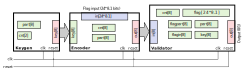

# license-check

[library.m0unt41n.ch/challenges/license-check](https://library.m0unt41n.ch/challenges/license-check)   

# TL;DR

This task has a trivial XOR encoder disguised as a Verilog module. 

# Functions of various components:



The flag is hidden in the `validator` module and the input provided to `encoder` module
needs to be decoded against bits coming from the `keygen`.

Below are simplified desriptions of what the modules do, with a pseudocode.

## Keygen

Generates a simple (and reproducible) 8-bit key signal. Rough semantics of the code:

```c
int_2 cnt = 0
int_8 key = 11011001b

for each clock pulse:
    key = key + 2 * cnt   // mod 256
    cnt++                 // mod 4
    out = key
```

## Encoder

Iterate over bytes from the test flag `in`, using `cnt` as a counter.
For each clock pulse:

*   take the byte number `cnt` from the test flag
*   XOR it with the key provided by the keygen
*   send it to `out`.

... effectively, encrypting the provided flag with the dynamic key.
Note that `part` seems not used.

```c
int_8   key = 0
int_192 in             // Test flag for verification
int_8   cnt = 0
int_8   out = 0
int_8   part = 0       // Not used

for each clock pulse:
    part = (part + 1) & 0x03
    cnt++
    out = key ^ ((in & (0xFF << (cnt*8))) >> cnt*8)
```

## Validator

Iterate over encrypted bytes provided via `in` and compare them with
encrypted flag stored internally in `flag` register. For each clock pulse:

*   if `in` byte is equal to the respective byte of the `flag`, keep `out`
    in high state
*   otherwise, if it is equal to `0xEB` (presumably end of string), keep
    `out` in high state too
*   otherwise, switch `out` to low state, signaling a flag verification
    failure

```c
int_8   in
int_8   out = 1
int_8   cnt = 0
int_8   flagpart = 0
int_8   flagin = 0
int_200 flag = 0x52737427253d3f7279669699ccb29a96998481808ce7b8a400

for each clock pulse:
    flagin = in
    flagpart = (flag & (0xFF << (cnt*8))) >> (cnt*8)
    if in == (flag & (0xFF << (cnt*8))) >> (cnt*8)
        out = out
    elif in == 0xeb
        out = out
    else
        out = 0
    endif
    cnt++
```

# Getting the flag

Let's write some code, generating bytes similar to the keygen and read bytes from encrypted
flag, starting with LSB:

```python
#!/usr/bin/python3

flag = 0x52737427253d3f7279669699ccb29a96998481808ce7b8a4
result = ''
cnt = 0
key = 0b11011001

for i in range(24):
  # Keygen
  key = (key + 2 * cnt) & 0xFF
  cnt = (cnt+1) & 0x3
  # Encoder
  result=chr(key^(flag&0xFF))+result
  flag>>=8

print(result)
```

---

## `shc2024{peid1Eighofei8c}`


<hr>

&copy; [muflon77](https://library.m0unt41n.ch/players/805ae1c8-9fe4-5816-b4a4-5057fa6eedb1)
