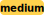

# lifo

[library.m0unt41n.ch/challenges/lifo](https://library.m0unt41n.ch/challenges/lifo)   

# TL;DR

We get a binary, the flag is inside somewhere.

```
$ ./lifo 
Flag please (15 chars, without shc2022{}): shc2022{blah?}
wrong
```

# Decompilation

The code is a mess, but it is actually quite easy to understand &#128578; Full source: [lifo.c](https://github.com/mufl0n/mufl0n.github.io/blob/main/shc/re/lifo/lifo.c).
One interesting thing is that there is no `main()` function, but there is `start()` - and it is referenced
from the ELF header as entry point.

The key parts of the code:

## Some funny helper functions

```c
int isArg7EqualArg8Plus1(int a1, int a2, int a3, int a4, int a5, int a6, int a7, int a8) { return a7 + 2 == a8 + 3; }
int isArg7EqualArg8Plus1(int a1, int a2, int a3, int a4, int a5, int a6, int a7, int a8) { return a7 + 2 == a8 + 3; }
int isArg7EqualArg8Minus2(int a1, int a2, int a3, int a4, int a5, int a6, int a7, int a8) { return a7 == a8 - 2; }
int isArg7EqualArg8Minus53(int a1, int a2, int a3, int a4, int a5, int a6, int a7, int a8) { return a8 - 53 == a7; }
int isPtrArg1EqualArg2Plus9(int *a1, int a2) { return *a1 == a2 + 9; }
int isArg1EqualArg7(int a1, int a2, int a3, int a4, int a5, int a6, int a7) { return a7 == a1; }
int is95(int a1) { return a1 == 95; }
int isArg7ArgArg9Equal0x463777(int a1, int a2, int a3, int a4, int a5, int a6, int a7, int a8, int a9) { return a9 + ((a8 + (a7 << 8)) << 8) == 0x463777; }
int isArgEqual31337(int arg) { return arg + 8983 == factorial(8); }
```

## Some boring helper functions

(They do exactly what they say, no point in copying the details here)

```c
int factorial(int arg);
int readFromStdIn(char *buf, size_t count);
int writeToStdOut(const char *buf, size_t count);
void writeOneChar(char c);
int readSignedIntFromStdIn();
int writeSignedIntToStdout(int arg);
void exit(int code);
```

## Some functions that write strings

```c
void writeChars()   { writeOneChar('c'); writeOneChar('h'); writeOneChar('a'); writeOneChar('r'); writeOneChar('s'); }
void writeFlag()    { writeOneChar('F'); writeOneChar('l'); writeOneChar('a'); writeOneChar('g'); }
void writePlease()  { writeOneChar('p'); writeOneChar('l'); writeOneChar('e'); writeOneChar('a'); writeOneChar('s'); writeOneChar('e'); }
void writeWithout() { writeOneChar('w'); writeOneChar('i'); writeOneChar('t'); writeOneChar('h'); writeOneChar('o'); writeOneChar('u'); writeOneChar('t'); }
void writeShc()     { writeOneChar('s'); writeOneChar('h'); writeOneChar('c'); }
void writeWrong()   { writeOneChar('w'); writeOneChar('r'); writeOneChar('o'); writeOneChar('n'); writeOneChar('g'); }
void writeSuccess() { writeOneChar('s'); writeOneChar('u'); writeOneChar('c'); writeOneChar('c'); writeOneChar('e'); writeOneChar('s'); writeOneChar('s'); }
```

## start()

... which just prints the prompt message using `write...()` functions above, and calls `doAllThings()`.

## doAllThings()

... where everything actually happens. The code pretty much walks us through what the flag is:

```c
int success1, success2;
char buf[128];

void doAllThings() {
  long chars[11];
  success1 = success2 = 0;

  chars[10] = readOneCharIntoBuf();
  chars[9] = readOneCharIntoBuf();
  chars[8] = readOneCharIntoBuf();
  chars[7] = readOneCharIntoBuf();
  chars[6] = readOneCharIntoBuf();
  chars[5] = readOneCharIntoBuf();
  if (isArg7EqualArg8Plus1(1, 3, 3, 7, 4, 2, chars[10], 'r'))                         
    if (isArg7EqualArg8Minus2(1, 3, 3, 7, 4, 2, chars[9], 'v'))                      
      if (isArg7EqualArg8Minus53(1, 3, 3, 7, 4, 2, chars[8], 'i'))                    
        if (isPtrArg1EqualArg2Plus9(&chars[7], 'Z')                                   
          && isArg1EqualArg7(chars[6], 'Z', _dummy1, _dummy2, _dummy3, _dummy4, 'K')  
          && is95(chars[5]) ) {                                                      
          success1 = 1;
        }
```

Which translates to:

*   `chars[10]` == `r`+1 == `s`
*   `chars[9]` == `'v`-2 == `t`
*   `chars[8]` == `i`-53 == `4`
*   `chars[7]` == `Z`+7 == `c`
*   `chars[6]` == `K`
*   `chars[5]` == `_`

And then:

```c
  chars[3] = readOneCharIntoBuf();
  chars[2] = readOneCharIntoBuf();
  chars[1] = readOneCharIntoBuf();
  chars[4] = readOneCharIntoBuf();
  chars[0] = readSignedIntFromStdIn();

  if ( isArg7Arg8Arg9Equal0x463777(chars[0], probablyDummy, _dummy5, _dummy6, _dummy7, _dummy8, chars[3], chars[2], chars[1])
       && is95(chars[4])              
       && isArgEqual31337(chars[0]) ) 
         success2 = 1;
```

Which translates to:

*   `chars[3]` == `0x46` = `F`
*   `chars[2]` == `0x37` = `7`
*   `chars[1]` == `0x77` = `w`
*   `chars[4]` == `95` = `_`
*   ... and the remaining characters are: `31337`

```c
  if (success1 & success2) writeSuccess();
                      else writeWrong();
}
```

So, the full inner text of the flag is `st4cK_F7w_31337`.

---

## `shc2022{st4cK_F7w_31337}`


<hr>

&copy; [muflon77](https://library.m0unt41n.ch/players/805ae1c8-9fe4-5816-b4a4-5057fa6eedb1)
