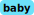

# nopass

[library.m0unt41n.ch/challenges/nopass](https://library.m0unt41n.ch/challenges/nopass)   

# TL;DR

A trivial binary decompilation exercise. The code is the TL;DR &#128578;

```c
int main(int argc, const char **argv, const char **envp) {
  char pass[40], input[56];

  qmemcpy(pass, "pass:H15}SCD{l3t5_g3t_r3v3r51ng}", 32);
  int found = 1;
  printf("Enter the password: ");
  fgets(input, 50, _bss_start);
  int len = strlen(input);
  if ( input[len - 1] == '\n' )
    input[len - 1] = 0;
  for ( int i = 0; i <= 8; ++i )
    if ( input[i] != pass[i] ) {
      found = 0; break;
    }
  if ( strlen(input) != 9 )
    found = 0;
  if ( found ) {
    printf("Correct password! The flag is: ");
    for ( int j = 0; j <= 22; ++j )
      putchar(pass[j + 9]);
    putchar('\n');
  } else {
    puts("Incorrect password.");
  }
  return 0;
}
```

Yeah, it's that easy. Password is `pass:H15}` and flag is `SCD{l3t5_g3t_r3v3r51ng}`.

The only interesting part is that this seems to be exploiting the fact that both
buffers are adjacent, so, can be initialized with a single `qmemcpy()`. But that
could be a compiler optimization artifact too.

---

## `SCD{l3t5_g3t_r3v3r51ng}`


<hr>

&copy; [muflon77](https://library.m0unt41n.ch/players/805ae1c8-9fe4-5816-b4a4-5057fa6eedb1)
