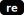

# snakes-on-social-media

[library.m0unt41n.ch/challenges/snakes-on-social-media](https://library.m0unt41n.ch/challenges/snakes-on-social-media)   

# TL;DR

We get a compiled Python class, executed with `marshal`.

# Source

```python
#!/usr/bin/python3
# HELLO GENERAL MANAGEMENT LLC!
# WE HAVE TAKEN OVER YOUR SYSTEM
# IF YOU DON'T SEND US 1337 BTC TO https://www.youtube.com/watch?v=dQw4w9WgXcQ
# WE WILL PUBLISH FEMBOY MEMES ON ALL OF YOUR
# SOCIAL MEDIA ACCOUNTS TOMORROW
# ENTER THE PASSWORD AFTER PAYING TO STOP THE PUBLISHING
# -- THE CAT GANG
exec(__import__('marshal').loads(b'c\x00\x00\x00\x00\x00\x00\x00\x00\x00\x00\x00\x00\x0b\x00\x00\x00\x00\x00\x00\x00\xf3\x8e\x01\x00\x00\x97\x00d\x00d\x01l\x00Z\x00d\x00d\x01l\x01Z\x01d\x00d\x01l\x02Z\x02e\x02j\x06\x00\x00\x00\x00\x00\x00\x00\x00\x00\x00\x00\x00\x00\x00\x00\x00\x00\x00d\x00\x19\x00\x00\x00Z\x04\x02\x00e\x05e\x04d\x02\xab\x02\x00\x00\x00\x00\x00\x00j\r\x00\x00\x00\x00\x00\x00\x00\x00\x00\x00\x00\x00\x00\x00\x00\x00\x00\x00\xab\x00\x00\x00\x00\x00\x00\x00Z\x07d\x03Z\x08d\x04Z\t\x02\x00e\x01j\x14\x00\x00\x00\x00\x00\x00\x00\x00\x00\x00\x00\x00\x00\x00\x00\x00\x00\x00d\x05e\x08z\x00\x00\x00e\tz\x00\x00\x00d\x06z\x00\x00\x00d\x07e\x07\xab\x03\x00\x00\x00\x00\x00\x00Z\x07e\x07j\x17\x00\x00\x00\x00\x00\x00\x00\x00\x00\x00\x00\x00\x00\x00\x00\x00\x00\x00e\x08d\x08\xab\x02\x00\x00\x00\x00\x00\x00Z\x07e\x07j\x17\x00\x00\x00\x00\x00\x00\x00\x00\x00\x00\x00\x00\x00\x00\x00\x00\x00\x00e\td\t\xab\x02\x00\x00\x00\x00\x00\x00Z\x07\x02\x00e\x0c\x02\x00e\rd\x00\x02\x00e\x0ee\x07\xab\x01\x00\x00\x00\x00\x00\x00d\n\xab\x03\x00\x00\x00\x00\x00\x00D\x00\x8f\x00c\x02g\x00c\x02]\x11\x00\x00}\x00\x02\x00e\x0fe\x07|\x00|\x00d\nz\x00\x00\x00\x1a\x00d\x0b\xab\x02\x00\x00\x00\x00\x00\x00\x91\x02\x8c\x13\x04\x00c\x02}\x00\xab\x01\x00\x00\x00\x00\x00\x00Z\x10\x02\x00e\x11\x02\x00e\x00j$\x00\x00\x00\x00\x00\x00\x00\x00\x00\x00\x00\x00\x00\x00\x00\x00\x00\x00e\x10\xab\x01\x00\x00\x00\x00\x00\x00\xab\x01\x00\x00\x00\x00\x00\x00\x01\x00y\x01c\x02\x01\x00c\x02}\x00w\x00)\x0c\xe9\x00\x00\x00\x00N\xda\x01ru\x03\x00\x00\x00\xe2\x80\x80u\x03\x00\x00\x00\xe2\x80\x84z\x02[^\xfa\x01]\xda\x00\xda\x010\xda\x011\xe9\x08\x00\x00\x00\xe9\x02\x00\x00\x00)\x13\xda\x07marshal\xda\x02re\xda\x03sys\xda\x04argv\xda\x01f\xda\x04open\xda\x04read\xda\x03cat\xda\x06u_2000\xda\x06u_2004\xda\x03sub\xda\x07replace\xda\x05bytes\xda\x05range\xda\x03len\xda\x03int\xda\x08bytecode\xda\x04exec\xda\x05loads)\x01\xda\x01is\x01\x00\x00\x000\xfa\x07main.py\xfa\x08<module>r\x1e\x00\x00\x00\x01\x00\x00\x00s\xc9\x00\x00\x00\xf0\x03\x01\x01\x01\xdb\x00\x0e\xdb\x00\t\xdb\x00\n\xd8\x04\x07\x87H\x81H\x88Q\x81K\x80\x01\xd9\x06\n\x881\x88c\x83l\xd7\x06\x17\xd1\x06\x17\xd3\x06\x19\x80\x03\xd8\t\x11\x80\x06\xd8\t\x11\x80\x06\xe0\x06\x0c\x80b\x87f\x81f\x88U\x906\x89\\\x98&\xd1\r \xa0\x13\xd1\r$\xa0b\xa8#\xd3\x06.\x80\x03\xd8\x06\t\x87k\x81k\x90&\x98#\xd3\x06\x1e\x80\x03\xd8\x06\t\x87k\x81k\x90&\x98#\xd3\x06\x1e\x80\x03\xf1\x06\x00\x0c\x11\xa9e\xb0A\xb1s\xb83\xb3x\xc0\x11\xd3.C\xd6\x11D\xa8\x11\x91#\x90c\x98!\x98A\x98a\x99C\x90j\xa0!\xd5\x12$\xd2\x11D\xd3\x0bE\x80\x08\xd9\x00\x04\x80]\x80W\x87]\x81]\x908\xd3\x05\x1c\xd5\x00\x1d\xf9\xf2\x03\x00\x12E\x01s\x06\x00\x00\x00\xc2\x0c\x16C\x02\x08'))
# GOOD LUCK!
```

## Let's save this to `code1.pyc` file instead of running

Trick: https://stackoverflow.com/questions/73439775/how-to-convert-marshall-code-object-to-pyc-file

```python
import marshal
import importlib
bytecode = b'c\x00\x00\x00\x00\x00\x00\x00\x00\x00\x00\x00\x00\x0b\x00\x00\x00\x00\x00\x00\x00\xf3\x8e\x01\x00\x00\x97\x00d\x00d\x01l\x00Z\x00d\x00d\x01l\x01Z\x01d\x00d\x01l\x02Z\x02e\x02j\x06\x00\x00\x00\x00\x00\x00\x00\x00\x00\x00\x00\x00\x00\x00\x00\x00\x00\x00d\x00\x19\x00\x00\x00Z\x04\x02\x00e\x05e\x04d\x02\xab\x02\x00\x00\x00\x00\x00\x00j\r\x00\x00\x00\x00\x00\x00\x00\x00\x00\x00\x00\x00\x00\x00\x00\x00\x00\x00\xab\x00\x00\x00\x00\x00\x00\x00Z\x07d\x03Z\x08d\x04Z\t\x02\x00e\x01j\x14\x00\x00\x00\x00\x00\x00\x00\x00\x00\x00\x00\x00\x00\x00\x00\x00\x00\x00d\x05e\x08z\x00\x00\x00e\tz\x00\x00\x00d\x06z\x00\x00\x00d\x07e\x07\xab\x03\x00\x00\x00\x00\x00\x00Z\x07e\x07j\x17\x00\x00\x00\x00\x00\x00\x00\x00\x00\x00\x00\x00\x00\x00\x00\x00\x00\x00e\x08d\x08\xab\x02\x00\x00\x00\x00\x00\x00Z\x07e\x07j\x17\x00\x00\x00\x00\x00\x00\x00\x00\x00\x00\x00\x00\x00\x00\x00\x00\x00\x00e\td\t\xab\x02\x00\x00\x00\x00\x00\x00Z\x07\x02\x00e\x0c\x02\x00e\rd\x00\x02\x00e\x0ee\x07\xab\x01\x00\x00\x00\x00\x00\x00d\n\xab\x03\x00\x00\x00\x00\x00\x00D\x00\x8f\x00c\x02g\x00c\x02]\x11\x00\x00}\x00\x02\x00e\x0fe\x07|\x00|\x00d\nz\x00\x00\x00\x1a\x00d\x0b\xab\x02\x00\x00\x00\x00\x00\x00\x91\x02\x8c\x13\x04\x00c\x02}\x00\xab\x01\x00\x00\x00\x00\x00\x00Z\x10\x02\x00e\x11\x02\x00e\x00j$\x00\x00\x00\x00\x00\x00\x00\x00\x00\x00\x00\x00\x00\x00\x00\x00\x00\x00e\x10\xab\x01\x00\x00\x00\x00\x00\x00\xab\x01\x00\x00\x00\x00\x00\x00\x01\x00y\x01c\x02\x01\x00c\x02}\x00w\x00)\x0c\xe9\x00\x00\x00\x00N\xda\x01ru\x03\x00\x00\x00\xe2\x80\x80u\x03\x00\x00\x00\xe2\x80\x84z\x02[^\xfa\x01]\xda\x00\xda\x010\xda\x011\xe9\x08\x00\x00\x00\xe9\x02\x00\x00\x00)\x13\xda\x07marshal\xda\x02re\xda\x03sys\xda\x04argv\xda\x01f\xda\x04open\xda\x04read\xda\x03cat\xda\x06u_2000\xda\x06u_2004\xda\x03sub\xda\x07replace\xda\x05bytes\xda\x05range\xda\x03len\xda\x03int\xda\x08bytecode\xda\x04exec\xda\x05loads)\x01\xda\x01is\x01\x00\x00\x000\xfa\x07main.py\xfa\x08<module>r\x1e\x00\x00\x00\x01\x00\x00\x00s\xc9\x00\x00\x00\xf0\x03\x01\x01\x01\xdb\x00\x0e\xdb\x00\t\xdb\x00\n\xd8\x04\x07\x87H\x81H\x88Q\x81K\x80\x01\xd9\x06\n\x881\x88c\x83l\xd7\x06\x17\xd1\x06\x17\xd3\x06\x19\x80\x03\xd8\t\x11\x80\x06\xd8\t\x11\x80\x06\xe0\x06\x0c\x80b\x87f\x81f\x88U\x906\x89\\\x98&\xd1\r \xa0\x13\xd1\r$\xa0b\xa8#\xd3\x06.\x80\x03\xd8\x06\t\x87k\x81k\x90&\x98#\xd3\x06\x1e\x80\x03\xd8\x06\t\x87k\x81k\x90&\x98#\xd3\x06\x1e\x80\x03\xf1\x06\x00\x0c\x11\xa9e\xb0A\xb1s\xb83\xb3x\xc0\x11\xd3.C\xd6\x11D\xa8\x11\x91#\x90c\x98!\x98A\x98a\x99C\x90j\xa0!\xd5\x12$\xd2\x11D\xd3\x0bE\x80\x08\xd9\x00\x04\x80]\x80W\x87]\x81]\x908\xd3\x05\x1c\xd5\x00\x1d\xf9\xf2\x03\x00\x12E\x01s\x06\x00\x00\x00\xc2\x0c\x16C\x02\x08'
code = marshal.loads(bytecode)
pyc_data = importlib._bootstrap_external._code_to_timestamp_pyc(code)
with open('code1.pyc', 'wb') as f:
    f.write(pyc_data)
```

## pylingual.io decompile of code1.pyc

```python
# Decompiled with PyLingual (https://pylingual.io)
# Internal filename: main.py
# Bytecode version: 3.12.0rc2 (3531)
# Source timestamp: 1970-01-01 00:00:00 UTC (0)

import marshal
import re
import sys
f = sys.argv[0]
cat = open(f, 'r').read()
u_2000 = '\u2000'
u_2004 = '\u2004'
cat = re.sub('[^' + u_2000 + u_2004 + ']', '', cat)
cat = cat.replace(u_2000, '0')
cat = cat.replace(u_2004, '1')
bytecode = bytes([int(cat[i:i + 8], 2) for i in range(0, len(cat), 8)])
exec(marshal.loads(bytecode))
```

Instead of executing it, let's create `code2.pyc`, from the original `malware.py`

```python
import marshal
import re
import sys
import importlib

cat = open("malware.py", 'r').read()
u_2000 = '\u2000'
u_2004 = '\u2004'
cat = re.sub('[^' + u_2000 + u_2004 + ']', '', cat)
cat = cat.replace(u_2000, '0')
cat = cat.replace(u_2004, '1')
bytecode = bytes([int(cat[i:i + 8], 2) for i in range(0, len(cat), 8)])

code = marshal.loads(bytecode)
pyc_data = importlib._bootstrap_external._code_to_timestamp_pyc(code)
with open('code2.pyc', 'wb') as f:
    f.write(pyc_data)
```

## pylingual.io decompile of code2.pyc

```python
# Decompiled with PyLingual (https://pylingual.io)
# Internal filename: cat.py
# Bytecode version: 3.12.0rc2 (3531)
# Source timestamp: 1970-01-01 00:00:00 UTC (0)

goodCat = input('Meow: ')

class Cat:

    def __init__(self):
        self.stomach = 28

    def eatSalami(self, amount):
        self.stomach += amount

    def pat(self, hand):
        res = []
        for i in range(len(hand)):
            res.append(hand[i] ^ self.stomach)
        return ''.join([chr(x) for x in res])
salamicat = Cat()
salamicat.eatSalami(1)
salamicat.eatSalami(3)
salamicat.eatSalami(3)
salamicat.eatSalami(7)
if goodCat == salamicat.pat(b'YBI\x18\x1a\x18\x1eQY\x1aXXSuL\x1aXu^B\x19uZ\x1e\x1bDu\x10\x19W'):
    print('Congrats!')
else:
    print('Nope >:(')
```

# Getting the flag

Flag seems to be the encrypted string at the end. And, by decoding time, it's xor'd with
self.stomach. Which, after the four invocations of `eatSalami()` will be 42. Let's get it:

```python
for b in b'YBI\x18\x1a\x18\x1eQY\x1aXXSuL\x1aXu^B\x19uZ\x1e\x1bDu\x10\x19W':
    print(chr(b^42), end="")
```

---

## `shc2024{s0rry_f0r_th3_p41n_:3}`


<hr>

&copy; [muflon77](https://library.m0unt41n.ch/players/805ae1c8-9fe4-5816-b4a4-5057fa6eedb1)
