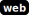

# office-press

[library.m0unt41n.ch/challenges/office-press](https://library.m0unt41n.ch/challenges/office-press)   

# TL;DR

The challenge involves a Wordpress instance, with a flag hidden in a file
on the server. The intended solution is likely exploiting a RCE in one of
the WP plugins, but... there is an easier way &#128522;

# Looking around

Starting the container:

```bash
$ echo "shc2024{fake_flag}" >flag.txt
$ docker build -t office:latest .
$ docker run -p 8000:80 office:latest
```

## The flag is exposed in plain sight

The `Dockerfile` is copying the flag with:

```bash
COPY ./flag.txt ./flag.txt
```

However, with `php:7.4-apache` as base image, this is happening in `/var/www/html`
([defined](https://github.com/docker-library/php/blob/8450cfcf440a1c76470c345193083d817108833c/7.4/bullseye/apache/Dockerfile#L283) as `WORKDIR` there).

... which means that the flag can be retrieved with a simple `http://$URL/flag.txt` &#128522; - almost certainly an unintended solution.

---

## `shc2024{backup_software_to_the_rescue!}`


<hr>

&copy; [muflon77](https://library.m0unt41n.ch/players/805ae1c8-9fe4-5816-b4a4-5057fa6eedb1)
